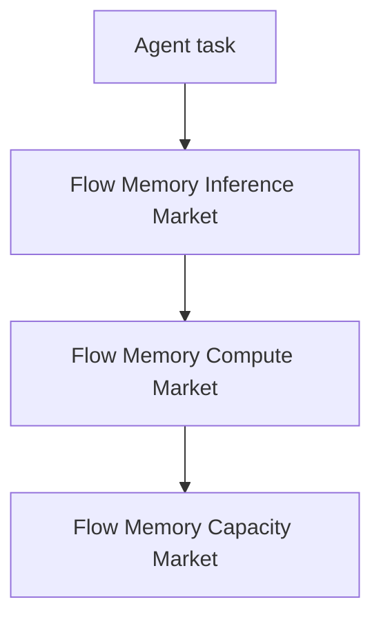

# Flow Memory agent instructions

Flow Memory is the product. Squire and UsePod are reference patterns only; never expose their branding in public APIs, CLI commands, OpenAPI tags, package names, model names, or user-facing errors.

## Mermaid diagrams

When producing architecture docs, operator notes, design plans, or final reports, include valid Mermaid diagrams for major flows. Enable Mermaid rendering in the UI before review:

Tools > Render Mermaid

Use fenced blocks:



Keep labels short. Avoid unescaped quotes inside node labels. Prefer `flowchart TD`, `sequenceDiagram`, or `stateDiagram-v2`.

## Safety boundaries

All payment, settlement, capacity reservation, forward capacity, and futures behavior is dry-run, planning, simulation, or audit-record only unless a future security/legal/compliance release explicitly changes that.

Never introduce code that:

- accepts private keys, seed phrases, mnemonics, or wallet private keys
- broadcasts transactions
- moves funds
- enables live settlement
- enables live futures trading
- enables margin or leverage
- implies legal, regulatory, or compliance approval

Default safety values must remain:

```text
FLOW_MEMORY_COMPUTE_DRY_RUN_REQUIRED=true
FLOW_MEMORY_COMPUTE_LIVE_SETTLEMENT_ENABLED=false
FLOW_MEMORY_COMPUTE_BROADCAST_ENABLED=false
FLOW_MEMORY_COMPUTE_PRIVATE_KEY_INPUTS_ALLOWED=false
```

Relevant responses should expose explicit safety fields such as `dry_run_only`, `funds_moved`, `broadcast_allowed`, `private_key_required`, `live_trading_enabled`, `legal_review_required`, and `compliance_review_required`.
