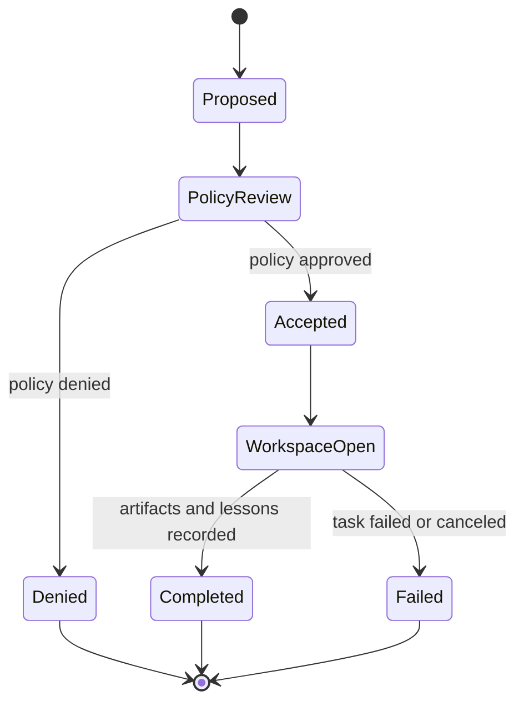
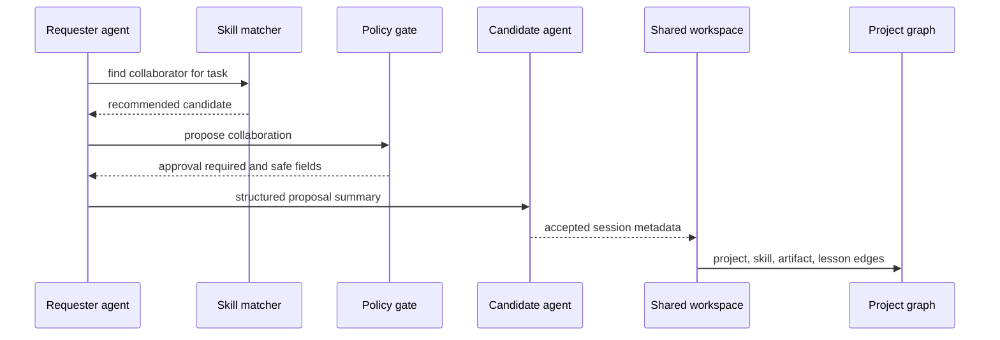

# Agent Collaboration Protocol

The Agent Collaboration Protocol records local, policy-gated collaboration proposals and sessions between Flow Memory agent nodes.

It does not allow agents to bypass approval. Shared workspaces store structured summaries and audit events, not hidden reasoning or raw private memory.

## Lifecycle



## Collaboration sequence



## Records

`CollaborationRequest` contains requester, candidate, task, required skills, proposed role, workspace id, policy requirements, optional dry-run payment intent, status, and creation time.

`CollaborationSession` contains participating agents, roles, workspace id, task id, project id, policy state, messages summary, artifacts, experience references, reputation events, and completion time.

## CLI

```bash
python -m flow_memory internet collaborations propose --from internet-alpha --to internet-beta --task "build skill matcher" --required-skill coding --json
python -m flow_memory internet collaborations list --json
python -m flow_memory internet workspace show <workspace_id> --json
```
