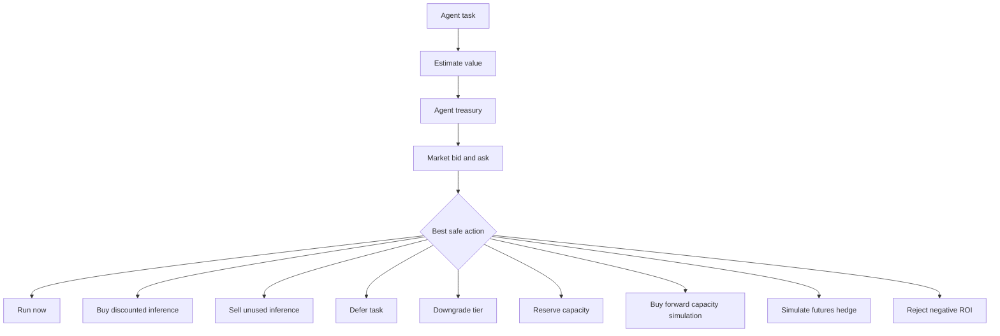

# Flow Memory Agent Economy

Flow Memory agents can act as buyers and sellers of inference and capacity. The agent economy layer decides whether to spend, defer, downgrade, sell unused inference, reserve capacity, buy forward capacity, or simulate a futures hedge.

## Current implementation

- `AgentTreasury`
- `AgentBudgetAccount`
- `AgentSpendPolicy`
- `AgentEarnPolicy`
- `RunVsSellAnalysis`
- `OpportunityCostDecision`

The planner warns when task value is unknown and defaults to conservative defer or human approval unless urgency justifies running.

## Safety

All earning, buying, forwarding, and futures actions are dry-run only. No funds move. No settlement is performed. No private keys are accepted.
