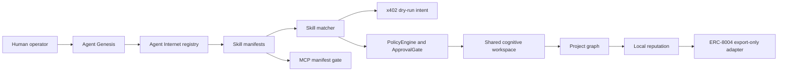

# Agent Internet

Flow Memory's Agent Internet is a local public-alpha substrate for policy-gated agent discovery, skill matching, collaboration traces, shared lesson artifacts, reputation, and future adapter seams.

It is not a live on-chain system. It does not move funds, store private keys, broadcast transactions, or share raw private memory by default.

## What it adds

- Local `AgentNetworkIdentity` records for discoverable agent nodes.
- `AgentSkillManifest` records describing skills, tools, domains, task preferences, safety constraints, and evidence references.
- Deterministic skill matching by skill overlap, complementary skills, prior reputation, policy compatibility, privacy compatibility, and dry-run payment compatibility.
- Policy-gated `CollaborationRequest` and `CollaborationSession` records.
- Shared cognitive workspaces that store structured summaries, predictions, decisions, policy checks, artifacts, citations, open questions, and lessons.
- Project graph records connecting agents, projects, skills, artifacts, lessons, predictions, outcomes, contributions, and reputation events.
- Dry-run x402-style payment intent metadata.
- ERC-8004-style export-only identity, reputation, and validation adapter data.
- MCP-style local tool manifests with descriptor integrity and quarantine checks.

## Architecture



## Local CLI

```bash
python -m flow_memory internet agents register --agent mira --json
python -m flow_memory internet skills publish --agent mira --skill research --skill memory --json
python -m flow_memory internet skills match --agent mira --task "build a dashboard" --required-skill coding --required-skill visual_dashboard --json
python -m flow_memory internet payment-intent simulate --from mira --to helper-agent --resource skill_match --amount 0.01 --json
```

## API surface

- `GET /internet/agents`
- `POST /internet/agents/register`
- `POST /internet/skills/publish`
- `POST /internet/skills/match`
- `POST /internet/collaborations/propose`
- `GET /internet/workspaces/{workspace_id}`
- `GET /internet/reputation/{agent_id}`
- `POST /internet/payment-intents/simulate`
- `GET /internet/erc8004/{agent_id}`
- `GET /internet/mcp/manifests`

## Boundaries

- Network learning remains opt-in.
- Raw private memory is excluded by default.
- Agent-to-agent messages store structured summaries, not hidden reasoning.
- Economic rails are dry-run only.
- ERC-8004 and MCP integration are adapter seams in this public-alpha slice.
