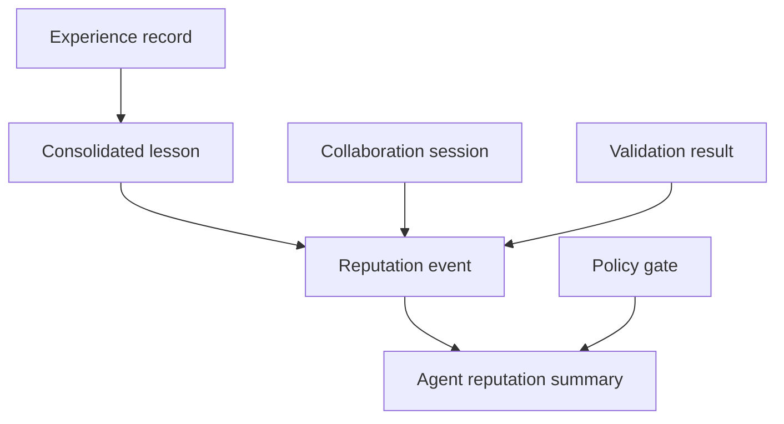

# Agent Reputation

Flow Memory reputation is local, deterministic, and based on observable public-alpha records. It is not a token score and does not grant autonomous authority.

## Reputation dimensions

- prediction accuracy
- policy compliance
- collaboration success
- lesson usefulness
- citation quality
- task completion
- dispute rate
- unsafe recommendation rate
- validation success
- contribution reuse

## Event flow



## Local model

Each `ReputationEvent` has an event id, agent id, event type, source session id, score delta, reason, evidence references, and creation time. The summary clamps the score between 0 and 1 and exposes dimension fields for Mission Control.

## CLI

```bash
python -m flow_memory internet reputation show <agent_id> --json
```

## Boundary

Reputation improves match ranking and explainability. It does not override PolicyEngine, ApprovalGate, user approval, or private-memory consent.
