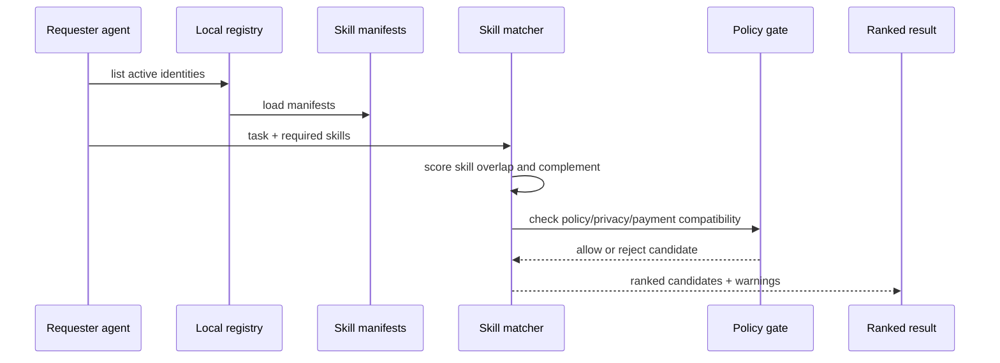

# Agent Skill Matcher

The Agent Skill Matcher ranks local Flow Memory agents for a requested task without making external calls. It is deterministic and designed for public-alpha verification.

## Matching inputs

- requesting agent id
- task description
- required skills
- optional skills
- missing skills to complement
- domain
- collaboration style
- policy constraints
- dry-run budget policy
- minimum trust score

## Scoring

Candidates are ranked by:

1. required skill overlap
2. optional skill overlap
3. complementary skill coverage
4. local reputation score
5. policy compatibility
6. privacy compatibility
7. dry-run payment compatibility

Candidates are rejected when policy/privacy constraints are incompatible or the score falls below the requested trust minimum.

## Sequence



## Example

```bash
python -m flow_memory internet agents register --agent internet-alpha --json
python -m flow_memory internet agents register --agent internet-beta --json
python -m flow_memory internet skills publish --agent internet-alpha --skill research --skill memory --json
python -m flow_memory internet skills publish --agent internet-beta --skill coding --skill verification --skill visual_dashboard --json
python -m flow_memory internet skills match --agent internet-alpha --task "build an agent skill matcher" --required-skill coding --required-skill verification --missing-skill visual_dashboard --json
```

The matcher returns a `match_id`, ranked candidates, score breakdown, recommended collaborator ids, rejected candidates, policy warnings, and an explanation.
