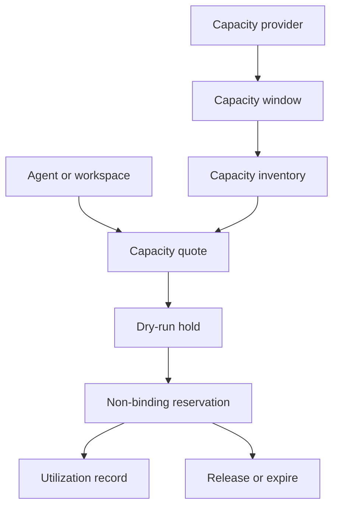
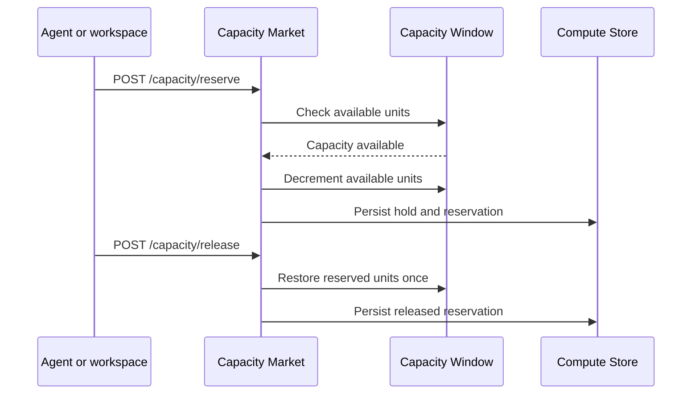

# Flow Memory Capacity Market

Flow Memory Capacity Market models standardized compute units, capacity windows, dry-run holds, non-binding reservations, utilization, and order-book views.



## CLI

```bash
flow-memory capacity inventory --json
flow-memory capacity quote --gpu-class H100 --region us-east --hours 100 --json
flow-memory capacity reserve --gpu-class H100 --region us-east --hours 10 --json
flow-memory capacity index --gpu-class H100 --region us-east --json
flow-memory capacity forward-curve --gpu-class H100 --region us-east --json
flow-memory capacity forward quote --gpu-class H100 --hours 100 --json
```

## API

- `GET /capacity/inventory`
- `POST /capacity/quote`
- `POST /capacity/hold`
- `POST /capacity/reserve`
- `POST /capacity/release`
- `GET /capacity/reservations`
- `GET /capacity/utilization`
- `GET /capacity/order-book`

All reservations are dry-run and non-binding: `funds_moved=false`, `legally_binding=false`.

## Reservation accounting

Capacity windows are treated as a dry-run inventory book. Creating a hold decrements the selected window's `available_units`; releasing the reservation restores those units exactly once. Repeating the same hold or release is idempotent, so a retry cannot double-consume or double-restore simulated capacity.


