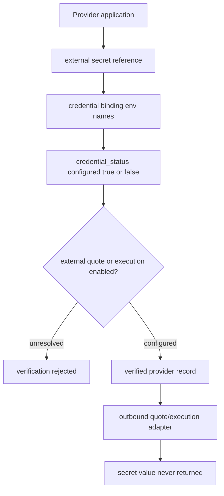
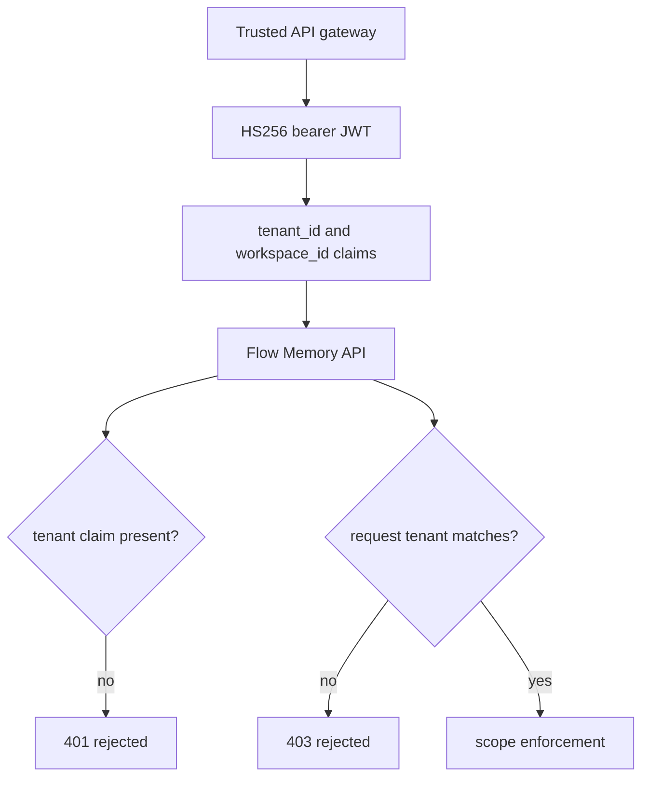
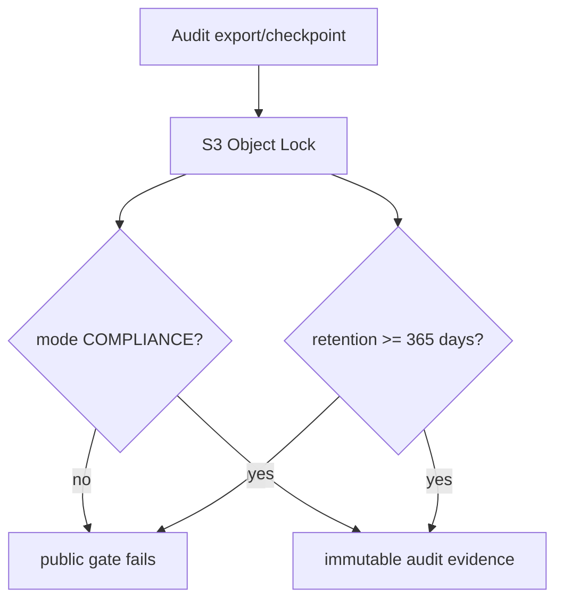

# Flow Memory Compute Market

Flow Memory Compute Market gives AI agents economic memory for compute.

Flow Memory Compute Market is production-planning infrastructure for compute decisions: provider registry, route selection, quote normalization, strict policy enforcement, durable economic memory, audit logs, and dry-run payment planning. Flow Memory Compute Market Alpha data was planning-only; the production-planning release adds durable storage and operational controls while preserving the alpha API and CLI surfaces.

## Launch headline

Flow Memory gives AI agents economic memory for compute.

## Production planning mode

Default mode is `production_planning`:

- durable provider, route, policy, quote, decision, economic-memory, and audit records
- database migrations through `ComputeMarketStore.migrate()`
- scoped API access for read, plan, provider-admin, policy-admin, and audit operations
- request IDs and idempotency keys for write-like planning operations
- policy traces with machine-readable reason codes and human-readable explanations
- bounded provider adapter failures, retry/circuit-breaker scaffolding, and quote cache records
- explicit local rate limiter and circuit breaker abstractions with distributed-ready contracts
- tamper-evident audit hash chain verification
- hardened HTTP quote provider scaffold with SSRF protections
- PostgreSQL-compatible storage adapter for managed SQL multi-node deployments
- Redis-backed distributed rate limiter and circuit breaker implementations
- local audit export/checkpoint verification for immutable-storage handoff
- provider quote contract validation for external provider onboarding
- structured logs, metrics, and tracing hooks
- health/readiness checks

Intelligence utility planning is also dry-run planning infrastructure. It recommends how much intelligence a task should buy, records price snapshots and usage records, and can recommend run-now/defer/downgrade/reserve decisions without executing work, moving funds, or enabling settlement.

Payment and settlement are dry-run only. No funds are moved. Transaction broadcast is disabled.

All payment and settlement flows are dry-run only. Flow Memory does not accept private keys, does not move funds, and does not broadcast transactions unless a future live-settlement mode is explicitly enabled through documented security gates.
All payment and settlement flows are dry-run only. Flow Memory does not handle private keys, does not move funds, and does not broadcast transactions in this release.

## What it supports

- production-grade compute planning
- provider registry
- route selection
- quote normalization
- policy enforcement
- durable economic memory
- audit logs
- observability
- dry-run payment planning
- decision replay
- provider health checks
- admin-safe provider, route, and policy management

## What it does not enable by default

- live settlement
- private-key custody
- seed phrase handling
- transaction signing
- transaction broadcast
- mainnet funds movement
- compute futures or financialized settlement

Live settlement requires a separate security review and the gates in `docs/security/COMPUTE_MARKET_LIVE_SETTLEMENT_GATES.md`.
Live settlement requires a separate security review before any future live-settlement mode can be enabled.

## API surface

Planning:

- `POST /compute/plan`
- `POST /compute/marketplace-plan`
- `POST /compute/quote`
- `POST /compute/route`
- `POST /compute/payment-plan`
- `POST /compute/simulate-settlement`

Intelligence utility:

- `POST /compute/intelligence-plan`
- `GET /compute/prices`
- `GET /compute/prices/history`
- `GET /compute/prices/anomalies`
- `POST /compute/prices/forecast`
- `GET /compute/usage`
- `GET /compute/usage/by-agent/{agent_id}`
- `GET /compute/usage/by-goal/{goal_id}`
- `GET /compute/usage/statement`

Providers:

- `GET /compute/providers`
- `GET /compute/providers/{provider_id}`
- `POST /compute/providers`
- `PATCH /compute/providers/{provider_id}`
- `POST /compute/providers/{provider_id}/disable`
- `POST /compute/providers/{provider_id}/health-check`

Routes:

- `GET /compute/routes`
- `GET /compute/routes/{route_id}`
- `POST /compute/routes`
- `PATCH /compute/routes/{route_id}`
- `POST /compute/routes/{route_id}/disable`

Policies:

- `GET /compute/policies`
- `GET /compute/policies/{policy_id}`
- `POST /compute/policies`
- `PATCH /compute/policies/{policy_id}`
- `POST /compute/policies/{policy_id}/validate`

Economic memory:

- `GET /compute/economic-memory`
- `POST /compute/economic-memory/query`
- `GET /compute/economic-memory/summary`
- `GET /compute/economic-memory/anomalies`
- `GET /compute/economic-memory/providers/{provider_id}`
- `GET /compute/economic-memory/routes/{route_id}`
- `GET /compute/economic-memory/tasks/{task_type}`

Decisions and audit:

- `GET /compute/decisions/{decision_id}`
- `POST /compute/decisions/{decision_id}/replay`
- `GET /compute/audit`
- `GET /compute/audit/{audit_event_id}`
- `GET /compute/audit/verify`
- `POST /compute/audit/export`
- `POST /compute/audit/checkpoint`
- `POST /compute/audit/verify-export`

Health:

- `GET /compute/health`
- `GET /compute/readiness`

## CLI surface

- `flow-memory compute plan`
- `flow-memory compute quote`
- `flow-memory compute route`
- `flow-memory compute providers`
- `flow-memory compute provider-health --provider <provider_id>`
- `flow-memory compute routes`
- `flow-memory compute policies`
- `flow-memory compute economic-memory`
- `flow-memory compute replay-decision <decision_id>`
- `flow-memory compute simulate-settlement`
- `flow-memory compute audit`
- `flow-memory compute audit verify`
- `flow-memory compute audit export --chain-id all --out <path>`
- `flow-memory compute audit checkpoint --chain-id all`
- `flow-memory compute audit verify-export --path <path>`
- `flow-memory compute provider-contract validate <quote.json>`
- `flow-memory compute intelligence-plan`
- `flow-memory compute prices`
- `flow-memory compute usage`
- `flow-memory compute statement`
- `flow-memory compute health`
- `flow-memory compute readiness`

Common options:

- `--json`
- `--request-id`
- `--idempotency-key`
- `--agent-id`
- `--goal-id`
- `--policy`
- `--strategy` / `--selection-strategy`
- `--provider`
- `--route`
- `--marketplace-only`
- `--dry-run`
- `--limit`
- `--cursor`
- `--allow-no-route`

- `--budget`
- `--estimated-value`
- `--intelligence-tier`
- `--reasoning-level`
- `--max-reasoning-steps`
- `--max-tool-calls`
- `--allow-background`
- `--allow-reserved-capacity`
- `--max-background-runtime-seconds`
- `--checkpoint-interval-seconds`
CLI fail-closed denials exit nonzero unless `--allow-no-route` is explicitly used for a valid no-route outcome.

## Policy behavior

Marketplace-only policies fail closed when no marketplace route satisfies policy.

The policy engine rejects by default when:

- price is unknown and `allow_unknown_price` is false
- quote is stale or expired and `allow_stale_quote` is false
- route is non-marketplace while `marketplace_only` is true
- fallback is selected while fallback is disallowed
- dry-run is required but a route or quote implies live broadcast
- settlement mode is not allowed
- capacity confirmation is required and unavailable
- verified providers or signed quotes are required but absent
- human approval threshold is exceeded without approval
- audit logging is required and cannot be written

Every rejection includes a machine-readable reason and a human-readable explanation in `policy_trace`.

## Durable storage

`ComputeMarketStore` creates `compute_market_records` and `compute_market_migrations` with typed indexes for:

- economic memory by `agent_id`
- economic memory by `goal_id`
- economic memory by provider/route
- economic memory by `created_at`
- economic memory by task type and task hash
- quotes by provider, route, and expiration
- providers by status
- audit events by actor, request, action, creation time, chain ID, sequence number, and event hash

Stored record types include provider, route, quote, capacity window, reservation, compute intent, payment intent, payment plan, settlement intent, task economic profile, budget policy, market policy, route decision, provider capability, price snapshots, price curves, intelligence plans, route/provider price indexes, price anomalies, price forecasts, intelligence usage records, compute statements, economic memory, audit events, provider health, and quote cache entries.

SQLite is the default local/single-node store. Multi-node production deployments can use the PostgreSQL-compatible adapter through `FLOW_MEMORY_COMPUTE_STORAGE_BACKEND=postgres` and `FLOW_MEMORY_COMPUTE_DATABASE_URL=postgresql://...`; install the optional `flow-memory[postgres]` extra and run migrations before serving traffic. Production can fail readiness on SQLite by setting `FLOW_MEMORY_COMPUTE_REQUIRE_MANAGED_SQL_IN_PRODUCTION=true`.

## Economic memory analytics

`POST /compute/economic-memory/query` supports filters for time range, agent, goal, provider, route, task type, marketplace-only, unit type, policy result, selected/rejected routes, fallback, limit, and cursor.

Responses include:

- data
- confidence
- sample size
- time range
- filters applied
- warnings
- next recommended action

Analytics include cheapest route, best ROI route, latency-adjusted cost, provider reliability, route rejection rates, fallback frequency, stale quote frequency, policy failure distribution, marketplace route performance, budget overrun attempts, estimated versus actual cost/latency, provider drift, task classes to defer, and routes needing human approval.

## Intelligence as a metered utility

`POST /compute/intelligence-plan` sits above `/compute/plan`. It asks what tier of intelligence a task should buy before choosing a route. Supported tiers are `instant`, `standard`, `deep_reasoning`, `background_agent`, `batch`, `premium`, and `reserved_capacity`.

An intelligence plan includes:

- `recommended_intelligence_tier`
- `recommended_reasoning_budget`
- `recommended_route_types`
- `max_recommended_spend`
- `run_decision`
- `defer_until`
- `downgrade_options`
- `reserve_capacity_recommended`
- `rationale`
- `next_safe_actions`

Reasoning budgets constrain agent-native work with `reasoning_level`, `max_reasoning_steps`, `max_parallel_branches`, `max_reflection_passes`, `max_tool_calls`, `max_wall_time_seconds`, `max_background_runtime_seconds`, and `checkpoint_interval_seconds`.

Run decisions are `run_now`, `defer_until_cheaper`, `downgrade_tier`, `reserve_capacity`, `require_human_approval`, and `reject_negative_roi`. The planner considers estimated value, estimated cost, quote freshness, capacity availability, policy constraints, and stored price history.

Background compute remains planning-only unless the separate compute job execution layer is used. `allow_background`, `background_deadline`, `checkpoint_interval_seconds`, and `max_background_runtime_seconds` influence tiering and route preferences without starting background work.

Provider classes make intelligence tiers provider-class aware instead of only provider-type aware. Supported provider classes are `foundational_model`, `small_model`, `reasoning_model`, `agent_runtime`, `gpu_cluster`, `batch_inference`, `local_runtime`, `reserved_capacity_pool`, and `marketplace_pool`. Provider onboarding accepts `provider_class`; if omitted, Flow Memory derives a safe class from `provider_type`. Intelligence plans return `recommended_provider_classes` and filter default route discovery through those classes unless the caller supplies explicit provider constraints.

## Compute price history and utility ledger

Flow Memory records compute price snapshots when plans observe quotes. Price APIs expose current route/provider indexes, history, anomaly detection, and simple forecasts:

- `GET /compute/prices`
- `GET /compute/prices/history`
- `GET /compute/prices/anomalies`
- `POST /compute/prices/forecast`

The intelligence usage ledger records the economics of intelligence use: workspace, agent, goal, task, tier, reasoning level, metered units, estimated and actual cost, estimated value, ROI, selected route, provider, route, background runtime, and creation time.

Usage APIs provide utility-bill views:

- `GET /compute/usage`
- `GET /compute/usage/by-agent/{agent_id}`
- `GET /compute/usage/by-goal/{goal_id}`
- `GET /compute/usage/statement`

These records are accounting and planning records. They do not debit real credits, move funds, accept private keys, broadcast transactions, or enable live settlement.

## Rate limits, circuit breakers, and external quotes

The service exposes `RateLimiter` and `CircuitBreaker` contracts with in-memory implementations for local/dev/test and Redis-backed implementations for multi-node production. Planning, quotes, routes, provider health checks, decision replay, economic-memory queries, and admin mutations are rate-limit aware. Open provider circuits add the provider to denied providers so planning skips it instead of silently selecting an unhealthy route. Redis controls fail closed by default when configured but unavailable.

`HTTPQuoteProvider` remains disabled unless explicitly configured. When enabled it validates scheme/host, blocks local/private network targets unless dev mode allows them, rejects redirects, enforces a max response size, injects auth headers from environment variables without logging secret values, parses only typed quote fields, hashes raw quotes, and marks stale or unknown-price responses for fail-closed policy evaluation.

Provider onboarding stores only external secret references and environment variable names. The verification path recomputes `credential_status` from those bindings and, when external provider quotes or execution are enabled, refuses to verify a provider whose required credential environment variables are unresolved. Secret values are used only by outbound adapters and are never emitted in provider, route, quote, audit, or release-evidence payloads.

`flow-memory compute provider-contract validate <quote.json> --json` validates provider quote samples before onboarding. Contract checks reject missing/negative/unknown prices, expired or stale quotes, provider spoofing, policy override attempts, live-settlement demands, private-key requirements, broadcast requirements, oversized responses, and disallowed assets/networks.

## Public auth and tenant isolation

Public Level 1 keeps API-key scope enforcement and nonce replay checks enabled, and the gateway JWT bridge is tenant-bound. Public deployment envs must set `FLOW_MEMORY_API_JWT_REQUIRE_TENANT=true`; smoke and buildout validation mint JWTs with `tenant_id` and `workspace_id`, then prove missing-tenant bearer tokens return 401 and tenant-mismatched requests return 403. This is a gateway bridge for a trusted upstream issuer, not a full OIDC provider implementation.

## Observability

Metrics:

- `compute_plan_requests_total`
- `compute_plan_fail_closed_total`
- `compute_quote_requests_total`
- `compute_quote_provider_timeouts_total`
- `compute_quote_provider_errors_total`
- `compute_route_selected_total`
- `compute_route_rejected_total`
- `compute_policy_denials_total`
- `compute_fallback_used_total`
- `compute_payment_plan_created_total`
- `compute_settlement_simulated_total`
- `compute_economic_memory_writes_total`
- `compute_economic_memory_query_total`
- `compute_provider_health_status`
- `compute_provider_latency_ms`
- `compute_quote_latency_ms`
- `compute_plan_latency_ms`
- `compute_estimated_cost`
- `compute_actual_cost`
- `compute_roi`

Trace spans:

- `compute.plan_request`
- `compute.provider_discovery`
- `compute.quote_collection`
- `compute.quote_normalization`
- `compute.policy_evaluation`
- `compute.route_selection`
- `compute.payment_planning`
- `compute.economic_memory_write`
- `compute.audit_write`

Structured logs include request ID, decision ID, agent ID, goal ID, provider ID, route ID, policy ID, strategy, result, rejected reason codes, latency, estimated cost, and dry-run flag.

## Audit integrity

Compute audit events include `chain_id`, `sequence_number`, `previous_hash`, `canonical_payload_hash`, `event_hash`, and `hash_algorithm`. The chain scope is tenant/workspace when present, otherwise a global compute-market audit chain. `GET /compute/audit/verify` and `flow-memory compute audit verify --json` verify the chain from genesis to latest and report the first broken sequence.

This is tamper-evident hash chaining, not WORM storage. `flow-memory compute audit export --chain-id all --out <path> --json` writes newline-delimited canonical JSON with a checkpoint, and `flow-memory compute audit verify-export --path <path> --json` detects tampering or broken chain boundaries. Local exports are not immutable by themselves; production deployments should write exports/checkpoints to object-lock/WORM storage and include export verification in readiness and incident response.

Public Level 1 gates require S3 Object Lock `COMPLIANCE` mode with at least 365 retention days before immutable audit export can be claimed. Governance mode or short retention can still be useful for local drills, but it does not satisfy the public production-planning evidence gate.

## Backward compatibility

The existing alpha surfaces are preserved:

- `POST /compute/plan`
- `POST /compute/marketplace-plan`
- `POST /compute/quote`
- `POST /compute/route`
- `POST /compute/payment-plan`
- `POST /compute/simulate-settlement`
- `GET /compute/providers`
- `GET /compute/routes`
- `GET /compute/policies`
- `GET /compute/economic-memory`
- `POST /compute/economic-memory/query`
- `flow-memory compute plan`
- `flow-memory compute quote`
- `flow-memory compute route`
- `flow-memory compute providers`
- `flow-memory compute simulate-settlement`
- `flow-memory compute economic-memory`

New fields are additive where response shapes changed.
