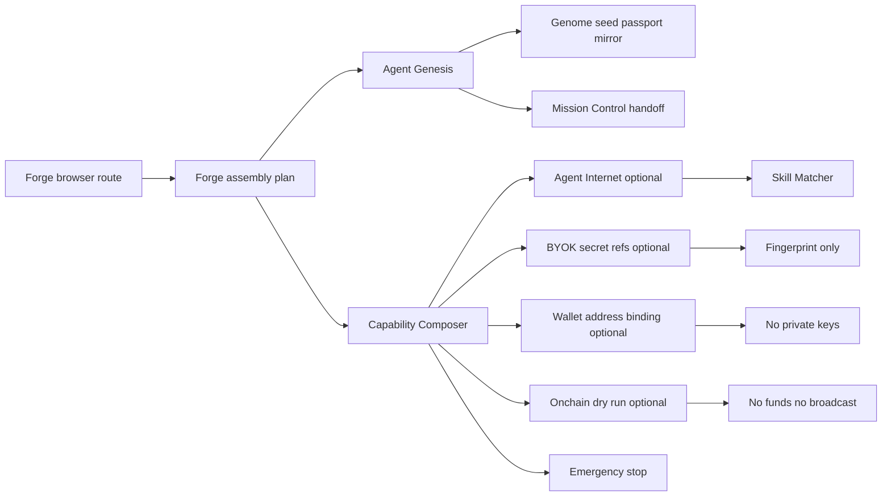
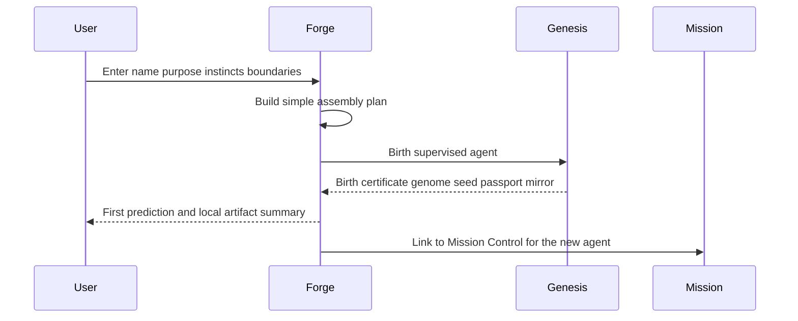
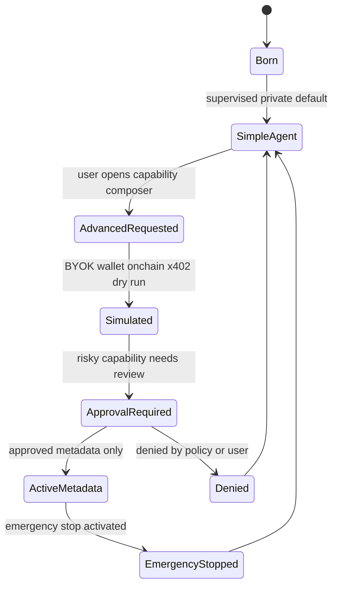
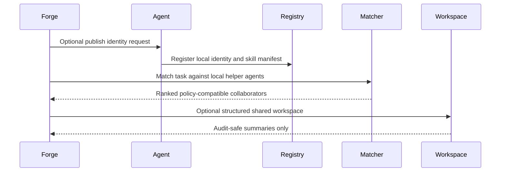

# Flow Memory Forge

Flow Memory Forge is the browser entry point for creating a Flow Memory agent and composing optional capabilities after the agent exists.

The simple path is intentionally boring and safe: the first agent requires no wallet/API key/funds, uses private memory by default, launches supervised, and stays policy-gated. BYOK, wallet identity, on-chain dry-run upgrade, x402 route simulation, Agent Internet publication, and collaborator matching are optional advanced capabilities.

## Forge architecture



## First-agent birth sequence



## Optional upgrade lifecycle



## Forge to Agent Internet skill match flow



## Browser route

Run the dashboard and open:

```bash
cd dashboard
npm run dev
```

Then visit `/forge` or `/agents/new` on the local dashboard server.

The route shows:

- Simple mode for first-agent birth.
- Advanced mode for optional upgrades after birth.
- Capability Composer cards for local runtime, predictive cognition, Agent Internet identity, skill manifest, skill matcher, BYOK model key, wallet identity, on-chain dry run, x402 dry-run route, and emergency stop.
- A first prediction, birth certificate placeholder, Agent Passport/Mirror handoff, and Mission Control link.
- A read-only demo mode backed by `dashboard/src/mock-data/flow-memory-forge.json`.

## CLI examples

```bash
python -m flow_memory forge defaults --json
python -m flow_memory forge plan --name Mira --archetype research-builder --purpose "Help me build Flow Memory" --json
python -m flow_memory forge birth --name Mira --archetype research-builder --purpose "Help me build Flow Memory" --json
python -m flow_memory forge simulate-upgrades --agent genesis_agent_11b7e7b435abc729711373b0 --byok --wallet --onchain-dry-run --json
```

## API examples

```text
GET /forge/defaults
POST /forge/assembly-plan
POST /forge/birth
POST /forge/simulate-upgrades
```

Scopes are local public-alpha scopes: `forge:read`, `forge:create`, and `forge:simulate`.

## Safety boundaries

- first agent requires no wallet/API key/funds
- BYOK is optional
- wallet identity is optional
- on-chain upgrade is dry-run only
- x402 route is dry-run/simulated unless future explicit audited mode exists
- network learning is opt-in
- private memory is default
- no private keys
- no seed phrases
- no funds moved
- no broadcast
- no mainnet writes
- relay disabled by default
- PolicyEngine and ApprovalGate remain authoritative

Forge is public-alpha software. It is not production autonomous intelligence, not audited wallet infrastructure, not live settlement, and not a provider-calling console by default.
