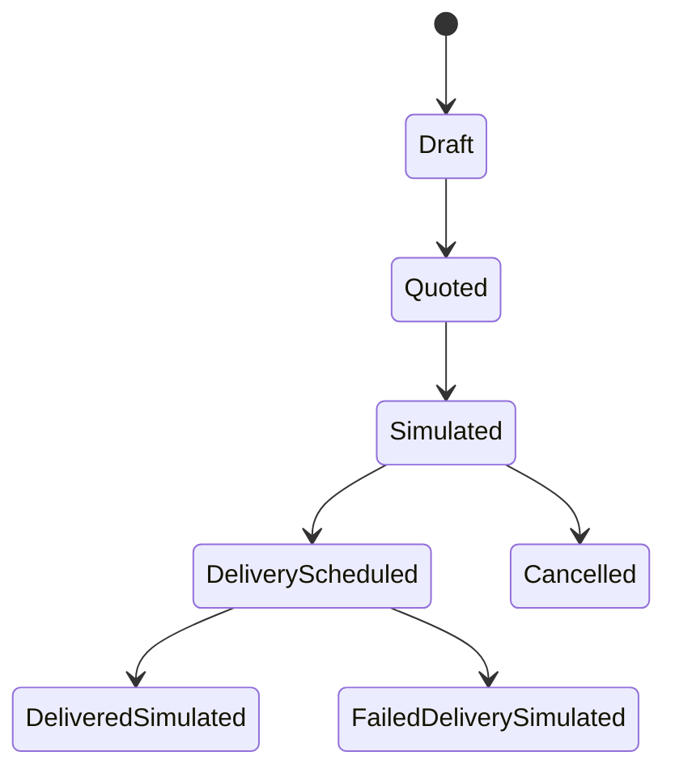

# Flow Memory Forward Capacity Market

Forward capacity is a simulation layer for future-dated compute delivery agreements. It is not live futures trading and is not legally binding.

## API

- `POST /capacity/forwards/quote`
- `POST /capacity/forwards/draft`
- `POST /capacity/forwards/simulate`
- `GET /capacity/forwards`
- `GET /capacity/forwards/{contract_id}`
- `POST /capacity/forwards/{contract_id}/simulate-delivery`
- `POST /capacity/forwards/{contract_id}/simulate-settlement`
- `POST /capacity/forwards/{contract_id}/cancel`

## Safety fields

Every forward response includes or preserves:

- `dry_run_only=true`
- `funds_moved=false`
- `legally_binding=false`
- `live_trading_enabled=false`
- `legal_review_required=true`
- `compliance_review_required=true`

Live settlement, collateral, margin, leverage, private keys, and transaction broadcast are rejected.
