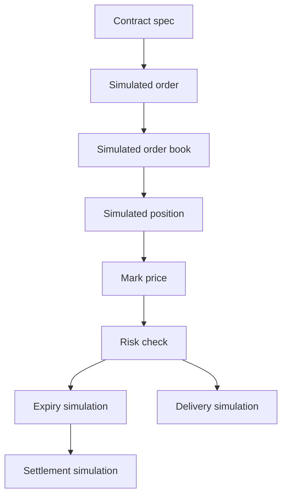
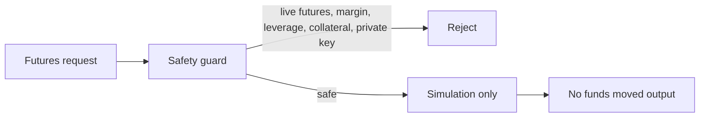

# Flow Memory GPU Futures Simulator

The GPU Futures Simulator is a non-live, non-regulated simulation layer for studying standardized GPU capacity markets. It is not a live trading venue. It provides no investment advice.

## API

- `GET /futures/markets`
- `POST /futures/markets/simulate`
- `GET /futures/contracts`
- `POST /futures/contracts`
- `GET /futures/order-book`
- `POST /futures/orders/simulate`
- `POST /futures/orders/cancel`
- `GET /futures/positions`
- `POST /futures/mark-price`
- `POST /futures/index-price`
- `POST /futures/risk-check`
- `POST /futures/expiry/simulate`
- `POST /futures/delivery/simulate`
- `POST /futures/settlement/simulate`

## Safety boundary

Every response includes:

- `dry_run_only=true`
- `live_trading_enabled=false`
- `funds_moved=false`
- `broadcast_allowed=false`
- `private_key_required=false`
- `legal_review_required=true`
- `compliance_review_required=true`
- `not_investment_advice=true`
