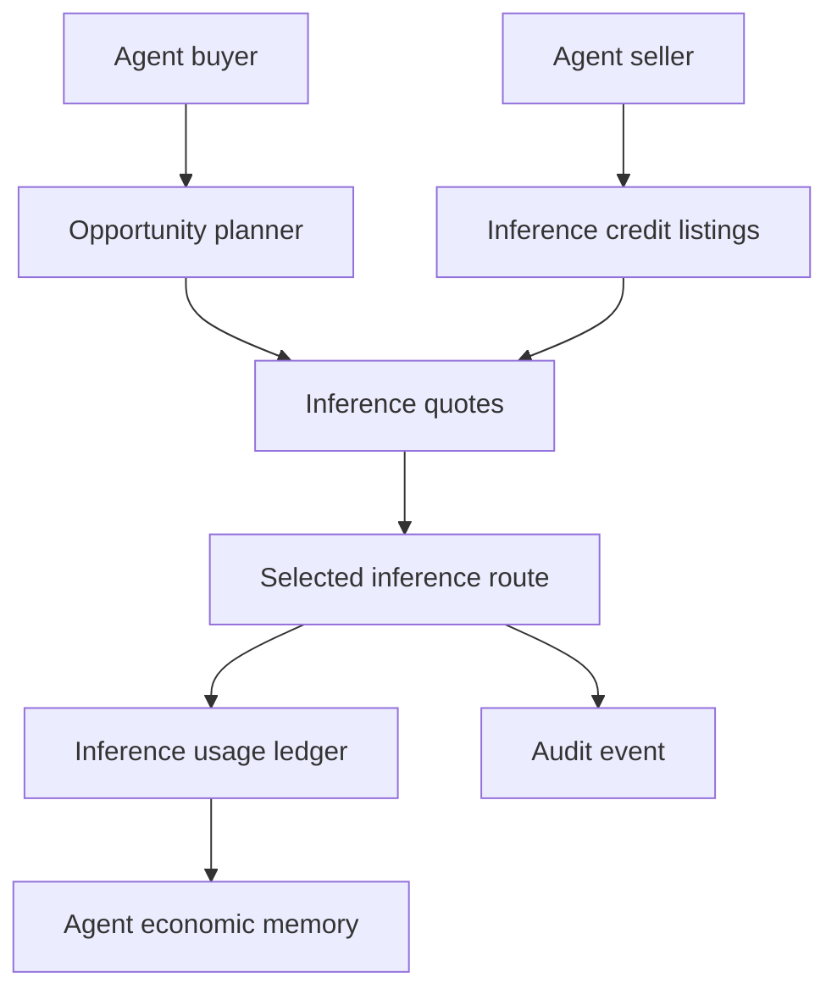
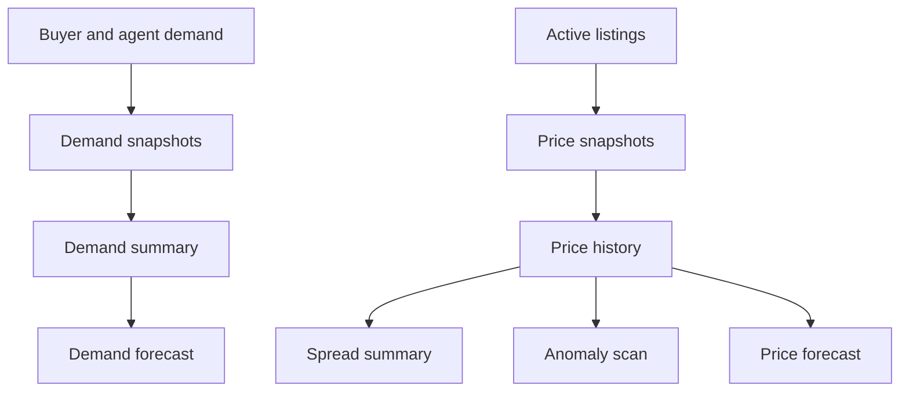
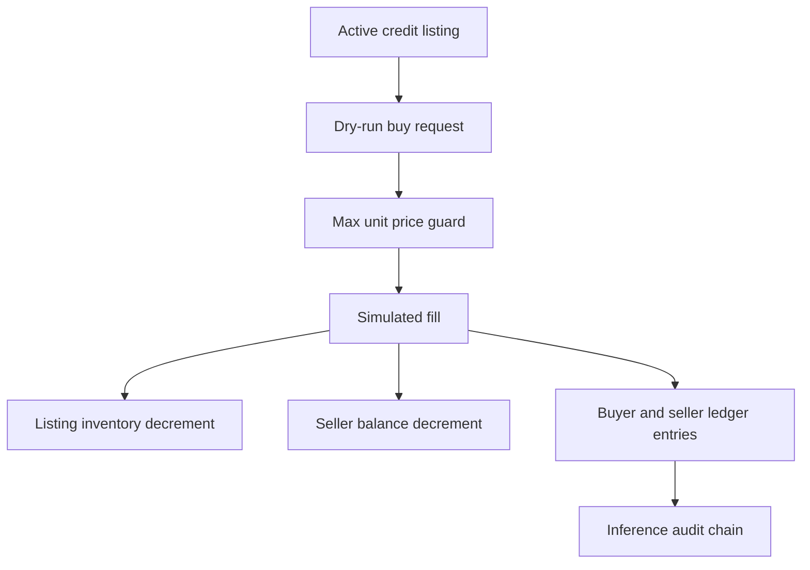
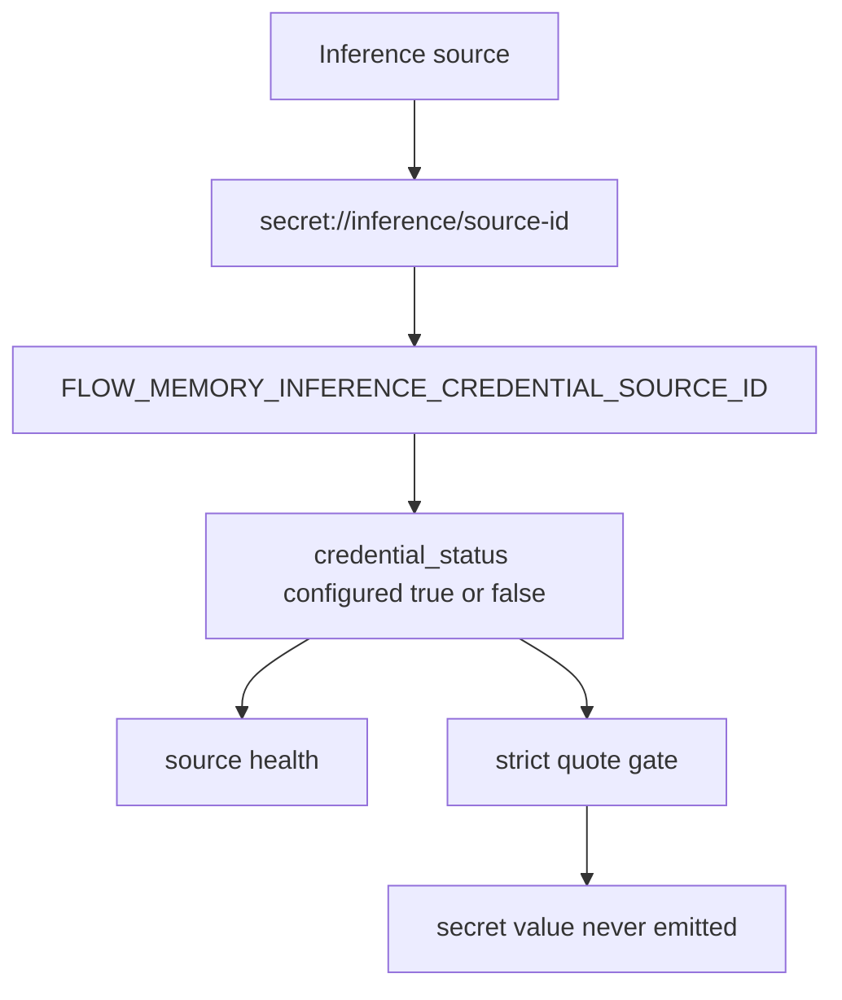
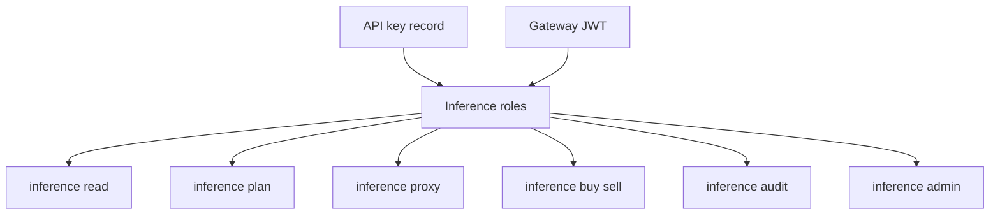
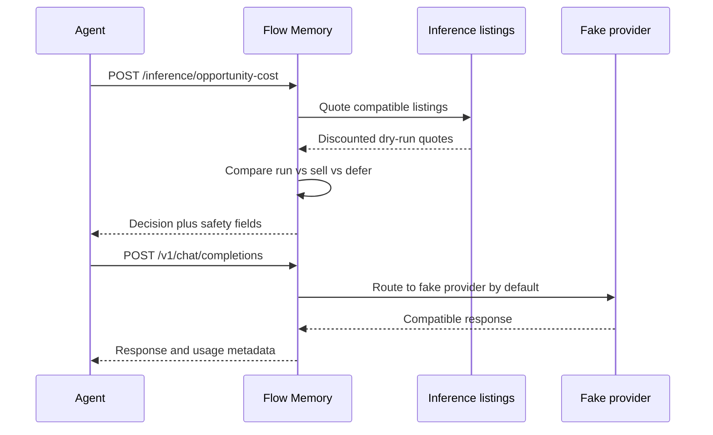

# Flow Memory Inference Market

Flow Memory Inference Market is a dry-run marketplace layer for inference credit resale, discounted routing, demand aggregation, and agent economic decisions. Flow Memory is the product and the public naming surface.

## Architecture

## Demand and price intelligence

## Credit accounting

## Safety

All behavior is simulation-only until real provider, billing, legal, compliance, and security gates are satisfied.

- `dry_run_only=true`
- `funds_moved=false`
- `broadcast_allowed=false`
- `private_key_required=false`
- raw credentials rejected
- seller credentials never exposed

## Credential references

External inference providers are onboarded with `secret://inference/<provider-or-source-id>` references only. The service resolves those references to process environment variables named `FLOW_MEMORY_INFERENCE_CREDENTIAL_<SANITIZED_ID>` when strict credential resolution is enabled, for example:

- `secret://inference/src-real-provider`
- `FLOW_MEMORY_INFERENCE_CREDENTIAL_SRC_REAL_PROVIDER`

The resolved secret is never returned in API, CLI, health, quote, route, usage, or audit payloads. A verified non-local source cannot be created with a missing or unresolvable credential reference, and strict mode rejects quotes for external sources whose secret reference is not configured.

## Auth roles

The marketplace can be scoped by API key records or gateway JWT roles without putting every raw scope in every credential.

| Role | Granted scopes |
|---|---|
| `inference-viewer` | `inference:read` |
| `inference-planner` | `inference:read`, `inference:plan` |
| `inference-proxy` | `inference:read`, `inference:proxy` |
| `inference-buyer` | `inference:read`, `inference:buy` |
| `inference-seller` | `inference:read`, `inference:sell` |
| `inference-auditor` | `inference:read`, `inference:audit` |
| `inference-admin` | all inference marketplace scopes |

## Current implementation

- Package: `src/flow_memory/inference_market/`
- API adapters: `src/flow_memory/api/marketplace_endpoints.py`
- CLI: `flow-memory inference ...`, including `flow-memory inference credits list`, `flow-memory inference credits buy`, and `flow-memory inference credits sell`
- Tests: `tests/test_inference_capacity_futures_markets.py`
- Demand intelligence: `GET /inference/demand`, `GET /inference/demand/summary`, `POST /inference/demand/forecast`
- Price intelligence: `GET /inference/prices`, `GET /inference/prices/history`, `GET /inference/prices/spreads`, `GET /inference/prices/anomalies`, `POST /inference/prices/forecast`
- CLI demand intelligence: `flow-memory inference demand-summary --json`, `flow-memory inference demand-forecast --json`
- CLI price intelligence: `flow-memory inference price-history --json`, `flow-memory inference price-spreads --json`, `flow-memory inference price-forecast --json`

## Core objects

- `InferenceCreditSource`
- `InferenceCreditAccount`
- `InferenceCreditBalance`
- `InferenceCreditListing`
- `InferenceCreditOrder`
- `InferenceCreditFill`
- `InferenceCreditLedgerEntry`
- `InferenceQuote`
- `InferenceUsageRecord`
- `OpportunityCostDecision`

## Request flow

