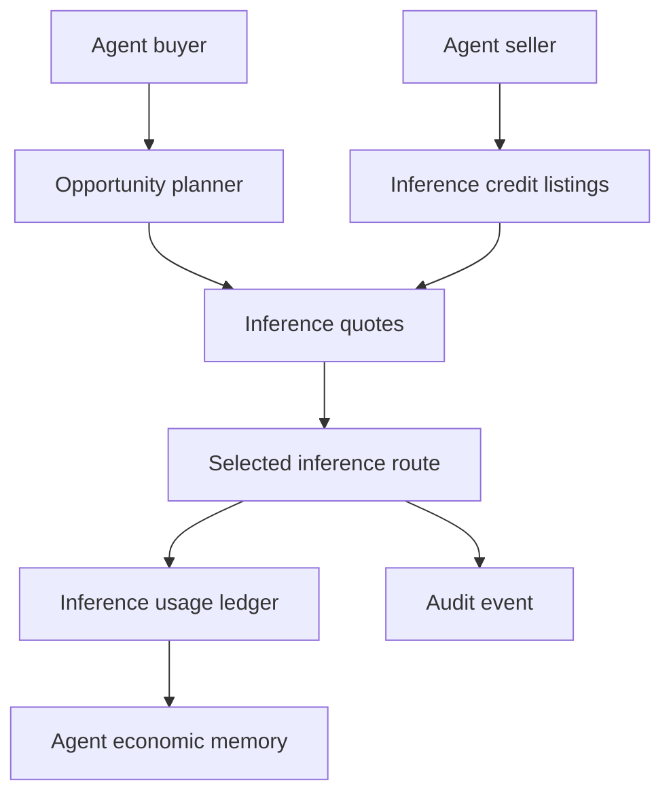
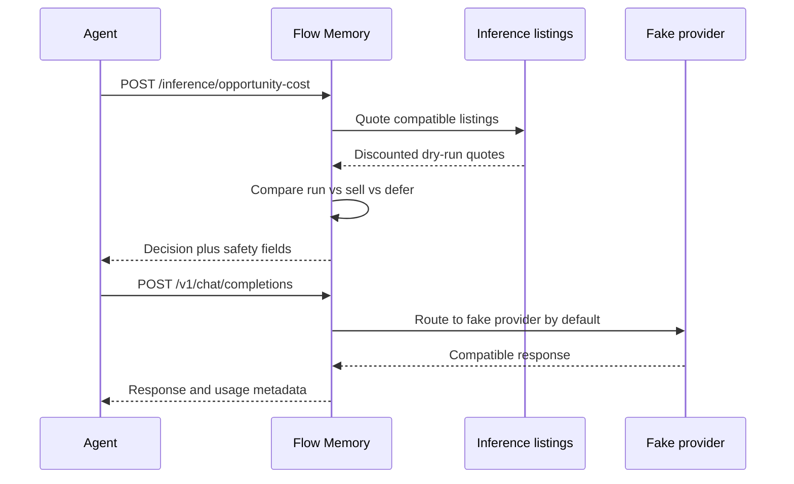

# Flow Memory Inference Market

Flow Memory Inference Market is a dry-run marketplace layer for inference credit resale, discounted routing, demand aggregation, and agent economic decisions. Flow Memory is the product and the public naming surface.

## Architecture

## Safety

All behavior is simulation-only until real provider, billing, legal, compliance, and security gates are satisfied.

- `dry_run_only=true`
- `funds_moved=false`
- `broadcast_allowed=false`
- `private_key_required=false`
- raw credentials rejected
- seller credentials never exposed

## Current implementation

- Package: `src/flow_memory/inference_market/`
- API adapters: `src/flow_memory/api/marketplace_endpoints.py`
- CLI: `flow-memory inference ...`, including `flow-memory inference credits list`, `flow-memory inference credits buy`, and `flow-memory inference credits sell`
- Tests: `tests/test_inference_capacity_futures_markets.py`

## Core objects

- `InferenceCreditSource`
- `InferenceCreditAccount`
- `InferenceCreditBalance`
- `InferenceCreditListing`
- `InferenceCreditOrder`
- `InferenceCreditFill`
- `InferenceQuote`
- `InferenceUsageRecord`
- `OpportunityCostDecision`

## Request flow

