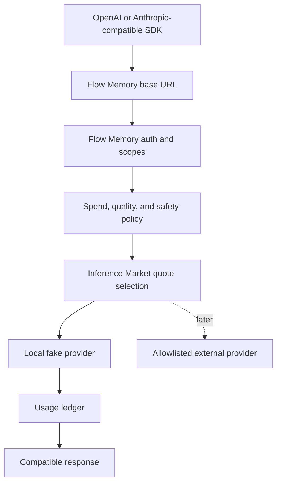
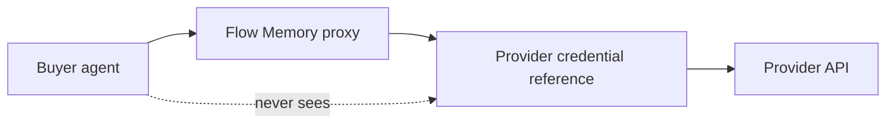
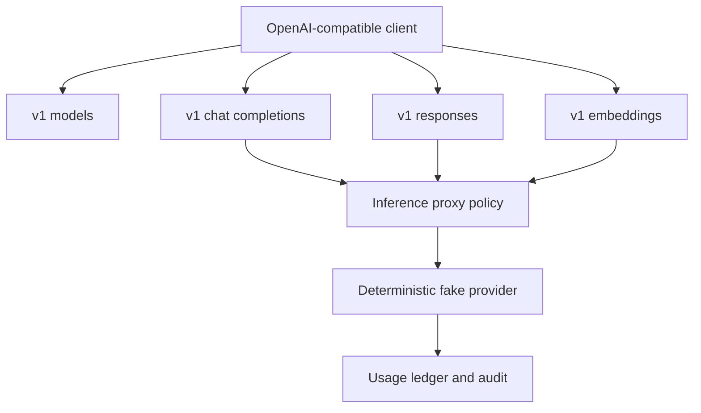

# Flow Memory Inference Proxy

The inference proxy is the one-line base URL adoption path. It exposes OpenAI-compatible and Anthropic-compatible local endpoints backed by deterministic fake providers until external provider credentials are configured.



## Endpoints

- `GET /v1/models`
- `POST /v1/chat/completions`
- `POST /v1/responses`
- `POST /v1/embeddings`
- `GET /anthropic/v1/models`
- `POST /anthropic/v1/messages`
- `POST /inference/proxy`

## Credential boundary



Raw provider credentials, private keys, seed phrases, live settlement flags, and broadcast flags are rejected.

## Local smoke

```bash
flow-memory inference proxy-smoke --model flow-local-small --task "hello" --json
flow-memory inference proxy-smoke --api all --model flow-local-small --task "hello" --json
```

`--api all` exercises chat completions, Responses, and Embeddings through the deterministic fake provider path and asserts only dry-run, no-funds proxy behavior.

Anthropic-compatible local smoke:

```bash
curl -s http://127.0.0.1:8765/anthropic/v1/messages \
  -H "content-type: application/json" \
  -H "x-flow-memory-api-key: dev" \
  -H "x-flow-memory-scopes: inference:proxy" \
  -d '{"model":"claude-3-5-haiku","messages":[{"role":"user","content":"hello"}]}'
```

OpenAI-compatible Responses and Embeddings smoke:

```bash
curl -s http://127.0.0.1:8765/v1/responses \
  -H "content-type: application/json" \
  -H "x-flow-memory-api-key: dev" \
  -H "x-flow-memory-scopes: inference:proxy" \
  -d '{"model":"flow-local-small","input":"hello"}'

curl -s http://127.0.0.1:8765/v1/embeddings \
  -H "content-type: application/json" \
  -H "x-flow-memory-api-key: dev" \
  -H "x-flow-memory-scopes: inference:proxy" \
  -d '{"model":"flow-local-embedding","input":["hello","world"]}'
```


