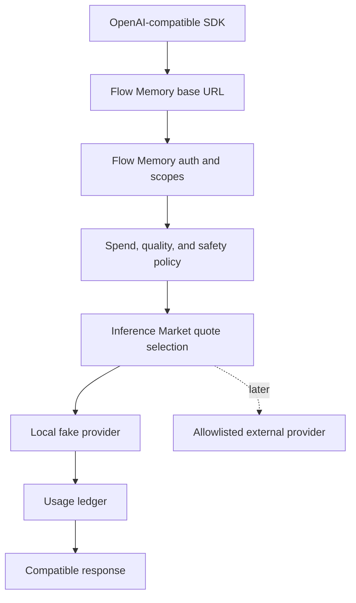
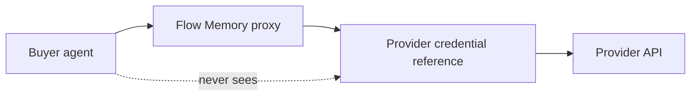

# Flow Memory Inference Proxy

The inference proxy is the one-line base URL adoption path. It exposes OpenAI-compatible local endpoints backed by a deterministic fake provider until external provider credentials are configured.



## Endpoints

- `GET /v1/models`
- `POST /v1/chat/completions`
- `POST /inference/proxy`

## Credential boundary



Raw provider credentials, private keys, seed phrases, live settlement flags, and broadcast flags are rejected.

## Local smoke

```bash
flow-memory inference proxy-smoke --model flow-local-small --task "hello" --json
```
