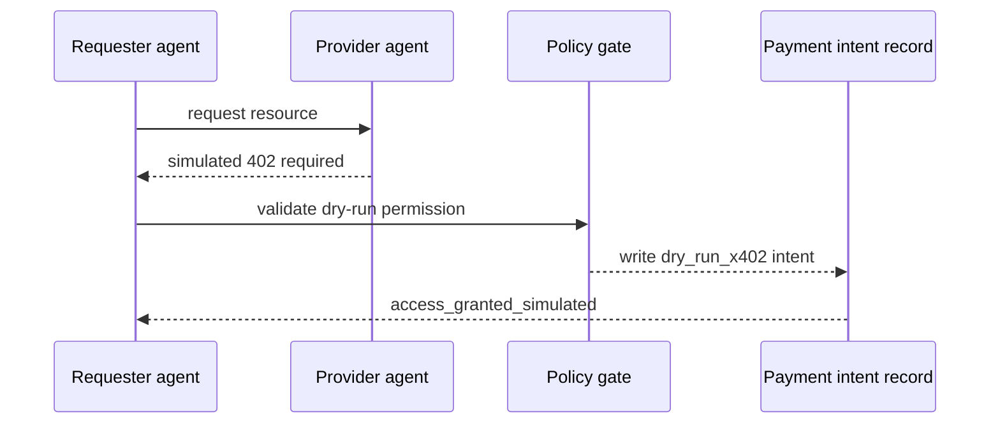
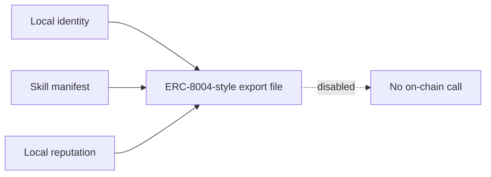

# MCP, x402, and ERC-8004 Adapter Seams

This public-alpha slice adds local adapter seams for tool manifests, dry-run payment intents, and registry-style exports. These are not live production integrations.

## MCP-style tool manifests

Flow Memory stores local MCP-style tool manifests with endpoint refs, schemas, permissions, risk level, optional descriptor hash, policy approval status, and quarantine status.

Security rules:

- no arbitrary tool execution by default
- descriptor integrity hash can be recorded
- risky permissions require review
- poisoned descriptors are quarantined
- MCP manifests do not bypass PolicyEngine or ApprovalGate

## x402 dry-run flow



The record sets `settlement_state= dry_run_only`, `no_private_key_required=true`, `no_broadcast=true`, and `no_funds_moved=true`.

## ERC-8004 export-only adapter



The export file includes identity registry adapter data, reputation registry adapter data, validation registry adapter data, and explicit invariants: no on-chain call, no private key, and no broadcast.

## CLI examples

```bash
python -m flow_memory internet mcp manifests list --json
python -m flow_memory internet payment-intent simulate --from mira --to helper-agent --resource skill_match --amount 0.01 --json
python -m flow_memory internet erc8004 export --agent helper-agent --out artifacts/agent_internet/erc8004/helper-agent.json --json
```
