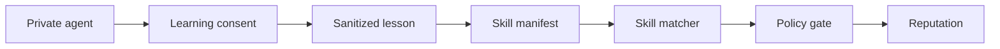

# Network Learning Protocol

The Network Learning Protocol defines how Flow Memory can turn local agent experience into structured, consented learning records.

The network grows from structured experience, not hidden raw data collection. More agents can create more prediction records, outcome records, lessons, benchmark traces, policy outcomes, Experience Graph edges, and Proof of Learning records. Only records allowed by the user's consent mode can become network contributions.

## Consent modes

Default mode is `private_only`.

| Mode | Meaning |
| --- | --- |
| `private_only` | Records stay local and private. |
| `sanitized_lessons` | Only sanitized lesson summaries may be prepared for review. |
| `anonymous_benchmark_traces` | Local deterministic benchmark traces may be contributed without raw private payloads. |
| `public_agent_genome` | The public genome can be shared without private memory. |
| `compute_node_contributor` | Optional node path for compute contribution metadata and local checks. |

Raw private payloads are not shared by default. Private memory is not shared by default.

## Contribution types

- prediction error
- experience
- consolidated lesson
- benchmark result
- policy denial
- memory retrieval signal
- public genome
- human teaching event

Each contribution stores:

- consent id
- contribution type
- sanitized payload
- raw-payload-excluded flag
- validation status
- usefulness score

## Experience Graph and Proof of Learning

The Experience Graph links consented/sanitized learning records into a local cause/effect graph. Proof of Learning records are derived from prediction-error-to-lesson edges and preserve the invariant that private payloads are excluded.

```text
GET /experience-graph
GET /proof-of-learning
GET /learning-reputation
```

## API

```text
GET /genesis/archetypes
GET /genesis/instincts
GET /genesis/boundaries
POST /genesis/birth
GET /genesis/agents/{agent_id}/passport
GET /genesis/agents/{agent_id}/genome
GET /genesis/agents/{agent_id}/mirror
POST /genesis/agents/{agent_id}/teaching
GET /genesis/contributions
POST /genesis/contributions/export
```

Scopes:

- `genesis:read`
- `genesis:create`
- `genesis:teach`
- `genesis:export`

## Optional node path

No download is required for the first agent concept. A local node is optional when the user wants private local tools, private compute, or compute contribution.

## Safety limits

The protocol does not bypass PolicyEngine or ApprovalGate. It does not use real funds, private keys, transaction broadcast, live settlement, or live provider calls.
## Agent Internet contribution path

Agent Internet uses network learning artifacts as structured, consented records: sanitized lessons, benchmark traces, public genomes, knowledge artifacts, and reputation events. Skill matching can use these summaries, but raw private memory remains excluded unless a future audited workflow explicitly changes consent.



Dry-run payment intents and ERC-8004-style exports are metadata records only in public alpha.

## Capability-upgrade privacy

Network learning does not require BYOK, wallet identity, or on-chain upgrade setup. The first agent does not require wallet/API key/funds. If optional upgrades exist, shared lessons and contribution bundles reference capability status only; raw credential material and private wallet signing data are excluded.
