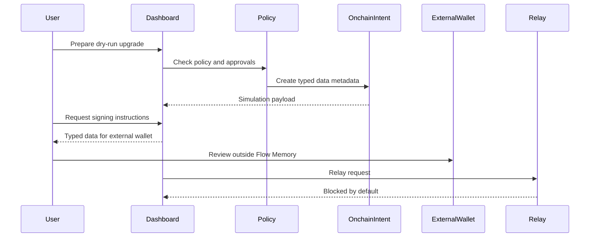
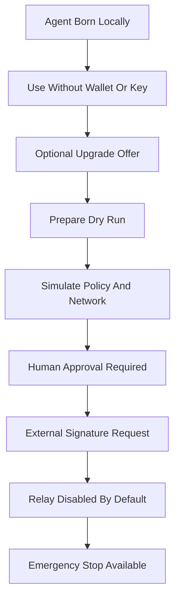

# On-chain agent upgrades

On-chain upgrade support is an optional dry-run path for agents that already exist. The first agent does not require wallet/API key/funds.

The public-alpha design separates prepare, external sign request, and relay. Flow Memory does not hold private keys, does not ask for seed phrases, does not move funds, and does not broadcast transactions.

Flow Memory Forge exposes on-chain upgrade controls only in Advanced mode after birth. `/forge` keeps the Simple first-agent path local and private by default; the on-chain card prepares and simulates Base Sepolia metadata only.

## Prepare / sign / relay



## Capability lifecycle



## Supported public-alpha networks

- Base Sepolia: default dry-run/testnet target.
- Base mainnet read-only: writes disabled.

## CLI examples

```powershell
python -m flow_memory wallet bind --agent genesis_agent_11b7e7b435abc729711373b0 --network base_sepolia --address 0x0000000000000000000000000000000000000000 --json
python -m flow_memory onchain upgrade prepare --agent genesis_agent_11b7e7b435abc729711373b0 --network base_sepolia --action register_agent --json
python -m flow_memory onchain upgrade simulate --intent <intent_id> --json
python -m flow_memory onchain upgrade sign-request --intent <intent_id> --json
python -m flow_memory onchain upgrade relay --intent <intent_id> --json
```

Relay returns blocked/dry-run-only by default.
