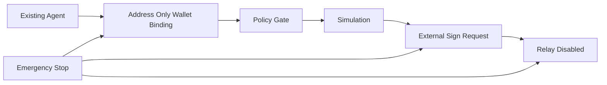
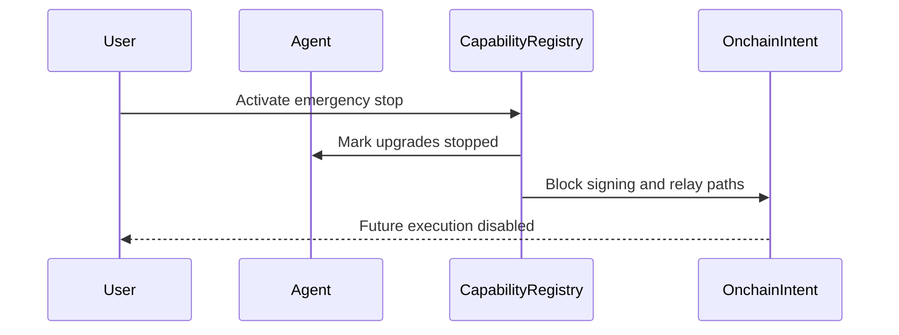

# Wallet safety

Flow Memory wallet support is an optional identity binding for existing agents. The first agent does not require wallet/API key/funds.

## Safety rules

- No private keys.
- No seed phrases.
- No funds movement.
- No transaction broadcast.
- Mainnet writes disabled.
- Token approvals disabled.
- Signing is an external wallet/user action only.
- Relay is disabled by default.
- PolicyEngine and ApprovalGate remain authoritative.
- Emergency stop can disable BYOK, wallet, on-chain, provider, and future execution modes.

## Emergency stop

## Dashboard

Mission Control shows a capability panel with:

- BYOK provider registry and fingerprinted credential status.
- Wallet binding status.
- Base Sepolia default and mainnet write disabled state.
- On-chain dry-run prepare/simulate/approval/sign-request/relay stages.
- Emergency stop status.
- Agent Internet capability projection.
