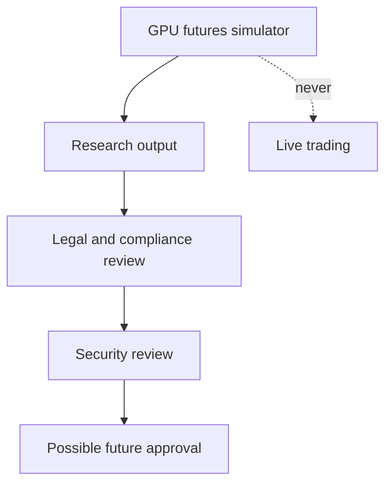

# GPU Futures Simulator compliance notes

Flow Memory GPU futures are simulation-only. They must not be represented as live derivatives, regulated futures, investment products, margin products, or collateralized trading.

Current guarantees:

- `live_trading_enabled=false`
- `funds_moved=false`
- `margin_allowed=false`
- `leverage_allowed=false`
- `legal_review_required=true`
- `compliance_review_required=true`
- no investment advice
