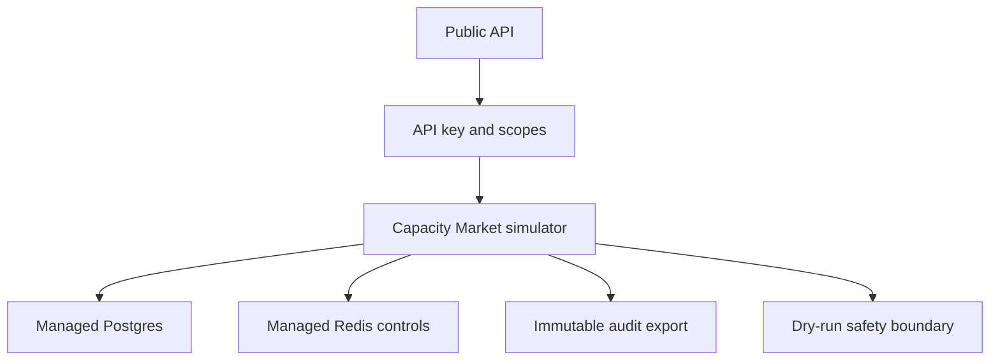

# Capacity Market deployment notes

Capacity Market public deployment is gated behind the same Level 1 Compute Market infrastructure: managed Postgres, managed Redis, API key scopes, immutable audit export, and public HTTPS.

Capacity reservations and forward capacity contracts are non-binding simulations until legal, compliance, and security review approve a future live product.
