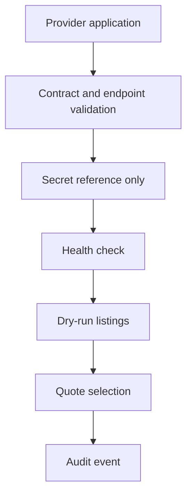
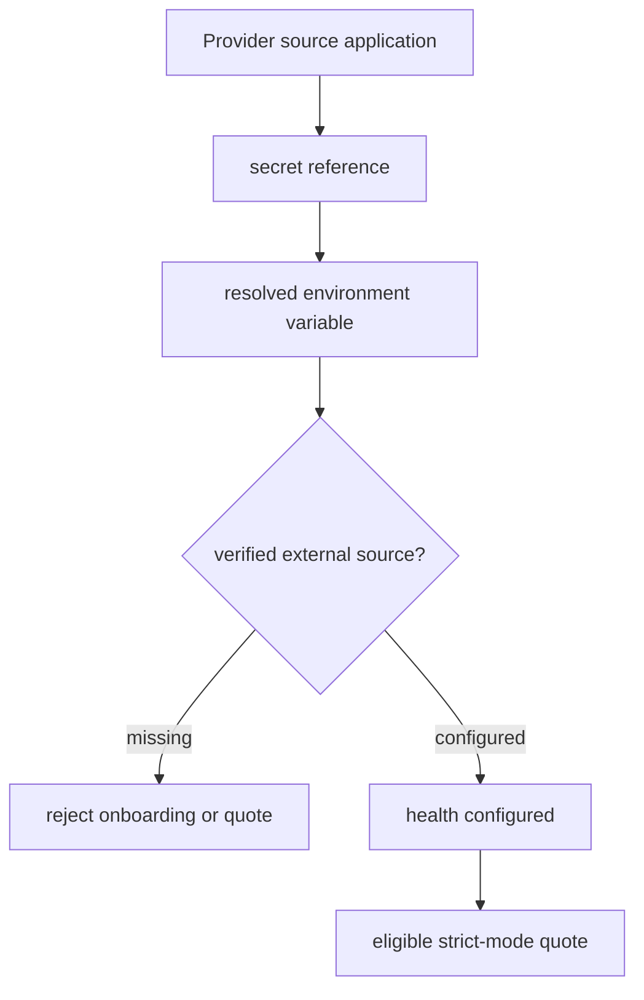

# Inference Market provider onboarding

Providers must be onboarded with secret references only. Raw API keys, private keys, seed phrases, wallet private keys, custody language, live settlement flags, broadcast flags, margin, leverage, and live futures payloads are rejected.

Credential references use the `secret://inference/<source-id>` form. In strict mode, the source id is sanitized to an environment variable name and must exist before a provider can be verified:

- `secret://inference/src-real-provider`
- `FLOW_MEMORY_INFERENCE_CREDENTIAL_SRC_REAL_PROVIDER`

The resolver reports only `configured`, `env_key`, and failure reason metadata. It never emits the environment value.

## Local default

The local fake provider is enabled for deterministic tests. External providers remain disabled by default until production secrets and allowlists exist.

## Credential resolution gate

Set `FLOW_MEMORY_INFERENCE_REQUIRE_RESOLVABLE_CREDENTIAL_REFS=true` in production-like rehearsals to reject unresolved external-source credentials during quote selection. This keeps dry-run local planning available by default while making provider onboarding fail closed when a verified external source lacks a real secret binding.

