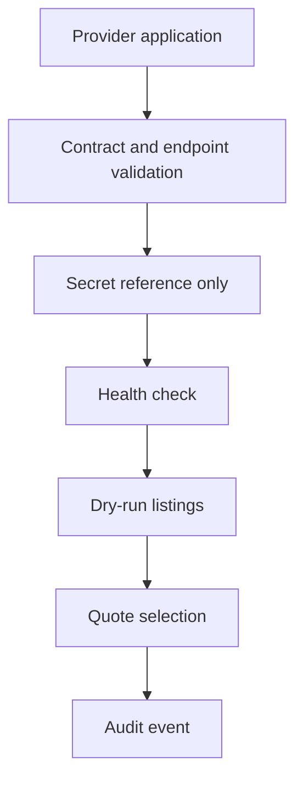

# Inference Market provider onboarding

Providers must be onboarded with secret references only. Raw API keys, private keys, seed phrases, wallet private keys, custody language, live settlement flags, broadcast flags, margin, leverage, and live futures payloads are rejected.

## Local default

The local fake provider is enabled for deterministic tests. External providers remain disabled by default until production secrets and allowlists exist.
