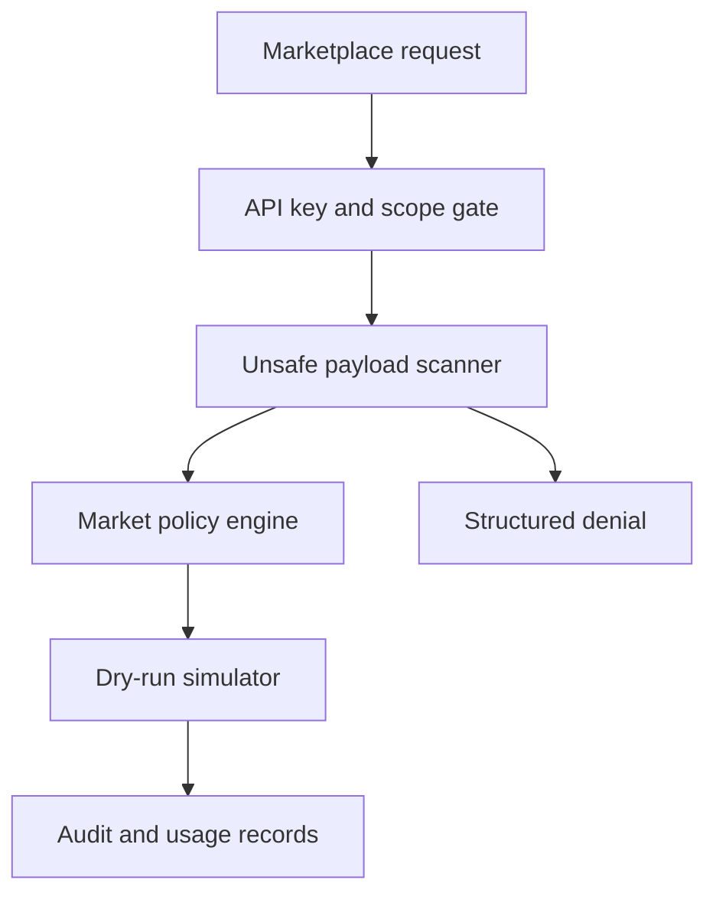
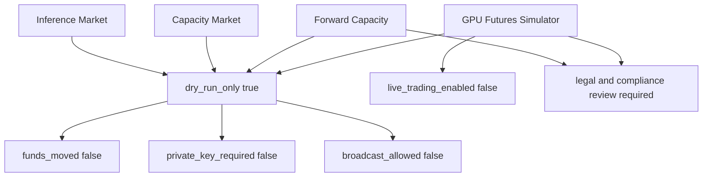

# Flow Memory marketplace safety audit

Date: 2026-05-26
Branch: `work/squire-v2`

This audit covers the Flow Memory marketplace buildout surface: inference market, OpenAI-compatible proxy, capacity market, forward-capacity simulator, GPU futures simulator, docs, and tests.



## Naming audit

Command run through the repository search tool:

```text
squire|Squire|SQUIRE|UsePod|podthesquire|square|Square|correlation|Correlation
```

Classification:

- Accepted: `AGENTS.md` and research docs explicitly mark Squire and UsePod as reference patterns only.
- Accepted: `docs/ops/MULTI_DAY_BUILDOUT_STATUS.md` contains branch name `work/squire-v2`.
- Accepted: `tests/test_compute_market_naming.py` contains banned-name assertions.
- Accepted: `src/flow_memory/neural/training/synthetic_motion_dataset.py` uses `square` as an unrelated geometric shape.
- No observed hit exposes reference branding in a Flow Memory public API path, CLI command, package name, OpenAPI tag, model name, or user-facing marketplace error.

Verification:

```text
python -m pytest tests/test_compute_market_naming.py tests/test_inference_capacity_futures_markets.py -q
22 passed
```

## Safety audit

Broad audit terms searched:

```text
private_key|seed phrase|seed_phrase|mnemonic|secret_key|wallet_private_key|broadcast|sendTransaction|signTransaction|mainnet|custody|transfer|withdraw|deposit|live_settlement|settle|settlement|margin|leverage|live futures
```

Classification:

- Accepted safety gates: marketplace services reject private keys, seed phrases, wallet private keys, live-settlement flags, broadcast flags, transfer requests, leverage, margin, and live futures requests.
- Accepted simulation fields: futures and forward-capacity records include `margin_required=false`, `leverage_allowed=false`, `live_trading_enabled=false`, `funds_moved=false`, legal review required, and compliance review required.
- Accepted docs: docs intentionally describe settlement, custody, mainnet, broadcast, margin, leverage, and live futures as disabled or future-review-only.
- Accepted API snapshots: simulation endpoints such as `/compute/simulate-settlement`, `/capacity/forwards/{contract_id}/simulate-settlement`, and `/futures/settlement/simulate` are explicitly simulation surfaces.
- Accepted tests: tests include unsafe strings to prove rejection behavior.
- Not accepted: no observed code path in the marketplace alpha enables live settlement, private-key custody, transaction broadcast, live futures, margin, leverage, or funds movement.

## Current safety invariant



## Focused verification

- `python -m pytest tests/test_compute_market_naming.py tests/test_inference_capacity_futures_markets.py -q` — 22 passed
- `python -m pytest tests/test_inference_capacity_futures_markets.py -q` — 17 passed
- `python -m ruff check src/flow_memory/inference_market/service.py src/flow_memory/capacity_market/service.py src/flow_memory/futures_market/service.py tests/test_inference_capacity_futures_markets.py` — OK
- `python -m mypy src/flow_memory/inference_market src/flow_memory/capacity_market src/flow_memory/futures_market tests/test_inference_capacity_futures_markets.py --config-file pyproject.toml` — OK
- `python scripts/check_compute_market_production.py` — ruff OK, mypy OK, 427 passed, 2 skipped

## External blockers still outside repo control

The audit does not prove public production deployment. Public Level 1 still requires external managed infrastructure and secrets: Render API credentials, managed Postgres URL, managed Redis URL, public HTTPS URL, production API key, and immutable audit export storage URI.
