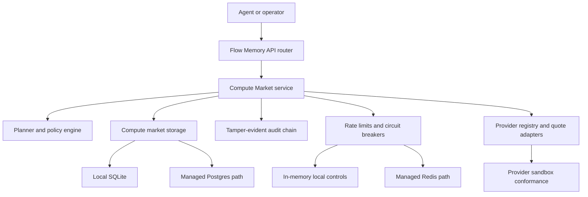
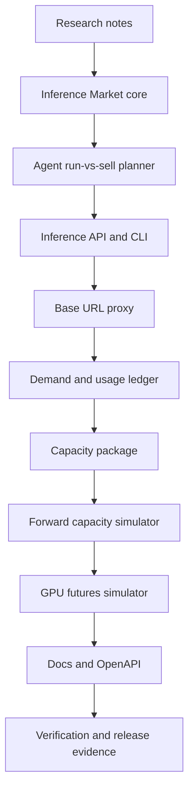
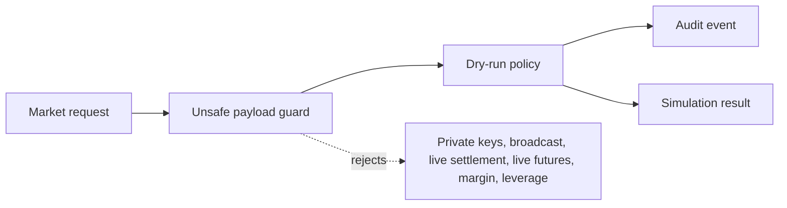
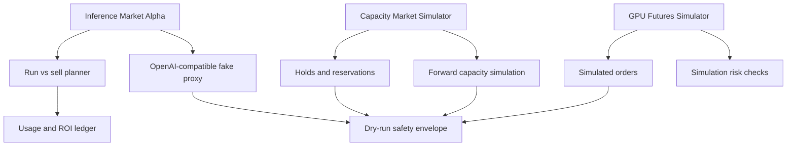
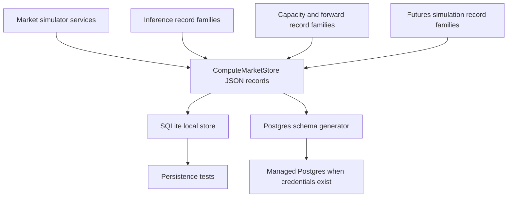

# Multi-day buildout status

Date: 2026-05-26
Branch: `work/squire-v2`
Latest inspected commit: `7819d2c Persist market simulator records`

## Current architecture

## What exists

- Compute Market planning, routing, dry-run payment planning, settlement simulation, audit, provider onboarding, quote validation, quote cache, quote drift, price history, price forecast, usage statements, jobs, billing ledger, capacity reservations, provider reputation, health/readiness, telemetry, alerts, Render deployment automation, Postgres path, and Redis path.
- Capacity reservations exist under `/market/capacity/*` and `flow-memory compute capacity ...`.
- Compute intelligence planning exists under `/compute/intelligence-plan` and `flow-memory compute intelligence-plan`.
- Safety defaults and live-settlement gates are implemented in Compute Market code and deployment validation.

## Partial areas

- Agent opportunity planning is currently buy-side/run-side; it lacks explicit inference resale and run-vs-sell decisions.
- Price forecasting exists, but forward capacity contracts and GPU futures simulation do not exist as first-class modules.
- Compute routes include inference-like units, but there is no Flow Memory Inference Market package, API family, or one-line compatible proxy yet.
- Deployment automation exists, but no real public managed Postgres, managed Redis, domain, TLS URL, production API key, object-lock audit storage, or Render API credentials are present in the environment.

## Missing buildout blocks

- Flow Memory Inference Market models and deterministic simulation fixtures.
- Agent treasury and run-vs-sell planner.
- `/inference/*` API surface and CLI commands.
- OpenAI-compatible base URL proxy path with fake provider default.
- Dedicated demand aggregation and inference price history.
- Dedicated capacity market package above existing Compute Market reservations.
- Forward capacity agreement simulator.
- GPU futures simulator with no live trading, margin, leverage, funds movement, or private keys.
- Standalone research notes, product thesis, and gap analysis for the interview reference pattern.
- Public deployment blocker document.

## Active blockers

- `RENDER_API_KEY` is not available.
- `FLOW_MEMORY_PUBLIC_API_URL` is not available.
- `FLOW_MEMORY_COMPUTE_DATABASE_URL` for managed Postgres is not available.
- `FLOW_MEMORY_COMPUTE_REDIS_URL` for managed Redis is not available.
- `FLOW_MEMORY_COMPUTE_AUDIT_EXPORT_URI` for immutable object storage is not available.
- No external provider credentials or allowlist are available.
- No billing provider credentials are available.
- No legal/compliance/security approval exists for live settlement, live forward-capacity instruments, or live futures.

## Planned work order

## Safety status

Current safe defaults remain required:

- `dry_run_only=true`
- `funds_moved=false`
- `broadcast_allowed=false`
- `private_key_required=false`
- `live_trading_enabled=false` for futures
- `legal_review_required=true` for forward capacity and futures
- `compliance_review_required=true` for forward capacity and futures

## Checkpoint 2026-05-26

Files added:

- `AGENTS.md`
- `docs/ops/MULTI_DAY_BUILDOUT_STATUS.md`

Tests run: pending for this checkpoint.
Commit: pending.
Next phase: research artifacts and inference market foundation.

## Checkpoint 2026-05-26 Inference, capacity, and futures alpha

Files changed:

- `src/flow_memory/inference_market/`
- `src/flow_memory/capacity_market/`
- `src/flow_memory/futures_market/`
- `src/flow_memory/api/router.py`
- `src/flow_memory/api/manifest.py`
- `src/flow_memory/api/scopes.py`
- `src/flow_memory/cli.py`
- `docs/API_SNAPSHOT.json`
- `docs/openapi/flow-memory.openapi.json`
- `tests/test_inference_capacity_futures_markets.py`

Tests run:

- `python -m pytest tests/test_inference_capacity_futures_markets.py -q`
- `python -m pytest tests/test_inference_capacity_futures_markets.py tests/test_api_openapi_snapshot.py tests/test_api_snapshot.py tests/test_compute_market_naming.py -q`
- `python -m pytest tests/test_api_auth.py tests/test_api_auth_scopes.py -q`
- `python -m ruff check src/flow_memory/inference_market src/flow_memory/capacity_market src/flow_memory/futures_market src/flow_memory/api/marketplace_endpoints.py tests/test_inference_capacity_futures_markets.py`
- `python scripts/check_compute_market_production.py`
- `python -m mypy src tests scripts --config-file pyproject.toml`

Commits:

- `2f88883 Add inference capacity futures simulators`

Safety status:

- Inference, capacity, forward-capacity, and futures behavior remains dry-run or simulation-only.
- External providers remain disabled by default.
- Futures remain non-live with legal and compliance review flags.

## Checkpoint 2026-05-26 Persistence follow-up

Files changed:

- `src/flow_memory/compute_market/storage.py`
- `src/flow_memory/compute_market/storage_backends.py`
- `src/flow_memory/inference_market/service.py`
- `src/flow_memory/capacity_market/service.py`
- `src/flow_memory/futures_market/service.py`
- `tests/test_inference_capacity_futures_markets.py`

Tests run:

- `python -m pytest tests/test_inference_capacity_futures_markets.py -q`
- `python -m ruff check src/flow_memory/inference_market/service.py src/flow_memory/capacity_market/service.py src/flow_memory/futures_market/service.py src/flow_memory/compute_market/storage.py src/flow_memory/compute_market/storage_backends.py tests/test_inference_capacity_futures_markets.py`
- `python -m mypy src/flow_memory/inference_market src/flow_memory/capacity_market src/flow_memory/futures_market src/flow_memory/compute_market src/flow_memory/api tests/test_inference_capacity_futures_markets.py --config-file pyproject.toml`
- `python scripts/check_compute_market_production.py`
- `git diff --check -- src/flow_memory/inference_market/service.py src/flow_memory/capacity_market/service.py src/flow_memory/futures_market/service.py src/flow_memory/compute_market/storage.py src/flow_memory/compute_market/storage_backends.py tests/test_inference_capacity_futures_markets.py`

Commits:

- `7819d2c Persist market simulator records`

Blockers:

- Public Level 1 deployment still requires external Render credentials, managed Postgres, managed Redis, public URL, API secret, object-lock audit URI, and production provider allowlist.
- Live provider quotes, live billing, live settlement, and live futures remain intentionally blocked.

