# Multi-day buildout status

Date: 2026-05-26
Branch: `work/squire-v2`
Latest inspected commit: `03c072c Assert Redis nonce TLS config binding`

## Current architecture

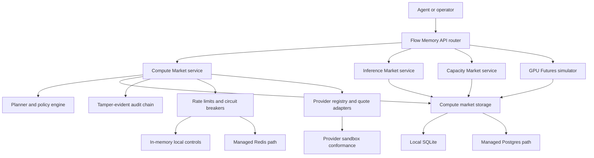

## What exists

- Compute Market planning, routing, dry-run payment planning, settlement simulation, audit, provider onboarding, quote validation, quote cache, quote drift, price history, price forecast, usage statements, jobs, billing ledger, capacity reservations, provider reputation, health/readiness, telemetry, alerts, Render deployment automation, Postgres path, and Redis path.
- Flow Memory Inference Market models, deterministic resale fixtures, run-vs-sell opportunity planner, OpenAI-compatible fake proxy path, demand snapshots, usage records, API endpoints, CLI commands, lazy API binding to the active compute-market store, and persistence-backed record families.
- Flow Memory Capacity Market and Forward Capacity simulators exist with dry-run inventory, quotes, holds, reservations, delivery schedules, settlement simulation records, CLI commands, APIs, lazy API binding to the active compute-market store, and persistence-backed record families.
- Flow Memory GPU Futures Simulator exists with simulated contracts, orders, positions, mark/index prices, risk checks, delivery/expiry/settlement simulations, CLI commands, APIs, lazy API binding to the active compute-market store, and persistence-backed record families.
- Safety defaults and live-settlement gates are implemented in Compute Market code, market simulators, docs, and deployment validation.

## Partial areas

- The new inference, capacity, forward-capacity, and futures services are simulator-grade; real provider credentials, real provider execution, and real billing providers are not bound.
- New market API services now attach lazily to the active compute-market store, so public API traffic uses the configured SQLite/Postgres storage path instead of a detached process-only singleton.
- Deployment automation exists, but no real public managed Postgres, managed Redis, domain, TLS URL, production API key, object-lock audit storage, or Render API credentials are present in the environment.

## Missing buildout blocks

- Real external inference credit seller onboarding and provider credential operations.
- Real provider quote ingestion with production credentials and allowlists.
- Real compute execution against external providers and artifact storage.
- External billing/prepaid credits with webhook credentials.
- Immutable object-lock audit storage binding.
- JWT/OIDC/API gateway production integration beyond API key and scope headers.
- Public Level 1 deployment and smoke tests against a managed Postgres and managed Redis URL.
- Legal/compliance/security review for any future live settlement, forward-capacity, or futures path.

## Active blockers

- `RENDER_API_KEY` is not available.
- `FLOW_MEMORY_PUBLIC_API_URL` is not available.
- `FLOW_MEMORY_COMPUTE_DATABASE_URL` for managed Postgres is not available.
- `FLOW_MEMORY_COMPUTE_REDIS_URL` for managed Redis is not available.
- `FLOW_MEMORY_COMPUTE_AUDIT_EXPORT_URI` for immutable object storage is not available.
- No external provider credentials or allowlist are available.
- No billing provider credentials are available.
- No legal/compliance/security approval exists for live settlement, live forward-capacity instruments, or live futures.

## Planned work order

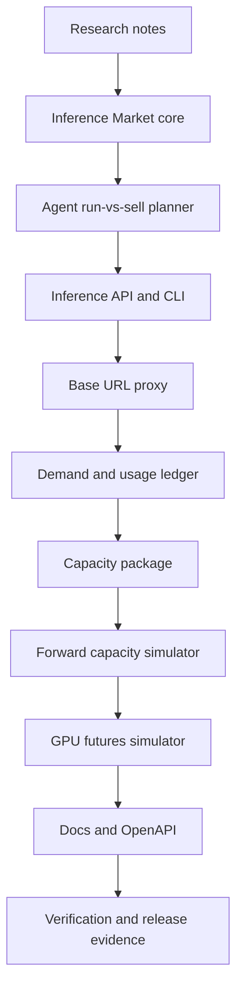

## Safety status

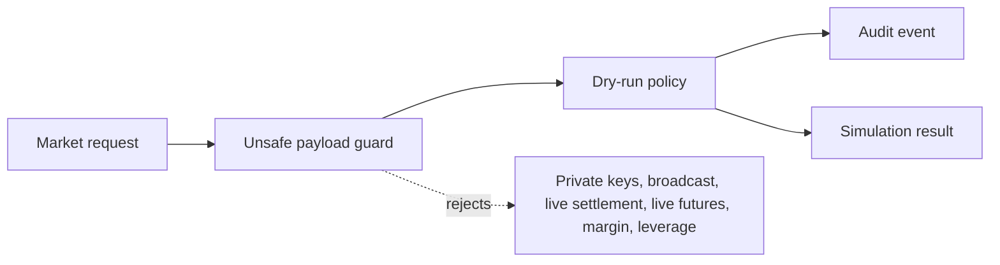

Current safe defaults remain required:

- `dry_run_only=true`
- `funds_moved=false`
- `broadcast_allowed=false`
- `private_key_required=false`
- `live_trading_enabled=false` for futures
- `legal_review_required=true` for forward capacity and futures
- `compliance_review_required=true` for forward capacity and futures

## Checkpoint 2026-05-26

Files added:

- `AGENTS.md`
- `docs/ops/MULTI_DAY_BUILDOUT_STATUS.md`

Tests run: pending for this checkpoint.
Commit: pending.
Next phase: research artifacts and inference market foundation.

## Checkpoint 2026-05-26 Inference, capacity, and futures alpha

Files changed:

- `src/flow_memory/inference_market/`
- `src/flow_memory/capacity_market/`
- `src/flow_memory/futures_market/`
- `src/flow_memory/api/router.py`
- `src/flow_memory/api/manifest.py`
- `src/flow_memory/api/scopes.py`
- `src/flow_memory/cli.py`
- `docs/API_SNAPSHOT.json`
- `docs/openapi/flow-memory.openapi.json`
- `tests/test_inference_capacity_futures_markets.py`

Tests run:

- `python -m pytest tests/test_inference_capacity_futures_markets.py -q`
- `python -m pytest tests/test_inference_capacity_futures_markets.py tests/test_api_openapi_snapshot.py tests/test_api_snapshot.py tests/test_compute_market_naming.py -q`
- `python -m pytest tests/test_api_auth.py tests/test_api_auth_scopes.py -q`
- `python -m ruff check src/flow_memory/inference_market src/flow_memory/capacity_market src/flow_memory/futures_market src/flow_memory/api/marketplace_endpoints.py tests/test_inference_capacity_futures_markets.py`
- `python scripts/check_compute_market_production.py`
- `python -m mypy src tests scripts --config-file pyproject.toml`

Commits:

- `2f88883 Add inference capacity futures simulators`

Safety status:

- Inference, capacity, forward-capacity, and futures behavior remains dry-run or simulation-only.
- External providers remain disabled by default.
- Futures remain non-live with legal and compliance review flags.

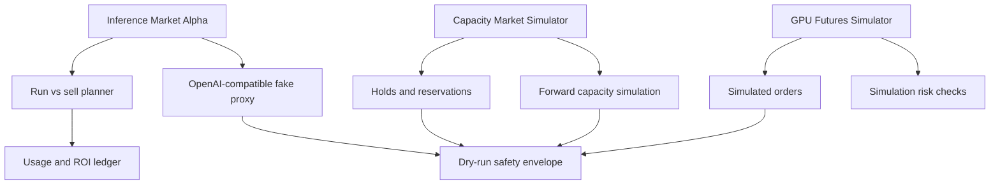

## Checkpoint 2026-05-26 Persistence follow-up

Files changed:

- `src/flow_memory/compute_market/storage.py`
- `src/flow_memory/compute_market/storage_backends.py`
- `src/flow_memory/inference_market/service.py`
- `src/flow_memory/capacity_market/service.py`
- `src/flow_memory/futures_market/service.py`
- `tests/test_inference_capacity_futures_markets.py`

Tests run:

- `python -m pytest tests/test_inference_capacity_futures_markets.py -q`
- `python -m ruff check src/flow_memory/inference_market/service.py src/flow_memory/capacity_market/service.py src/flow_memory/futures_market/service.py src/flow_memory/compute_market/storage.py src/flow_memory/compute_market/storage_backends.py tests/test_inference_capacity_futures_markets.py`
- `python -m mypy src/flow_memory/inference_market src/flow_memory/capacity_market src/flow_memory/futures_market src/flow_memory/compute_market src/flow_memory/api tests/test_inference_capacity_futures_markets.py --config-file pyproject.toml`
- `python scripts/check_compute_market_production.py`
- `git diff --check -- src/flow_memory/inference_market/service.py src/flow_memory/capacity_market/service.py src/flow_memory/futures_market/service.py src/flow_memory/compute_market/storage.py src/flow_memory/compute_market/storage_backends.py tests/test_inference_capacity_futures_markets.py`

Commits:

- `7819d2c Persist market simulator records`

Blockers:

- Public Level 1 deployment still requires external Render credentials, managed Postgres, managed Redis, public URL, API secret, object-lock audit URI, and production provider allowlist.
- Live provider quotes, live billing, live settlement, and live futures remain intentionally blocked.

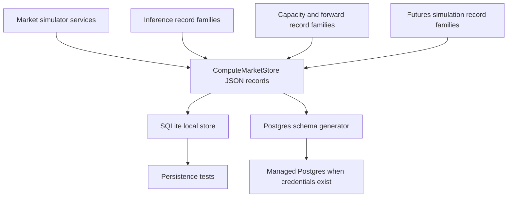

## Checkpoint 2026-05-26 Inference admin hardening

Files changed:

- `src/flow_memory/inference_market/service.py`
- `src/flow_memory/api/marketplace_endpoints.py`
- `tests/test_inference_capacity_futures_markets.py`

Tests run:

- `python -m pytest tests/test_inference_capacity_futures_markets.py -q`
- `python -m ruff check src/flow_memory/inference_market/service.py src/flow_memory/api/marketplace_endpoints.py tests/test_inference_capacity_futures_markets.py`
- `python -m mypy src/flow_memory/inference_market src/flow_memory/api/marketplace_endpoints.py tests/test_inference_capacity_futures_markets.py --config-file pyproject.toml`
- `python scripts/check_compute_market_production.py`
- `python -m mypy src tests scripts --config-file pyproject.toml`
- `git diff --check -- src/flow_memory/inference_market/service.py src/flow_memory/api/marketplace_endpoints.py tests/test_inference_capacity_futures_markets.py`

Commits:

- `51fe87e Harden inference market admin endpoints`

Implementation:

- Inference credit account creation, source create/update/disable/health, cancel-listing, and demand snapshot endpoints now delegate to stateful service methods.
- These state changes persist through the same compute-market record store when a store is attached.
- Raw provider credentials are rejected; `credential_ref` remains the only accepted secret reference field.

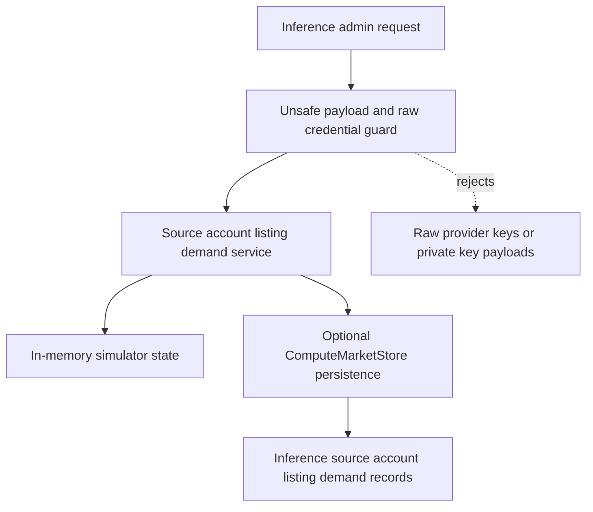

## Checkpoint 2026-05-26 CLI alias coverage

Files changed:

- `src/flow_memory/cli.py`
- `tests/test_inference_capacity_futures_markets.py`
- `docs/INFERENCE_MARKET.md`
- `docs/CAPACITY_MARKET.md`

Tests run:

- `python -m pytest tests/test_inference_capacity_futures_markets.py -q`
- `python -m ruff check src/flow_memory/cli.py tests/test_inference_capacity_futures_markets.py src/flow_memory/inference_market/service.py src/flow_memory/api/marketplace_endpoints.py`
- `python -m mypy src/flow_memory/cli.py src/flow_memory/inference_market src/flow_memory/api/marketplace_endpoints.py tests/test_inference_capacity_futures_markets.py --config-file pyproject.toml`
- `python scripts/check_compute_market_production.py`

Commits:

- `939ad0b Add nested market CLI aliases`

Implementation:

- `flow-memory inference credits list`
- `flow-memory inference credits buy`
- `flow-memory inference credits sell`
- `flow-memory capacity forward quote`
- `flow-memory capacity forward simulate`
- `flow-memory capacity forward simulate-delivery`
- `flow-memory capacity forward list`
- `flow-memory capacity index`
- `flow-memory capacity forward-curve`

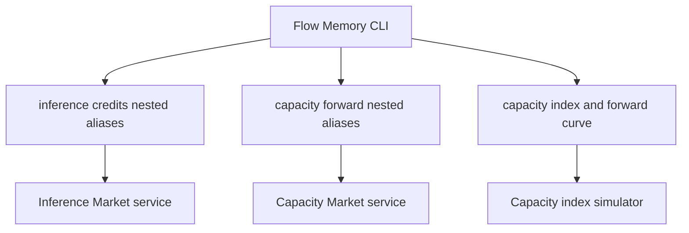

## Checkpoint 2026-05-26 Marketplace API persistence binding

Files changed:

- `src/flow_memory/api/marketplace_endpoints.py`
- `tests/test_inference_capacity_futures_markets.py`

Tests run:

- `python -m pytest tests/test_inference_capacity_futures_markets.py -q`
- `python -m ruff check src/flow_memory/api/marketplace_endpoints.py tests/test_inference_capacity_futures_markets.py`
- `python -m mypy src/flow_memory/api/marketplace_endpoints.py src/flow_memory/inference_market src/flow_memory/capacity_market src/flow_memory/futures_market tests/test_inference_capacity_futures_markets.py --config-file pyproject.toml`
- `python -m pytest tests/test_api_auth.py tests/test_api_auth_scopes.py tests/test_api_openapi_snapshot.py tests/test_api_snapshot.py -q`
- `python scripts/check_compute_market_production.py`
- `git diff --check -- src/flow_memory/api/marketplace_endpoints.py tests/test_inference_capacity_futures_markets.py docs/ops/MULTI_DAY_BUILDOUT_STATUS.md`

Commit:

- `27e2baf Bind market APIs to compute store`

Implementation:

- `/inference/*`, `/capacity/*`, `/capacity/forwards/*`, and `/futures/*` endpoint adapters now lazily bind their simulator services to `default_service().store`.
- The endpoint adapters rebuild their service wrapper when the active compute-market service changes, which keeps tests and production configuration aligned.
- API regression coverage verifies inference admin source creation, capacity reservation, and futures simulated orders persist to the active compute-market store.

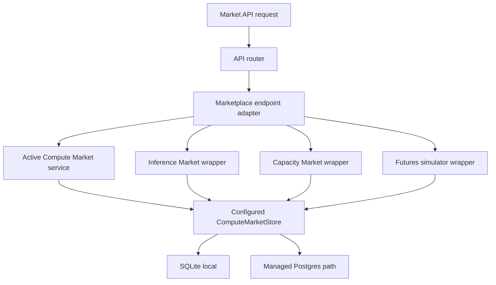

## Checkpoint 2026-05-26 Anthropic-compatible proxy

Files changed:

- `src/flow_memory/inference_market/service.py`
- `src/flow_memory/api/marketplace_endpoints.py`
- `src/flow_memory/api/router.py`
- `src/flow_memory/api/manifest.py`
- `docs/API_SNAPSHOT.json`
- `docs/openapi/flow-memory.openapi.json`
- `docs/INFERENCE_PROXY.md`
- `tests/test_inference_capacity_futures_markets.py`

Tests run:

- `python -m pytest tests/test_inference_capacity_futures_markets.py tests/test_api_openapi_snapshot.py tests/test_api_snapshot.py tests/test_compute_market_naming.py -q`
- `python -m ruff check src/flow_memory/inference_market/service.py src/flow_memory/api/marketplace_endpoints.py src/flow_memory/api/router.py src/flow_memory/api/manifest.py tests/test_inference_capacity_futures_markets.py`
- `python -m mypy src/flow_memory/inference_market src/flow_memory/api/marketplace_endpoints.py src/flow_memory/api/manifest.py tests/test_inference_capacity_futures_markets.py --config-file pyproject.toml`
- `python scripts/check_compute_market_production.py`

Commit:

- `5cd3f98 Add Anthropic-compatible inference proxy`

Implementation:

- Added a seeded Anthropic-compatible credit source, balance, and listing for the local dry-run marketplace.
- Added `GET /anthropic/v1/models` and `POST /anthropic/v1/messages`.
- OpenAI and Anthropic proxy responses now attach an inference usage record and persist it through the active compute-market store.
- External provider credentials remain disabled by default; the proxy still uses deterministic fake provider output.

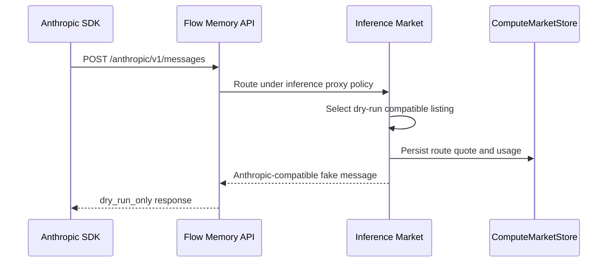

## Checkpoint 2026-05-26 Marketplace audit-chain binding

Files changed:

- `src/flow_memory/inference_market/service.py`
- `src/flow_memory/capacity_market/service.py`
- `src/flow_memory/futures_market/service.py`
- `tests/test_inference_capacity_futures_markets.py`

Tests run:

- `python -m pytest tests/test_inference_capacity_futures_markets.py -q`
- `python -m ruff check src/flow_memory/inference_market/service.py src/flow_memory/capacity_market/service.py src/flow_memory/futures_market/service.py tests/test_inference_capacity_futures_markets.py`
- `python -m mypy src/flow_memory/inference_market src/flow_memory/capacity_market src/flow_memory/futures_market tests/test_inference_capacity_futures_markets.py --config-file pyproject.toml`
- `python scripts/check_compute_market_production.py`

Commit:

- `c89b318 Bind market actions to audit chains`

Implementation:

- Inference market buy, sell, opportunity-cost, OpenAI proxy, and Anthropic proxy operations now append tamper-evident audit events when a compute-market store is attached.
- Capacity hold, reserve, release, forward draft, forward simulation, and delivery simulation now append tamper-evident audit events when a compute-market store is attached.
- Futures simulated orders, cancellations, risk checks, expiry, delivery, and settlement simulations now append tamper-evident audit events when a compute-market store is attached.
- Regression tests verify `inference-market`, `capacity-market`, and `futures-simulator` audit chains survive store reopen and pass hash-chain verification.

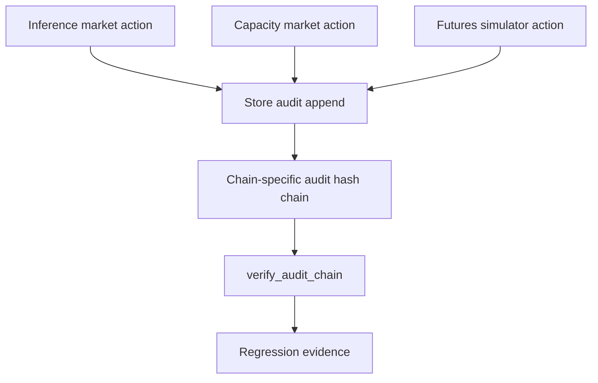

## Checkpoint 2026-05-26 Proxy scope and streaming hardening

Files changed:

- `src/flow_memory/inference_market/service.py`
- `tests/test_inference_capacity_futures_markets.py`

Tests run:

- `python -m pytest tests/test_inference_capacity_futures_markets.py -q`
- `python -m ruff check src/flow_memory/inference_market/service.py tests/test_inference_capacity_futures_markets.py`
- `python -m mypy src/flow_memory/inference_market tests/test_inference_capacity_futures_markets.py --config-file pyproject.toml`
- `python scripts/check_compute_market_production.py`

Commit:

- `dabba23 Harden inference proxy scope behavior`

Implementation:

- OpenAI-compatible and Anthropic-compatible proxy responses now include a deterministic `request_id`.
- If a caller asks for streaming while the local fake provider path is active, the response explicitly returns `streaming_not_implemented` inside `flow_memory.warnings` instead of silently pretending to stream.
- HTTP gateway coverage now verifies the Anthropic-compatible proxy requires `inference:proxy`, denies `inference:read`, records usage, and leaves the inference audit chain valid.

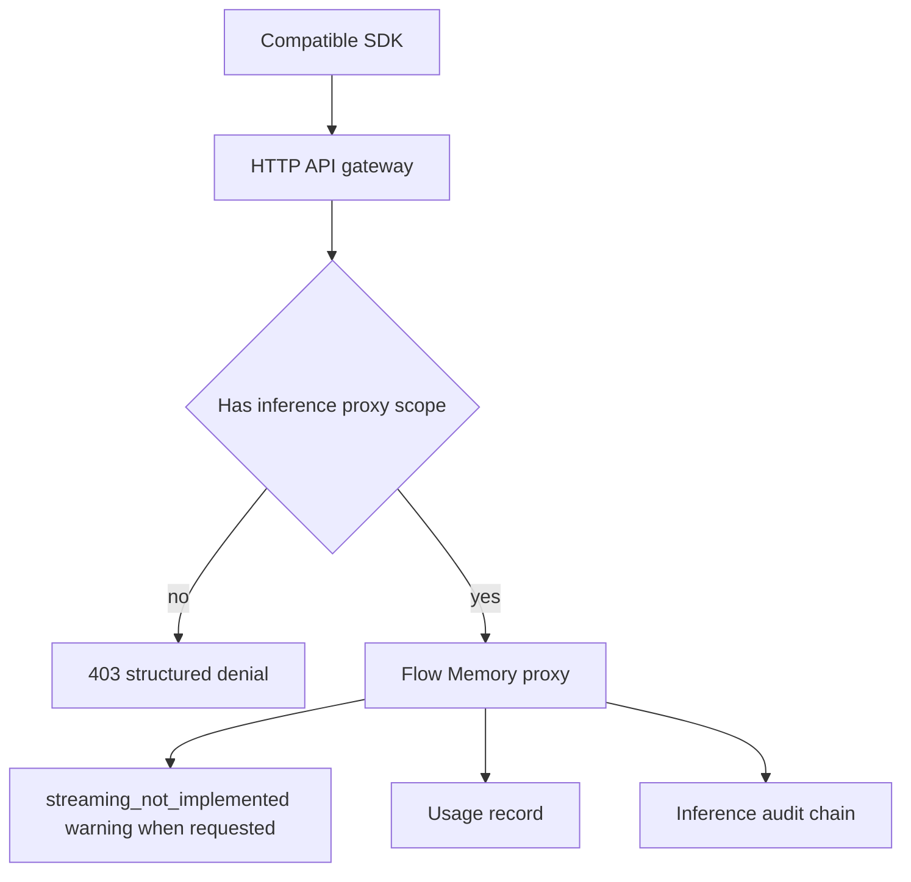

## Checkpoint 2026-05-26 Demand and price intelligence aliases

Files changed:

- `src/flow_memory/inference_market/service.py`
- `src/flow_memory/api/marketplace_endpoints.py`
- `src/flow_memory/api/router.py`
- `src/flow_memory/api/manifest.py`
- `docs/API_SNAPSHOT.json`
- `docs/openapi/flow-memory.openapi.json`
- `docs/INFERENCE_MARKET.md`
- `tests/test_inference_capacity_futures_markets.py`

Tests run:

- `python -m pytest tests/test_inference_capacity_futures_markets.py tests/test_api_openapi_snapshot.py tests/test_api_snapshot.py tests/test_compute_market_naming.py -q`
- `python -m ruff check src/flow_memory/inference_market/service.py src/flow_memory/api/marketplace_endpoints.py src/flow_memory/api/router.py src/flow_memory/api/manifest.py tests/test_inference_capacity_futures_markets.py`
- `python -m mypy src/flow_memory/inference_market src/flow_memory/api/marketplace_endpoints.py src/flow_memory/api/manifest.py tests/test_inference_capacity_futures_markets.py --config-file pyproject.toml`
- `python scripts/check_compute_market_production.py`

Commit:

- `3babbb1 Add inference demand price intelligence`

Implementation:

- Added demand aggregation endpoints: `GET /inference/demand`, `GET /inference/demand/summary`, and `POST /inference/demand/forecast`.
- Added price intelligence endpoints: `GET /inference/prices`, `GET /inference/prices/history`, `GET /inference/prices/spreads`, `GET /inference/prices/anomalies`, and `POST /inference/prices/forecast`.
- Added deterministic summaries and forecasts so agents can inspect demand before deciding whether to buy, sell, defer, or reserve.

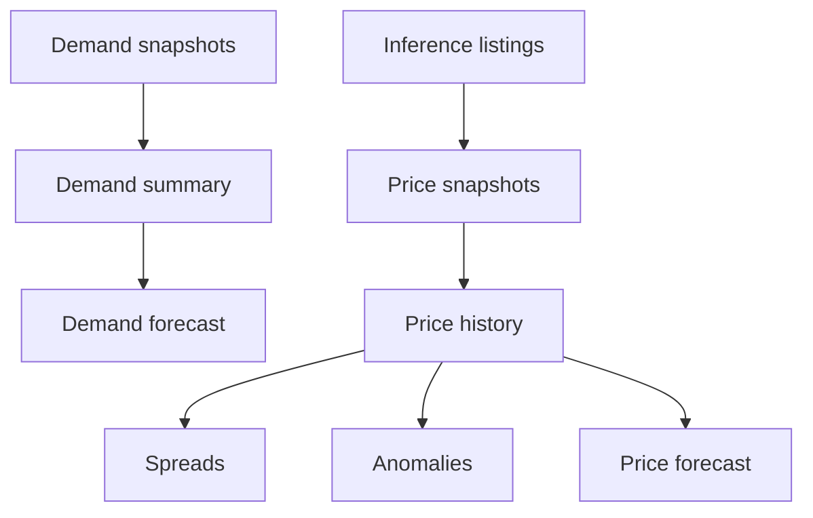

## Checkpoint 2026-05-26 Inference intelligence CLI

Files changed:

- `src/flow_memory/cli.py`
- `docs/INFERENCE_MARKET.md`
- `tests/test_inference_capacity_futures_markets.py`

Tests run:

- `python -m pytest tests/test_inference_capacity_futures_markets.py -q`
- `python -m ruff check src/flow_memory/cli.py tests/test_inference_capacity_futures_markets.py`
- `python -m mypy src/flow_memory/cli.py tests/test_inference_capacity_futures_markets.py --config-file pyproject.toml`
- `python scripts/check_compute_market_production.py`

Commit:

- `15f5820 Add inference intelligence CLI commands`

Implementation:

- Added inference CLI commands for demand summaries, demand forecasts, price history, price spreads, price anomalies, and price forecasts.
- Regression tests verify JSON CLI output for demand summary and price forecast.
- CLI remains dry-run and does not prompt for settlement, private keys, or provider credentials.

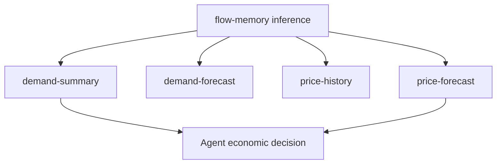

## Checkpoint 2026-05-26 Inference credit accounting

Files changed:

- `src/flow_memory/inference_market/service.py`
- `src/flow_memory/compute_market/storage.py`
- `src/flow_memory/compute_market/storage_backends.py`
- `docs/INFERENCE_MARKET.md`
- `tests/test_inference_capacity_futures_markets.py`

Tests run:

- `python -m pytest tests/test_inference_capacity_futures_markets.py -q`
- `python -m ruff check src/flow_memory/inference_market/service.py src/flow_memory/compute_market/storage.py src/flow_memory/compute_market/storage_backends.py tests/test_inference_capacity_futures_markets.py`
- `python -m mypy src/flow_memory/inference_market src/flow_memory/compute_market/storage.py src/flow_memory/compute_market/storage_backends.py tests/test_inference_capacity_futures_markets.py --config-file pyproject.toml`
- `python scripts/check_compute_market_production.py`

Commit:

- `3fd7cd7 Harden inference credit accounting`

Implementation:

- Inference credit buys now enforce `max_unit_price`, reject zero-fill listings, decrement listing inventory, and mark fully consumed listings filled.
- Seller inference credit balances now decrement when a matching balance exists.
- Buyer debit and seller credit ledger entries persist under the new `inference_credit_ledger_entry` record family.
- Seeded marketplace records no longer overwrite existing persisted records when a service is reconstructed against a store.

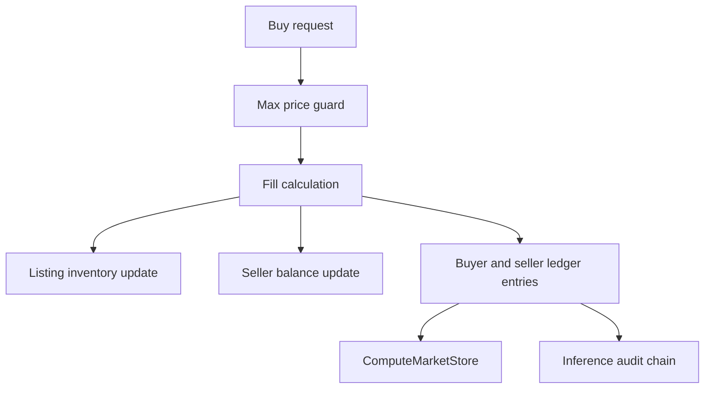

## Checkpoint 2026-05-26 Capacity reservation accounting

Files changed:

- `src/flow_memory/capacity_market/service.py`
- `tests/test_inference_capacity_futures_markets.py`
- `docs/CAPACITY_MARKET.md`

Tests run:

- `python -m pytest tests/test_inference_capacity_futures_markets.py -q` — 16 passed
- `python -m ruff check src/flow_memory/capacity_market/service.py tests/test_inference_capacity_futures_markets.py` — OK
- `python -m mypy src/flow_memory/capacity_market tests/test_inference_capacity_futures_markets.py --config-file pyproject.toml` — OK
- `python scripts/check_compute_market_production.py` — ruff OK, mypy OK, 427 passed, 2 skipped
- `git diff --check -- src/flow_memory/capacity_market/service.py tests/test_inference_capacity_futures_markets.py docs/CAPACITY_MARKET.md docs/ops/MULTI_DAY_BUILDOUT_STATUS.md` — clean

Commit:

- `46c5c43 Harden capacity reservation accounting`

Implementation:

- Capacity holds decrement the selected capacity window's available units and persist the updated window.
- Repeated holds and releases are idempotent, so retries cannot double-consume or double-restore simulated capacity.
- Reservation release restores available capacity once, marks the hold released, and excludes released reservations from active utilization.

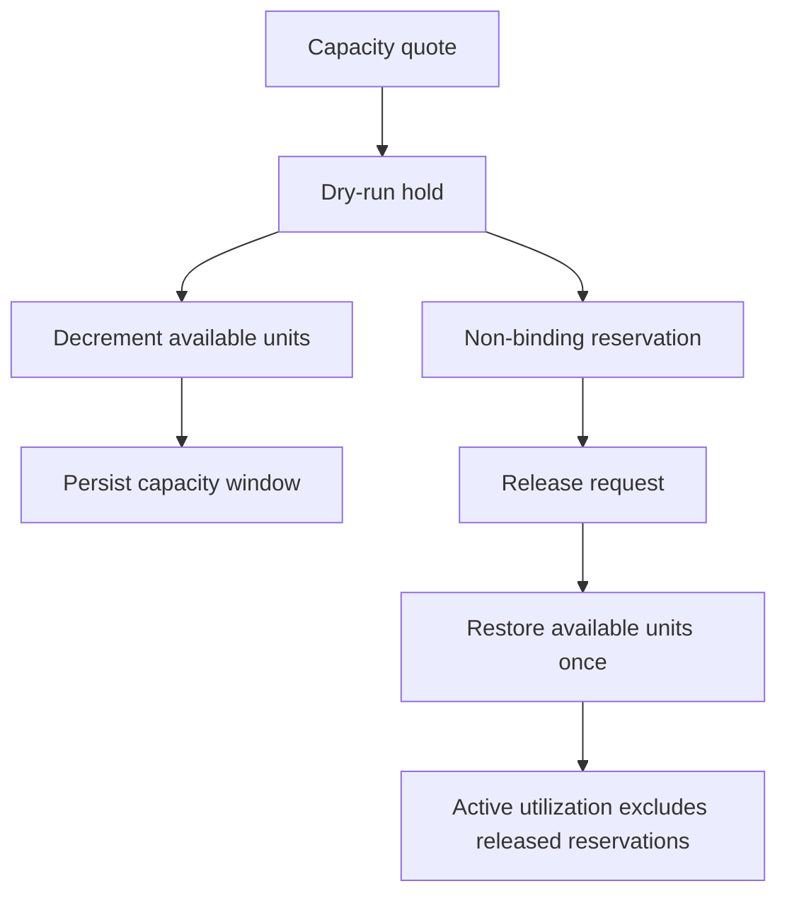

## Checkpoint 2026-05-26 Public marketplace alpha smoke option

Files changed:

- `scripts/smoke_compute_market_public.ps1`
- `tests/test_compute_market_live_deployment.py`
- `docs/ops/PUBLIC_DEPLOYMENT_BLOCKERS.md`

Tests run:

- `python -m pytest tests/test_compute_market_live_deployment.py::test_public_smoke_script_validates_gateway_jwt_when_configured -q` — 1 passed
- `python -m ruff check tests/test_compute_market_live_deployment.py` — OK
- `python -m pytest tests/test_compute_market_live_deployment.py -q` — 49 passed
- `python scripts/check_compute_market_production.py` — ruff OK, mypy OK, 427 passed, 2 skipped
- `git diff --check -- scripts/smoke_compute_market_public.ps1 tests/test_compute_market_live_deployment.py` — clean except Git line-ending warning for the PowerShell file

Commit: `df0c3bb Add marketplace alpha public smoke option`.

Implementation:

- Public Level 1 smoke remains compute-first by default.
- Optional `-IncludeMarketAlpha` adds inference opportunity-cost, inference order-book, OpenAI-compatible proxy, capacity inventory, and futures-market checks.
- Optional marketplace alpha checks assert dry-run and no-funds safety fields instead of implying live provider, billing, settlement, or futures readiness.

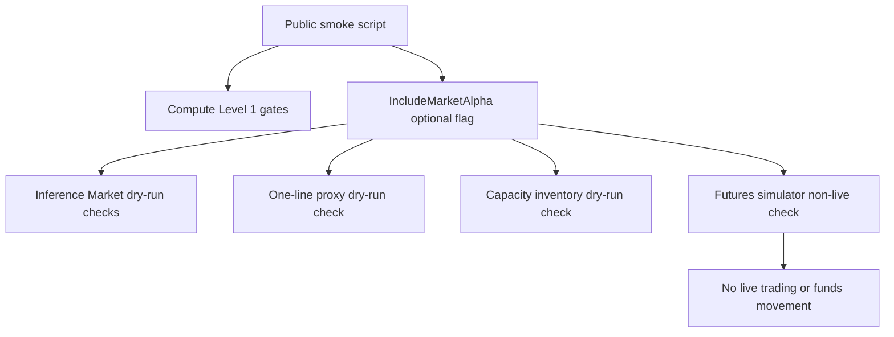

## Checkpoint 2026-05-26 Full typing evidence

Files changed:

- `docs/ops/MULTI_DAY_BUILDOUT_STATUS.md`

Tests run:

- `python -m mypy src tests scripts --config-file pyproject.toml` — OK

Commit: `95a63b2 Document full mypy evidence`.

Implementation:

- Full repository Python typing was rechecked after the latest marketplace, deployment smoke, and capacity-accounting commits.
- This updates the quality evidence from the older "legacy full-repo mypy remains failing" state to an observed passing full-repo mypy run for the current checkout.

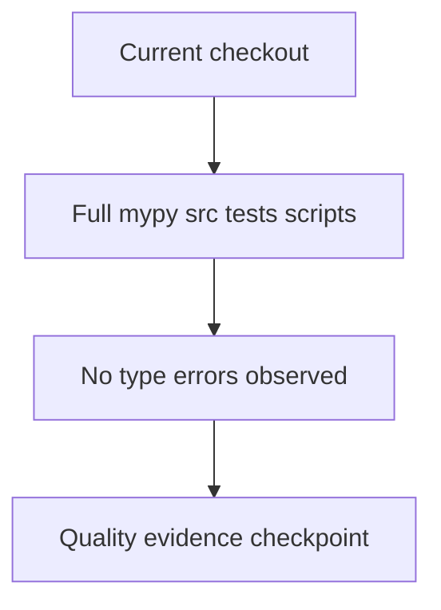

## Checkpoint 2026-05-26 Render marketplace alpha smoke parity

Files changed:

- `scripts/deploy_compute_market_render_level1.py`
- `tests/test_compute_market_live_deployment.py`

Tests run:

- `python -m pytest tests/test_compute_market_live_deployment.py -q` — 49 passed
- `python -m ruff check scripts/deploy_compute_market_render_level1.py tests/test_compute_market_live_deployment.py` — OK
- `python -m mypy scripts/deploy_compute_market_render_level1.py tests/test_compute_market_live_deployment.py --config-file pyproject.toml` — OK
- `python scripts/check_compute_market_production.py` — ruff OK, mypy OK, 427 passed, 2 skipped

Commit: `7de355f Add Render marketplace alpha smoke gate`.

Implementation:

- Render deployment helper gained optional marketplace-alpha public smoke checks through `--include-market-alpha-smoke` or `FLOW_MEMORY_PUBLIC_SMOKE_INCLUDE_MARKET_ALPHA=true`.
- The optional smoke gate validates inference opportunity planning, inference order book, OpenAI-compatible proxy, capacity inventory, and futures markets without changing the default compute-only Level 1 gate.
- Optional checks assert dry-run, no-funds, and non-live futures safety fields.

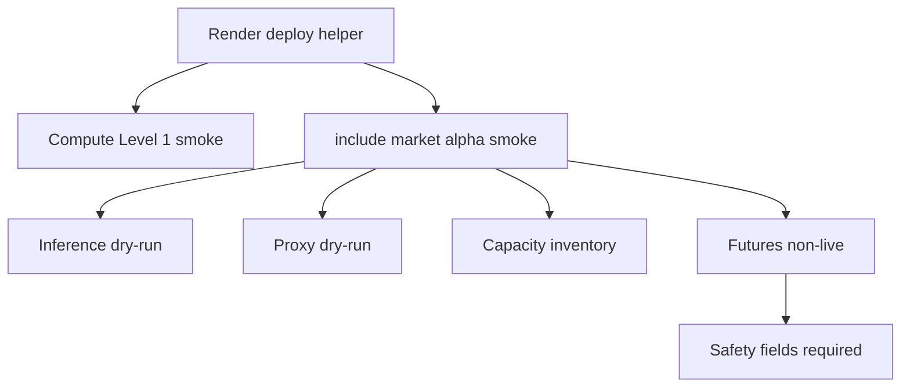

## Checkpoint 2026-05-26 OpenAI-compatible proxy expansion

Files changed:

- `src/flow_memory/inference_market/service.py`
- `src/flow_memory/api/marketplace_endpoints.py`
- `src/flow_memory/api/router.py`
- `src/flow_memory/api/manifest.py`
- `tests/test_inference_capacity_futures_markets.py`
- `docs/INFERENCE_PROXY.md`
- `docs/API_SNAPSHOT.json`
- `docs/openapi/flow-memory.openapi.json`

Tests run:

- `python -m ruff check src/flow_memory/inference_market/service.py src/flow_memory/api/marketplace_endpoints.py src/flow_memory/api/router.py src/flow_memory/api/manifest.py tests/test_inference_capacity_futures_markets.py` — OK
- `python -m pytest tests/test_inference_capacity_futures_markets.py -q` — 16 passed
- `python -m pytest tests/test_api_snapshot.py tests/test_api_openapi_snapshot.py -q` — 5 passed
- `python -m mypy src tests scripts --config-file pyproject.toml` — OK
- `python scripts/check_compute_market_production.py` — ruff OK, mypy OK, 427 passed, 2 skipped
- `git diff --check -- src/flow_memory/inference_market/service.py src/flow_memory/api/marketplace_endpoints.py src/flow_memory/api/router.py src/flow_memory/api/manifest.py tests/test_inference_capacity_futures_markets.py docs/INFERENCE_PROXY.md docs/API_SNAPSHOT.json docs/openapi/flow-memory.openapi.json` — clean except Git line-ending warnings for regenerated JSON snapshots

Commit: `ab5b2cf Expand OpenAI-compatible inference proxy`.

Implementation:

- OpenAI-compatible `/v1/responses` and `/v1/embeddings` now route through the deterministic fake provider path.
- Responses and embeddings write inference usage records and preserve dry-run, no-funds, no-broadcast, and no-private-key safety fields.
- API manifest, OpenAPI snapshot, API snapshot, docs, and router tests were updated.

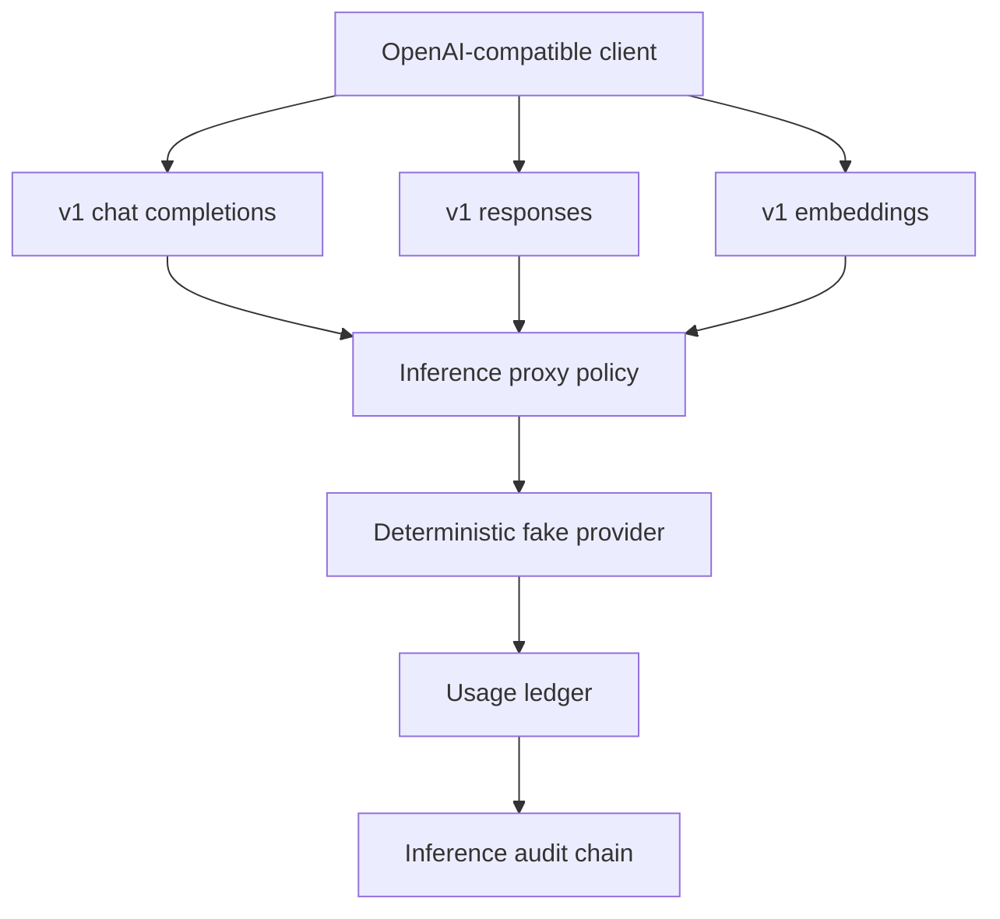

## Checkpoint 2026-05-26 Proxy smoke parity

Files changed:

- `scripts/smoke_compute_market_public.ps1`
- `scripts/deploy_compute_market_render_level1.py`
- `tests/test_compute_market_live_deployment.py`
- `docs/ops/PUBLIC_DEPLOYMENT_BLOCKERS.md`

Tests run:

- `python -m pytest tests/test_compute_market_live_deployment.py -q` — 49 passed
- `python -m ruff check scripts/deploy_compute_market_render_level1.py tests/test_compute_market_live_deployment.py` — OK
- `python -m mypy scripts/deploy_compute_market_render_level1.py tests/test_compute_market_live_deployment.py --config-file pyproject.toml` — OK
- `python scripts/check_compute_market_production.py` — ruff OK, mypy OK, 427 passed, 2 skipped
- `git diff --check -- scripts/smoke_compute_market_public.ps1 scripts/deploy_compute_market_render_level1.py tests/test_compute_market_live_deployment.py docs/ops/PUBLIC_DEPLOYMENT_BLOCKERS.md` — clean except Git line-ending warning for the PowerShell file

Commit: `f95c4d5 Extend public proxy smoke coverage`.

Implementation:

- Optional public marketplace-alpha smoke now exercises OpenAI-compatible chat, Responses, and Embeddings paths.
- Render deployment smoke parity now checks the same proxy surface when `--include-market-alpha-smoke` is enabled.
- All optional proxy smoke checks assert dry-run and no-funds safety fields.

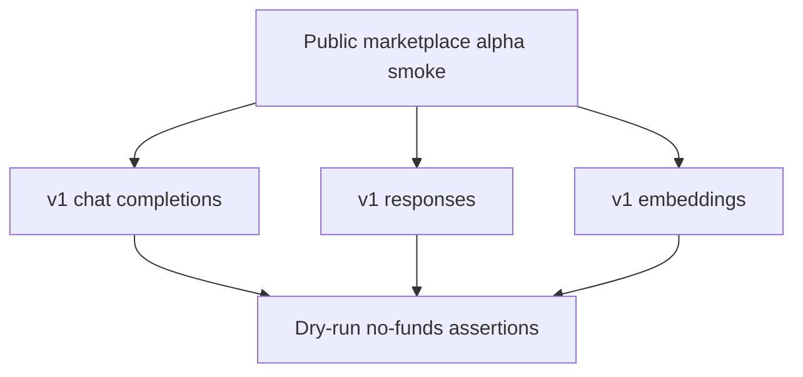

## Checkpoint 2026-05-26 Deployment inference scope parity

Files changed:

- `scripts/deploy_compute_market_render_level1.py`
- `docker-compose.compute-market.yml`
- `render.yaml`
- `deployments/compute-market/live.env.example`
- `tests/test_compute_market_live_deployment.py`

Tests run:

- `python -m pytest tests/test_compute_market_live_deployment.py -q` — 49 passed
- `python -m ruff check scripts/deploy_compute_market_render_level1.py tests/test_compute_market_live_deployment.py` — OK
- `python -m mypy scripts/deploy_compute_market_render_level1.py tests/test_compute_market_live_deployment.py --config-file pyproject.toml` — OK
- `python scripts/check_compute_market_production.py` — ruff OK, mypy OK, 427 passed, 2 skipped
- `git diff --check -- scripts/deploy_compute_market_render_level1.py docker-compose.compute-market.yml render.yaml deployments/compute-market/live.env.example tests/test_compute_market_live_deployment.py` — clean

Commit: `c8e4e6b Add inference scopes to deployment defaults`.

Implementation:

- Render, Docker Compose, and live env templates now include `inference:read`, `inference:plan`, `inference:proxy`, `inference:buy`, `inference:sell`, `inference:admin`, and `inference:audit` in production API key scopes.
- Optional marketplace-alpha public smoke can now authenticate inference and proxy checks with the default generated production key scope set.
- Compute scope defaults are preserved.

```mermaid
flowchart TD
    ApiKey[Production API key] --> ComputeScopes[Compute scopes]
    ApiKey --> InferenceScopes[Inference scopes]
    InferenceScopes --> Opportunity[Inference planning]
    InferenceScopes --> Proxy[Proxy endpoints]
    InferenceScopes --> BuySell[Credit buy sell admin]
    ComputeScopes --> Readiness[Level 1 compute readiness]
```

## Checkpoint 2026-05-26 Proxy smoke CLI coverage

Files changed:

- `src/flow_memory/cli.py`
- `tests/test_inference_capacity_futures_markets.py`
- `docs/INFERENCE_PROXY.md`

Tests run:

- `python -m pytest tests/test_inference_capacity_futures_markets.py -q` — 16 passed
- `python -m ruff check src/flow_memory/cli.py tests/test_inference_capacity_futures_markets.py` — OK
- `python -m mypy src/flow_memory/cli.py tests/test_inference_capacity_futures_markets.py --config-file pyproject.toml` — OK
- `python scripts/check_compute_market_production.py` — ruff OK, mypy OK, 427 passed, 2 skipped
- `git diff --check -- src/flow_memory/cli.py tests/test_inference_capacity_futures_markets.py docs/INFERENCE_PROXY.md` — clean

Commit: `8b23953 Add proxy smoke API selection`.

Implementation:

- `flow-memory inference proxy-smoke --api all` now exercises OpenAI-compatible chat completions, Responses, and Embeddings through the deterministic fake provider path.
- The CLI keeps the previous chat-only smoke path by default, while using the local fake model when `proxy-smoke` is run without an explicit `--model`.
- CLI coverage now verifies dry-run, no-funds, no-broadcast, and no-private-key proxy safety fields across all OpenAI-compatible local proxy surfaces.

```mermaid
flowchart TD
    ProxySmoke[proxy-smoke api all] --> Chat[v1 chat completions]
    ProxySmoke --> Responses[v1 responses]
    ProxySmoke --> Embeddings[v1 embeddings]
    Chat --> FakeProvider[Deterministic fake provider]
    Responses --> FakeProvider
    Embeddings --> FakeProvider
    FakeProvider --> Safety[Dry-run no funds no broadcast]
```

## Checkpoint 2026-05-26 Marketplace unsafe payload hardening

Files changed:

- `src/flow_memory/inference_market/service.py`
- `src/flow_memory/capacity_market/service.py`
- `src/flow_memory/futures_market/service.py`
- `tests/test_inference_capacity_futures_markets.py`

Tests run:

- `python -m pytest tests/test_inference_capacity_futures_markets.py -q` — 17 passed
- `python -m ruff check src/flow_memory/inference_market/service.py src/flow_memory/capacity_market/service.py src/flow_memory/futures_market/service.py tests/test_inference_capacity_futures_markets.py` — OK
- `python -m mypy src/flow_memory/inference_market src/flow_memory/capacity_market src/flow_memory/futures_market tests/test_inference_capacity_futures_markets.py --config-file pyproject.toml` — OK
- `python scripts/check_compute_market_production.py` — ruff OK, mypy OK, 427 passed, 2 skipped
- `git diff --check -- src/flow_memory/inference_market/service.py src/flow_memory/capacity_market/service.py src/flow_memory/futures_market/service.py tests/test_inference_capacity_futures_markets.py` — clean

Commit: `3169e95 Harden marketplace unsafe payload checks`.

Implementation:

- Unsafe token matching now reports the more specific `wallet_private_key` token before the shorter `private_key` substring across inference, capacity, and futures surfaces.
- Inference proxy safety coverage now verifies seed phrase rejection.
- Capacity and futures safety coverage now verifies wallet private key, live settlement, private key, and leverage rejection.

```mermaid
flowchart TD
    Payload[Marketplace request payload] --> UnsafeScan[Unsafe token scan]
    UnsafeScan --> Inference[Inference Market]
    UnsafeScan --> Capacity[Capacity Market]
    UnsafeScan --> Futures[Futures Simulator]
    Inference --> Deny[Reject unsafe request]
    Capacity --> Deny
    Futures --> Deny
    Deny --> SafeAction[Return safe denial path]
```

## Checkpoint 2026-05-26 Unsafe payload word-boundary hardening

Files changed:

- `src/flow_memory/inference_market/service.py`
- `src/flow_memory/capacity_market/service.py`
- `src/flow_memory/futures_market/service.py`
- `tests/test_inference_capacity_futures_markets.py`

Tests run:

- `python -m pytest tests/test_inference_capacity_futures_markets.py -q` — 17 passed
- `python -m ruff check src/flow_memory/inference_market/service.py src/flow_memory/capacity_market/service.py src/flow_memory/futures_market/service.py tests/test_inference_capacity_futures_markets.py` — OK
- `python -m mypy src/flow_memory/inference_market src/flow_memory/capacity_market src/flow_memory/futures_market tests/test_inference_capacity_futures_markets.py --config-file pyproject.toml` — OK
- `python scripts/check_compute_market_production.py` — ruff OK, mypy OK, 427 passed, 2 skipped
- `git diff --check -- src/flow_memory/inference_market/service.py src/flow_memory/capacity_market/service.py src/flow_memory/futures_market/service.py tests/test_inference_capacity_futures_markets.py` — clean

Commit: `4ebde60 Avoid unsafe payload false positives`.

Implementation:

- Unsafe word tokens such as `transfer`, `margin`, and `leverage` now match as standalone request words instead of substring-matching legitimate marketplace fields.
- Legitimate `transferable`, `non_transferable`, and simulated margin-account identifiers remain accepted where they are part of dry-run models.
- Explicit transfer, live settlement, wallet-private-key, private-key, and leverage requests are still rejected.

```mermaid
flowchart TD
    Payload[Marketplace payload] --> Scanner[Safety scanner]
    Scanner --> Exact[Exact unsafe fields]
    Scanner --> Word[Standalone unsafe words]
    Scanner --> Legit[Legitimate dry-run fields]
    Exact --> Reject[Reject]
    Word --> Reject
    Legit --> Continue[Continue simulation]
```

## Checkpoint 2026-05-26 Marketplace safety audit classification

Files changed:

- `docs/ops/MARKETPLACE_SAFETY_AUDIT.md`

Tests run:

- `python -m pytest tests/test_compute_market_naming.py tests/test_inference_capacity_futures_markets.py -q` — 22 passed
- `git diff --check -- docs/ops/MARKETPLACE_SAFETY_AUDIT.md` — clean

Commit: `29402eb Add marketplace safety audit classification`.

Implementation:

- Added a current naming-audit classification for reference-pattern branding hits.
- Added a current broad safety-audit classification for private-key, broadcast, settlement, margin, leverage, transfer, custody, and live-futures terms.
- Documented that public production deployment remains blocked on external managed infrastructure and secrets.

```mermaid
flowchart TD
    Audit[Marketplace safety audit] --> Naming[Naming classification]
    Audit --> Safety[Safety classification]
    Naming --> PublicSurface[No reference branding in public surface]
    Safety --> DryRun[Dry-run simulation only]
    DryRun --> Blockers[External infra blockers remain]
```

## Checkpoint 2026-05-26 Inference marketplace auth roles

Files changed:

- `src/flow_memory/api/auth.py`
- `tests/test_api_auth.py`
- `docs/INFERENCE_MARKET.md`

Tests run:

- `python -m pytest tests/test_api_auth.py tests/test_api_auth_scopes.py -q` — 39 passed
- `python -m ruff check src/flow_memory/api/auth.py tests/test_api_auth.py` — OK
- `python -m mypy src/flow_memory/api/auth.py tests/test_api_auth.py --config-file pyproject.toml` — OK
- `python scripts/check_compute_market_production.py` — ruff OK, mypy OK, 429 passed, 2 skipped
- `git diff --check -- src/flow_memory/api/auth.py tests/test_api_auth.py docs/INFERENCE_MARKET.md` — clean

Commit: `74f3dea Add inference marketplace auth roles`.

Implementation:

- Added least-privilege inference marketplace roles for API key records and gateway JWT role expansion.
- New roles cover viewer, planner, proxy, buyer, seller, auditor, and admin flows without broadening existing `member`, `provider`, or `admin` roles.
- Documented role-to-scope mapping in `docs/INFERENCE_MARKET.md`.

```mermaid
flowchart TD
    Credential[API key or JWT] --> Role[Inference role]
    Role --> Read[inference read]
    Role --> Plan[inference plan]
    Role --> Proxy[inference proxy]
    Role --> Buy[inference buy]
    Role --> Sell[inference sell]
    Role --> Audit[inference audit]
    Role --> Admin[inference admin]
```

## Checkpoint 2026-05-26 Role JWT public smoke coverage

Files changed:

- `scripts/smoke_compute_market_public.ps1`
- `scripts/deploy_compute_market_render_level1.py`
- `tests/test_compute_market_live_deployment.py`

Tests run:

- `python -m pytest tests/test_compute_market_live_deployment.py::test_public_smoke_script_validates_gateway_jwt_when_configured tests/test_compute_market_live_deployment.py::test_render_smoke_validates_gateway_jwt_when_configured -q` — 2 passed
- `python -m pytest tests/test_compute_market_live_deployment.py -q` — 49 passed
- `python -m ruff check scripts/deploy_compute_market_render_level1.py tests/test_compute_market_live_deployment.py` — OK
- `python -m mypy scripts/deploy_compute_market_render_level1.py tests/test_compute_market_live_deployment.py --config-file pyproject.toml` — OK
- `python scripts/check_compute_market_production.py` — ruff OK, mypy OK, 429 passed, 2 skipped
- `git diff --check -- scripts/smoke_compute_market_public.ps1 scripts/deploy_compute_market_render_level1.py tests/test_compute_market_live_deployment.py` — clean, with expected CRLF warning for the PowerShell file

Commit: `b1592e5 Add role JWT public smoke coverage`.

Implementation:

- PowerShell public smoke JWTs can now include validated `flow_memory_roles` claims.
- Public smoke now proves an `inference-admin` role JWT can pass the gateway and, when market-alpha smoke is enabled, authorize `/inference/market/order-book` with `inference:read`.
- Render deployment automation has matching role-claim JWT smoke coverage so Python and PowerShell public smoke paths stay aligned.

```mermaid
flowchart TD
    GatewayJWT[Gateway JWT] --> Explicit[Explicit compute read scope]
    GatewayJWT --> Role[flow_memory_roles inference-admin]
    Explicit --> Health[/compute/health smoke]
    Role --> ScopeExpansion[Role expands to inference scopes]
    ScopeExpansion --> Inference[/inference/market/order-book smoke]
    Inference --> DryRun[Dry-run public market alpha remains safe]
```

## Checkpoint 2026-05-26 Marketplace schema migration evidence

Files changed:

- `src/flow_memory/compute_market/storage.py`
- `src/flow_memory/compute_market/storage_backends.py`
- `tests/test_compute_market_storage.py`

Tests run:

- `python -m pytest tests/test_compute_market_storage.py::test_compute_database_config_supports_explicit_storage_settings tests/test_compute_market_live_infra_script.py::test_postgres_schema_sql_covers_all_compute_record_types tests/test_inference_capacity_futures_markets.py::test_new_market_record_families_are_in_sqlite_and_postgres_schema -q` — 3 passed
- `python -m pytest tests/test_compute_market_storage.py tests/test_compute_market_live_infra_script.py tests/test_inference_capacity_futures_markets.py -q` — 44 passed
- `python -m ruff check src/flow_memory/compute_market/storage.py src/flow_memory/compute_market/storage_backends.py tests/test_compute_market_storage.py tests/test_compute_market_live_infra_script.py tests/test_inference_capacity_futures_markets.py` — OK
- `python -m mypy src/flow_memory/compute_market/storage.py src/flow_memory/compute_market/storage_backends.py tests/test_compute_market_storage.py tests/test_compute_market_live_infra_script.py tests/test_inference_capacity_futures_markets.py --config-file pyproject.toml` — OK
- `python scripts/check_compute_market_production.py` — ruff OK, mypy OK, 429 passed, 2 skipped
- `git diff --check -- src/flow_memory/compute_market/storage.py src/flow_memory/compute_market/storage_backends.py tests/test_compute_market_storage.py` — clean

Commit: `a2083b6 Align migration plan with marketplace schemas`.

Implementation:

- Moved the PostgreSQL record-table mapping into the core storage module so migration planning and Postgres schema generation share the same source of truth.
- The migration plan now enumerates every marketplace record family table, including inference credit resale, capacity/forward capacity, futures simulation, agent treasury, billing, provider, audit, and observability records.
- Added production storage tests that require migration-plan table coverage to match the generated Postgres schema table map.

```mermaid
flowchart TD
    RecordTypes[Compute record types] --> TableMap[Shared Postgres table map]
    TableMap --> MigrationPlan[Migration plan evidence]
    TableMap --> SchemaSQL[Generated Postgres DDL]
    MigrationPlan --> DeploymentAudit[Deployment readiness evidence]
    SchemaSQL --> LiveMigrations[Managed Postgres migrations]
```

## Checkpoint 2026-05-26 Public smoke schema coverage gates

Files changed:

- `scripts/smoke_compute_market_public.ps1`
- `scripts/deploy_compute_market_render_level1.py`
- `tests/test_compute_market_live_deployment.py`

Tests run:

- `python -m pytest tests/test_compute_market_live_deployment.py::test_public_smoke_script_validates_gateway_jwt_when_configured tests/test_compute_market_live_deployment.py::test_render_smoke_validates_gateway_jwt_when_configured tests/test_compute_market_live_deployment.py::test_render_smoke_rejects_runtime_missing_managed_sql_requirement -q` — 3 passed
- `python -m pytest tests/test_compute_market_live_deployment.py -q` — 49 passed
- `python -m ruff check scripts/deploy_compute_market_render_level1.py tests/test_compute_market_live_deployment.py` — OK
- `python -m mypy scripts/deploy_compute_market_render_level1.py tests/test_compute_market_live_deployment.py --config-file pyproject.toml` — OK
- `python scripts/check_compute_market_production.py` — ruff OK, mypy OK, 429 passed, 2 skipped
- `git diff --check -- scripts/smoke_compute_market_public.ps1 scripts/deploy_compute_market_render_level1.py tests/test_compute_market_live_deployment.py` — clean, with expected CRLF warning for the PowerShell file

Commit: `43f5f3b Gate public smoke on schema coverage`.

Implementation:

- Public smoke now fails if live Postgres schema verification under-reports the marketplace table or index coverage expected by the current production schema.
- Both PowerShell and Render Python smoke results surface `postgres_required_table_count` and `postgres_required_index_count`.
- The gate keeps `/admin/storage/diagnostics` from reporting a superficially clean schema that is missing marketplace record-family migrations.

```mermaid
flowchart TD
    Smoke[Public smoke] --> StorageDiag[/admin/storage/diagnostics]
    StorageDiag --> Counts[Required table and index counts]
    Counts --> Gate{Meets current schema floor?}
    Gate -->|Yes| Continue[Continue production smoke]
    Gate -->|No| Fail[Fail deployment validation]
```

## Checkpoint 2026-05-26 Live infra schema count validation

Files changed:

- `scripts/validate_compute_market_live_infra.py`
- `tests/test_compute_market_live_infra_script.py`

Tests run:

- `python -m pytest tests/test_compute_market_live_infra_script.py -q` — 14 passed
- `python -m ruff check scripts/validate_compute_market_live_infra.py tests/test_compute_market_live_infra_script.py` — OK
- `python -m mypy scripts/validate_compute_market_live_infra.py tests/test_compute_market_live_infra_script.py --config-file pyproject.toml` — OK
- `python scripts/check_compute_market_production.py` — ruff OK, mypy OK, 430 passed, 2 skipped
- `git diff --check -- scripts/validate_compute_market_live_infra.py tests/test_compute_market_live_infra_script.py` — clean

Commit: `4676df4 Gate live infra validation on schema counts`.

Implementation:

- Live Postgres validation now derives minimum table and index counts from the migration plan and fails if schema verification under-reports them.
- The validator reports structured `required_schema_count_evidence` alongside required index-group evidence.
- Tests pin the table floor to all Postgres record tables plus `compute_migrations`, and the index floor to the generated per-record index plan.

```mermaid
flowchart TD
    MigrationPlan[Migration plan] --> Floors[Table and index count floors]
    LiveSchema[Live Postgres schema verification] --> Evidence[Schema count evidence]
    Floors --> Evidence
    Evidence --> Validator{Counts meet floor?}
    Validator -->|Yes| Pass[Live infra validation can pass]
    Validator -->|No| Fail[Live infra validation fails]
```

## Checkpoint 2026-05-26 Signed provider quote conformance

Files changed:

- `scripts/validate_compute_market_provider_conformance.py`
- `tests/test_compute_market_provider_conformance_script.py`

Tests run:

- `python -m pytest tests/test_compute_market_provider_conformance_script.py -q` — 2 passed
- `python -m ruff check scripts/validate_compute_market_provider_conformance.py tests/test_compute_market_provider_conformance_script.py` — OK
- `python -m mypy scripts/validate_compute_market_provider_conformance.py tests/test_compute_market_provider_conformance_script.py --config-file pyproject.toml` — OK
- `python -m pytest tests/test_compute_market_provider_conformance_script.py tests/test_compute_market_provider_adapters.py tests/test_compute_market_provider_contracts.py -q` — 33 passed
- `python scripts/check_compute_market_production.py` — ruff OK, mypy OK, 430 passed, 2 skipped
- `git diff --check -- scripts/validate_compute_market_provider_conformance.py tests/test_compute_market_provider_conformance_script.py` — clean

Commit: `2315f86 Exercise signed provider quote conformance`.

Implementation:

- Provider sandbox validation now signs its contract sample quote with a local deterministic provider quote key and verifies `signed_quote_valid=true`.
- The conformance script now explicitly proves stale/expired quote rejection and unsafe live-settlement quote rejection.
- Provider conformance output surfaces `signed_quote_valid`, `stale_quote_rejected`, and `unsafe_live_settlement_rejected`.

```mermaid
flowchart TD
    SandboxQuote[Provider sandbox quote] --> Sign[Local quote signature]
    Sign --> Conformance[Provider conformance]
    Conformance --> SignedOK[signed_quote_valid true]
    SandboxQuote --> Stale[Stale expired variant]
    SandboxQuote --> Unsafe[Live-settlement variant]
    Stale --> RejectStale[stale and expired rejected]
    Unsafe --> RejectUnsafe[live settlement rejected]
```

## Checkpoint 2026-05-26 HTTP provider quote validation hardening

Files changed:

- `src/flow_memory/compute_market/adapters.py`
- `tests/test_compute_market_provider_adapters.py`

Tests run:

- `python -m pytest tests/test_compute_market_provider_adapters.py::test_http_provider_rejects_unconfigured_route_and_missing_expiry tests/test_compute_market_provider_adapters.py::test_http_provider_honors_provider_marked_stale_quote tests/test_compute_market_provider_adapters.py::test_external_provider_adapter_verifies_signed_quote_responses -q` — 3 passed
- `python -m pytest tests/test_compute_market_provider_adapters.py tests/test_compute_market_provider_contracts.py tests/test_compute_market_provider_conformance_script.py -q` — 35 passed
- `python -m ruff check src/flow_memory/compute_market/adapters.py tests/test_compute_market_provider_adapters.py` — OK
- `python -m mypy src/flow_memory/compute_market/adapters.py tests/test_compute_market_provider_adapters.py --config-file pyproject.toml` — OK
- `python scripts/check_compute_market_production.py` — ruff OK, mypy OK, 432 passed, 2 skipped
- `git diff --check -- src/flow_memory/compute_market/adapters.py tests/test_compute_market_provider_adapters.py` — clean

Commit: `b0c7912 Harden HTTP provider quote validation`.

Implementation:

- HTTP provider quotes must now include `expires_at`; missing expiration is treated as an invalid provider response.
- HTTP provider quotes are rejected when they claim an unconfigured route for providers with explicit route records.
- Provider-marked stale quotes now normalize to stale status even when the timestamp itself is still in the future.

```mermaid
flowchart TD
    RawQuote[HTTP provider quote] --> Required[Required fields include expires_at]
    RawQuote --> RouteCheck[Provider route-id check]
    RawQuote --> StaleFlag[Provider stale flag]
    Required --> Valid{Valid response?}
    RouteCheck --> Valid
    Valid -->|No| Invalid[invalid_response]
    StaleFlag --> Stale[stale quote status]
```

## Checkpoint 2026-05-26 Signed external provider quote preservation

Files changed:

- `src/flow_memory/compute_market/service.py`
- `src/flow_memory/compute_market/provider_sandbox.py`
- `tests/test_compute_market_provider_adapters.py`

Tests run:

- `python -m pytest tests/test_compute_market_provider_adapters.py::test_service_external_provider_quote_preserves_signed_payload_for_broker_validation -q` — 1 passed
- `python -m pytest tests/test_compute_market_provider_adapters.py::test_service_external_provider_quote_preserves_signed_payload_for_broker_validation tests/test_compute_market_provider_adapters.py::test_provider_sandbox_signed_quote_response_flows_through_service -q` — 2 passed
- `python -m pytest tests/test_compute_market_provider_adapters.py -q` — 26 passed
- `python -m pytest tests/test_compute_market_provider_adapters.py tests/test_compute_market_provider_contracts.py tests/test_compute_market_provider_conformance_script.py tests/test_compute_market_production_buildout.py::test_provider_conformance_and_quote_ingest_verify_signed_quotes -q` — 38 passed
- `python -m ruff check src/flow_memory/compute_market/service.py src/flow_memory/compute_market/provider_sandbox.py tests/test_compute_market_provider_adapters.py` — OK
- `python -m mypy src/flow_memory/compute_market/provider_sandbox.py tests/test_compute_market_provider_adapters.py` — OK
- `python scripts/check_compute_market_production.py` — ruff OK, mypy OK, 434 passed, 2 skipped
- `git diff --check -- src/flow_memory/compute_market/provider_sandbox.py src/flow_memory/compute_market/service.py tests/test_compute_market_provider_adapters.py` — clean

Commit: `d529f31 Preserve signed external provider quotes`.

Implementation:

- External HTTP provider quotes that already passed adapter-level signature verification are now broker-validated against the provider's original signed payload instead of a normalized/mutated record.
- Stored broker quote records now serialize provider quote signatures as deterministic JSON, matching adapter cache behavior.
- Provider sandbox quote responses can optionally be signed with a local deterministic quote signer while stripping contract-unsafe false-only execution fields before signing.
- Tests prove signed HTTP provider responses and signed sandbox quote responses ingest through the service, remain dry-run-only, and retain `signed_quote_valid=true`.

```mermaid
flowchart TD
    Provider[Signed provider quote] --> Adapter[HTTP adapter verifies raw signature]
    Adapter --> Original[Preserve original signed payload]
    Original --> Broker[Broker contract validation]
    Broker --> Store[Stored compute quote]
    Store --> SignedOK[signed_quote_valid true]
    Sandbox[Provider sandbox quote signer] --> Adapter
    Broker --> Safety[dry_run_only and no funds moved]
```

## Checkpoint 2026-05-26 Public buildout validator schema gates

Files changed:

- `scripts/validate_compute_market_public_buildout.py`
- `tests/test_compute_market_public_validation_script.py`

Tests run:

- `python -m pytest tests/test_compute_market_public_validation_script.py -q` — 14 passed
- `python -m ruff check scripts/validate_compute_market_public_buildout.py tests/test_compute_market_public_validation_script.py` — OK
- `python -m mypy scripts/validate_compute_market_public_buildout.py tests/test_compute_market_public_validation_script.py --config-file pyproject.toml` — OK
- `python scripts/check_compute_market_production.py` — ruff OK, mypy OK, 437 passed, 2 skipped
- `git diff --check -- scripts/validate_compute_market_public_buildout.py tests/test_compute_market_public_validation_script.py` — clean

Commit: `a032aa6 Gate public buildout validation on schema evidence`.

Implementation:

- Public buildout validation now derives the Postgres schema table/index count floors from the migration plan and fails if `/admin/storage/diagnostics` under-reports required schema coverage.
- The validator now replays `/compute/plan` with the same idempotency key and requires a matching `decision_id` plus `idempotent_replay=true`.
- Production env prereq checks now require nonce fail-closed settings, rate-limit/circuit-breaker enablement, metrics/tracing enablement, and Stripe checkout disabled for Level 1.
- Optional observability sink URLs must use HTTPS, and audit export status must identify an allowed local/S3 exporter even when immutable S3 Object Lock is not required by the caller.

```mermaid
flowchart TD
    PublicValidator[Public buildout validator] --> Plan[Plan request]
    Plan --> Replay[Idempotent replay]
    PublicValidator --> StorageDiag[/admin/storage/diagnostics]
    StorageDiag --> SchemaFloor[Table and index count floors]
    PublicValidator --> Env[Production env prerequisites]
    Env --> Nonce[Nonce and fail-closed booleans]
    PublicValidator --> AuditExport[Audit export status]
    SchemaFloor --> Pass{Production evidence complete?}
    Replay --> Pass
    Nonce --> Pass
    AuditExport --> Pass
```

## Checkpoint 2026-05-26 Render smoke plan replay gate

Files changed:

- `scripts/deploy_compute_market_render_level1.py`
- `tests/test_compute_market_live_deployment.py`

Tests run:

- `python -m pytest tests/test_compute_market_live_deployment.py::test_render_smoke_validates_gateway_jwt_when_configured -q` — 1 passed
- `python -m pytest tests/test_compute_market_live_deployment.py -q` — 49 passed
- `python -m ruff check scripts/deploy_compute_market_render_level1.py tests/test_compute_market_live_deployment.py` — OK
- `python -m mypy scripts/deploy_compute_market_render_level1.py tests/test_compute_market_live_deployment.py --config-file pyproject.toml` — OK
- `python scripts/check_compute_market_production.py` — ruff OK, mypy OK, 437 passed, 2 skipped
- `git diff --check -- scripts/deploy_compute_market_render_level1.py tests/test_compute_market_live_deployment.py` — clean

Commit: `72262c8 Verify render smoke plan replay`.

Implementation:

- Render Level 1 smoke now submits a second `/compute/plan` request with the same idempotency key and requires `idempotent_replay=true`.
- The smoke gate requires the replayed `decision_id` to match the original plan before reporting a successful public deployment.
- Smoke output exposes `plan_idempotent_replay` as deployment evidence alongside Postgres, Redis, audit, JWT, metrics, and safety flags.

```mermaid
flowchart TD
    RenderDeploy[Render Level 1 deploy] --> Smoke[Post-deploy smoke]
    Smoke --> Plan[First compute plan]
    Plan --> Replay[Same idempotency key replay]
    Replay --> Match{Decision ID matches?}
    Match -->|Yes| Continue[Continue public readiness gates]
    Match -->|No| Fail[Fail deployment smoke]
```

## Checkpoint 2026-05-26 PowerShell public smoke plan replay gate

Files changed:

- `scripts/smoke_compute_market_public.ps1`
- `tests/test_compute_market_live_deployment.py`

Tests run:

- `python -m pytest tests/test_compute_market_live_deployment.py::test_public_smoke_script_validates_gateway_jwt_when_configured -q` — 1 passed
- `python -m pytest tests/test_compute_market_live_deployment.py -q` — 49 passed
- `python -m ruff check tests/test_compute_market_live_deployment.py scripts/deploy_compute_market_render_level1.py` — OK
- `python -m mypy tests/test_compute_market_live_deployment.py scripts/deploy_compute_market_render_level1.py --config-file pyproject.toml` — OK
- `powershell -NoProfile -ExecutionPolicy Bypass -Command '[System.Management.Automation.Language.Parser]::ParseFile(...)'` — PowerShell parser returned no syntax errors
- `python scripts/check_compute_market_production.py` — ruff OK, mypy OK, 437 passed, 2 skipped
- `git diff --check -- scripts/smoke_compute_market_public.ps1 tests/test_compute_market_live_deployment.py docs/ops/MULTI_DAY_BUILDOUT_STATUS.md` — clean

Commit: `148e660 Verify public smoke plan replay`.

Implementation:

- The standalone PowerShell public smoke now sends `/compute/plan` twice with the same idempotency key and requires `idempotent_replay=true`.
- It rejects public deployments where the replayed plan returns a different `decision_id` from the original plan.
- Smoke JSON output now includes `plan_idempotent_replay` next to storage, Redis, audit, JWT, and safety evidence.

```mermaid
flowchart TD
    PublicSmoke[PowerShell public smoke] --> Plan[First compute plan]
    Plan --> Replay[Same idempotency key replay]
    Replay --> Match{Decision ID matches?}
    Match -->|Yes| Evidence[plan_idempotent_replay true]
    Match -->|No| Fail[Fail public smoke]
```

## Checkpoint 2026-05-26 Insufficient-credit alert API coverage

Files changed:

- `src/flow_memory/compute_market/observability.py`
- `tests/test_compute_market_observability.py`

Tests run:

- `python -m pytest tests/test_compute_market_observability.py::test_billing_webhook_failure_and_readiness_failures_emit_alert_metrics -q` — 1 passed
- `python -m pytest tests/test_compute_market_observability.py -q` — 26 passed
- `python -m ruff check src/flow_memory/compute_market/observability.py tests/test_compute_market_observability.py` — OK
- `python -m mypy src/flow_memory/compute_market/observability.py tests/test_compute_market_observability.py --config-file pyproject.toml` — OK
- `python scripts/check_compute_market_production.py` — ruff OK, mypy OK, 437 passed, 2 skipped
- `git diff --check -- src/flow_memory/compute_market/observability.py tests/test_compute_market_observability.py` — clean

Commit: `157b078 Alert on insufficient compute credits`.

Implementation:

- `/compute/alerts` now fires `billing-insufficient-credit` when `billing_insufficient_credit_total` is present.
- In-code alert evaluation now matches the existing Prometheus `FlowMemoryComputeMarketBillingInsufficientCredit` alert and Grafana panel metric coverage.
- The observability test now proves insufficient-credit events are visible alongside billing, provider, Redis, Postgres, settlement, and allowlist alert states.

```mermaid
flowchart TD
    Usage[Compute usage debit] --> Credit[Credit balance check]
    Credit -->|Insufficient| Metric[billing_insufficient_credit_total]
    Metric --> Prometheus[Prometheus alert]
    Metric --> AdminAlerts[/compute/alerts]
    AdminAlerts --> Operator[Operator sees insufficient-credit warning]
```

## Checkpoint 2026-05-26 Render deploy smoke fail-closed test

Files changed:

- `tests/test_compute_market_live_deployment.py`

Tests run:

- `python -m pytest tests/test_compute_market_live_deployment.py::test_render_deploy_main_fails_closed_when_public_smoke_fails -q` — 1 passed
- `python -m pytest tests/test_compute_market_live_deployment.py -q` — 50 passed
- `python -m ruff check tests/test_compute_market_live_deployment.py` — OK
- `python -m mypy tests/test_compute_market_live_deployment.py --config-file pyproject.toml` — OK
- `python scripts/check_compute_market_production.py` — ruff OK, mypy OK, 438 passed, 2 skipped
- `git diff --check -- tests/test_compute_market_live_deployment.py` — clean

Commit: `2ccc7eb Test deploy smoke fail closed`.

Implementation:

- Render Level 1 deploy orchestration now has a direct regression test for the post-deploy public smoke failure path.
- The test proves repeated failed smoke results terminate with `failed_public_smoke_tests` and exit code 34 instead of reporting a successful deployment.
- The smoke failure payload preserves the public URL and last smoke reason for operator diagnosis.

```mermaid
flowchart TD
    RenderDeploy[Render deploy main] --> Service[Provision service]
    Service --> Smoke[Post-deploy public smoke]
    Smoke -->|ok false| Retry[Retry smoke loop]
    Retry --> Failed[failed_public_smoke_tests exit 34]
    Smoke -->|ok true| Live[public_level_1_live]
```

## Checkpoint 2026-05-26 Public Redis fail-closed validator coverage

Files changed:

- `tests/test_compute_market_public_validation_script.py`

Tests run:

- `python -m pytest tests/test_compute_market_public_validation_script.py::test_public_buildout_validation_rejects_redis_fail_open_controls -q` — 1 passed
- `python -m pytest tests/test_compute_market_public_validation_script.py -q` — 15 passed
- `python -m ruff check scripts/validate_compute_market_public_buildout.py tests/test_compute_market_public_validation_script.py` — OK
- `python -m mypy scripts/validate_compute_market_public_buildout.py tests/test_compute_market_public_validation_script.py --config-file pyproject.toml` — OK
- `python scripts/check_compute_market_production.py` — ruff OK, mypy OK, 439 passed, 2 skipped
- `git diff --check -- tests/test_compute_market_public_validation_script.py` — clean

Commit: `b9e8371 Test public Redis fail closed validation`.

Implementation:

- The public buildout validator test suite now covers both fail-open Redis diagnostic regressions: `rate_limit_fail_closed=false` and `circuit_breaker_fail_closed=false`.
- The test proves validation rejects public Level 1 deployments when Redis-backed rate limits or circuit breakers are not reported fail-closed.
- A compact public-buildout fake response helper now supports future negative-path validation tests without real public infrastructure.

```mermaid
flowchart TD
    Validator[Public buildout validator] --> RedisDiag[/admin/redis/diagnostics]
    RedisDiag --> Limiter{rate limit fail closed?}
    RedisDiag --> Breaker{circuit breaker fail closed?}
    Limiter -->|false| Reject[Fail public validation]
    Breaker -->|false| Reject
    Limiter -->|true| Continue[Continue Level 1 gates]
    Breaker -->|true| Continue
```

## Checkpoint 2026-05-26 Public immutable audit validator coverage

Files changed:

- `tests/test_compute_market_public_validation_script.py`

Tests run:

- `python -m pytest tests/test_compute_market_public_validation_script.py::test_public_buildout_validation_requires_immutable_s3_audit_when_requested -q` — 1 passed
- `python -m pytest tests/test_compute_market_public_validation_script.py -q` — 16 passed
- `python -m ruff check scripts/validate_compute_market_public_buildout.py tests/test_compute_market_public_validation_script.py` — OK
- `python -m mypy scripts/validate_compute_market_public_buildout.py tests/test_compute_market_public_validation_script.py --config-file pyproject.toml` — OK
- `python scripts/check_compute_market_production.py` — ruff OK, mypy OK, 440 passed, 2 skipped
- `git diff --check -- tests/test_compute_market_public_validation_script.py` — clean

Commit: `2b310cd Test immutable audit public validation`.

Implementation:

- The public buildout validator test suite now rejects non-immutable audit export status when `--require-immutable-audit` is in effect.
- The fake public buildout helper can now override audit exporter status, enabling focused negative tests without external S3 or Render credentials.
- The test proves a local-file or non-immutable exporter cannot satisfy the public Level 1 immutable audit gate.

```mermaid
flowchart TD
    Validator[Public buildout validator] --> AuditStatus[/admin/audit/export]
    AuditStatus --> Immutable{immutable S3 Object Lock?}
    Immutable -->|No| Reject[Fail public validation]
    Immutable -->|Yes| ExportWrite[Run audit export write probe]
```

## Checkpoint 2026-05-26 Live Redis validation evidence fields

Files changed:

- `scripts/validate_compute_market_live_infra.py`
- `tests/test_compute_market_live_infra_script.py`

Tests run:

- `python -m pytest tests/test_compute_market_live_infra_script.py::test_live_infra_validator_exercises_redis_shared_state_with_injected_client -q` — 1 passed
- `python -m pytest tests/test_compute_market_live_infra_script.py -q` — 14 passed
- `python -m ruff check scripts/validate_compute_market_live_infra.py tests/test_compute_market_live_infra_script.py` — OK
- `python -m mypy scripts/validate_compute_market_live_infra.py tests/test_compute_market_live_infra_script.py --config-file pyproject.toml` — OK
- `python scripts/check_compute_market_production.py` — ruff OK, mypy OK, 440 passed, 2 skipped
- `git diff --check -- scripts/validate_compute_market_live_infra.py tests/test_compute_market_live_infra_script.py` — clean

Commit: `b083ce6 Expose live Redis validation evidence`.

Implementation:

- The live Redis validator now returns explicit evidence for shared limiter state, shared circuit-breaker state, recovery, diagnostics fail-closed flags, and the unavailable-backend fail-closed probe.
- The injected-client live-infra test now asserts the structured evidence fields, not only the raw reason strings.
- This improves managed Redis acceptance evidence without requiring real Redis credentials in local CI.

```mermaid
flowchart TD
    RedisA[Limiter or breaker A] --> RedisState[Shared Redis state]
    RedisB[Limiter or breaker B] --> RedisState
    RedisState --> Evidence[Validation JSON evidence]
    Evidence --> SharedLimiter[rate_limit_shared_state]
    Evidence --> SharedBreaker[circuit_breaker_shared_state]
    Evidence --> FailClosed[fail_closed]
```

## Checkpoint 2026-05-26 Public Redis nonce replay gate

Files changed:

- `scripts/validate_compute_market_public_buildout.py`
- `tests/test_compute_market_public_validation_script.py`

Tests run:

- `python -m pytest tests/test_compute_market_public_validation_script.py::test_public_buildout_main_blocks_non_redis_nonce_replay_backend_before_network -q` — 1 passed
- `python -m pytest tests/test_compute_market_public_validation_script.py -q` — 17 passed
- `python -m ruff check scripts/validate_compute_market_public_buildout.py tests/test_compute_market_public_validation_script.py` — OK
- `python -m mypy scripts/validate_compute_market_public_buildout.py tests/test_compute_market_public_validation_script.py --config-file pyproject.toml` — OK
- `python scripts/check_compute_market_production.py` — ruff OK, mypy OK, 441 passed, 2 skipped
- `git diff --check -- scripts/validate_compute_market_public_buildout.py tests/test_compute_market_public_validation_script.py` — clean

Commit: `7ce510f Require Redis nonce replay for public validation`.

Implementation:

- Public buildout validation now requires `FLOW_MEMORY_API_NONCE_REPLAY_BACKEND=redis` and a configured `FLOW_MEMORY_API_NONCE_REDIS_PREFIX`.
- The Level 1 prerequisite gate now also requires `FLOW_MEMORY_API_NONCE_VERIFY_TLS=true` alongside nonce fail-closed and TLS-required settings.
- A new pre-network test proves non-Redis nonce replay storage cannot pass public production validation.

```mermaid
flowchart TD
    Env[Production env file] --> Nonce[Nonce replay config]
    Nonce --> Backend{backend redis?}
    Nonce --> TLS{verify TLS?}
    Backend -->|No| Reject[Fail before network validation]
    TLS -->|No| Reject
    Backend -->|Yes| PublicValidation[Run public Level 1 validation]
```

## Checkpoint 2026-05-26 Nonce TLS deployment template coverage

Files changed:

- `tests/test_compute_market_live_deployment.py`

Tests run:

- `python -m pytest tests/test_compute_market_live_deployment.py::test_live_env_template_preserves_non_settlement_safety_defaults tests/test_compute_market_live_deployment.py::test_compute_market_compose_uses_postgres_redis_and_scope_enforced_api tests/test_compute_market_live_deployment.py::test_render_blueprint_requires_explicit_tls_redis_url -q` — 3 passed
- `python -m pytest tests/test_compute_market_live_deployment.py -q` — 50 passed
- `python -m ruff check tests/test_compute_market_live_deployment.py` — OK
- `python -m mypy tests/test_compute_market_live_deployment.py --config-file pyproject.toml` — OK
- `python scripts/check_compute_market_production.py` — ruff OK, mypy OK, 441 passed, 2 skipped
- `git diff --check -- tests/test_compute_market_live_deployment.py` — clean

Commit: `e1b93aa Lock nonce TLS deployment templates`.

Implementation:

- Deployment tests now lock `FLOW_MEMORY_API_NONCE_REDIS_PREFIX` and `FLOW_MEMORY_API_NONCE_VERIFY_TLS=true` in the live env template, Docker Compose stack, and Render blueprint.
- This keeps API replay protection aligned with the public validator's new Redis nonce replay prerequisite.
- The assertions prevent future drift where public deployments keep nonce checks enabled but accidentally lose TLS verification or a Redis replay namespace.

```mermaid
flowchart TD
    LiveEnv[live.env.example] --> NonceTLS[nonce verify TLS true]
    Compose[docker-compose] --> NonceTLS
    Render[render.yaml] --> NonceTLS
    NonceTLS --> Validator[Public buildout validation]
```

## Checkpoint 2026-05-26 API server Redis nonce config binding

Files changed:

- `tests/test_compute_market_live_deployment.py`

Tests run:

- `python -m pytest tests/test_compute_market_live_deployment.py::test_api_server_cli_builds_redis_nonce_guard_from_public_env -q` — 1 passed
- `python -m pytest tests/test_compute_market_live_deployment.py -q` — 50 passed
- `python -m ruff check tests/test_compute_market_live_deployment.py` — OK
- `python -m mypy tests/test_compute_market_live_deployment.py --config-file pyproject.toml` — OK
- `python scripts/check_compute_market_production.py` — ruff OK, mypy OK, 441 passed, 2 skipped
- `git diff --check -- tests/test_compute_market_live_deployment.py` — clean

Commit: `03c072c Assert Redis nonce TLS config binding`.

Implementation:

- The API server CLI public-env test now asserts Redis nonce prefix and TLS verification fields are bound into `HttpApiConfig`.
- This closes the chain from deployment templates through CLI config into the actual nonce replay guard configuration.
- The public deployment path now has tests covering nonce backend, prefix, fail-closed, TLS-required, and TLS-verify settings.

```mermaid
flowchart TD
    Env[Public env vars] --> ServerCLI[build_http_api_config]
    ServerCLI --> Config[HttpApiConfig]
    Config --> RedisNonce[Redis nonce replay store]
    Config --> TLSVerify[nonce_verify_tls true]
```
