# Multi-day buildout status

Date: 2026-05-26
Branch: `work/squire-v2`
Latest inspected commit: `3babbb1 Add inference demand price intelligence`

## Current architecture

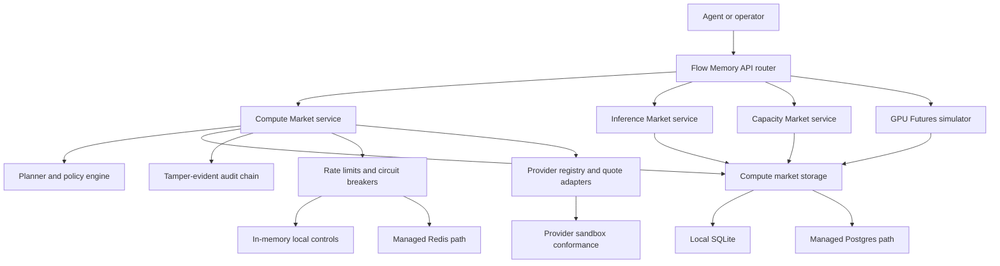

## What exists

- Compute Market planning, routing, dry-run payment planning, settlement simulation, audit, provider onboarding, quote validation, quote cache, quote drift, price history, price forecast, usage statements, jobs, billing ledger, capacity reservations, provider reputation, health/readiness, telemetry, alerts, Render deployment automation, Postgres path, and Redis path.
- Flow Memory Inference Market models, deterministic resale fixtures, run-vs-sell opportunity planner, OpenAI-compatible fake proxy path, demand snapshots, usage records, API endpoints, CLI commands, lazy API binding to the active compute-market store, and persistence-backed record families.
- Flow Memory Capacity Market and Forward Capacity simulators exist with dry-run inventory, quotes, holds, reservations, delivery schedules, settlement simulation records, CLI commands, APIs, lazy API binding to the active compute-market store, and persistence-backed record families.
- Flow Memory GPU Futures Simulator exists with simulated contracts, orders, positions, mark/index prices, risk checks, delivery/expiry/settlement simulations, CLI commands, APIs, lazy API binding to the active compute-market store, and persistence-backed record families.
- Safety defaults and live-settlement gates are implemented in Compute Market code, market simulators, docs, and deployment validation.

## Partial areas

- The new inference, capacity, forward-capacity, and futures services are simulator-grade; real provider credentials, real provider execution, and real billing providers are not bound.
- New market API services now attach lazily to the active compute-market store, so public API traffic uses the configured SQLite/Postgres storage path instead of a detached process-only singleton.
- Deployment automation exists, but no real public managed Postgres, managed Redis, domain, TLS URL, production API key, object-lock audit storage, or Render API credentials are present in the environment.

## Missing buildout blocks

- Real external inference credit seller onboarding and provider credential operations.
- Real provider quote ingestion with production credentials and allowlists.
- Real compute execution against external providers and artifact storage.
- External billing/prepaid credits with webhook credentials.
- Immutable object-lock audit storage binding.
- JWT/OIDC/API gateway production integration beyond API key and scope headers.
- Public Level 1 deployment and smoke tests against a managed Postgres and managed Redis URL.
- Legal/compliance/security review for any future live settlement, forward-capacity, or futures path.

## Active blockers

- `RENDER_API_KEY` is not available.
- `FLOW_MEMORY_PUBLIC_API_URL` is not available.
- `FLOW_MEMORY_COMPUTE_DATABASE_URL` for managed Postgres is not available.
- `FLOW_MEMORY_COMPUTE_REDIS_URL` for managed Redis is not available.
- `FLOW_MEMORY_COMPUTE_AUDIT_EXPORT_URI` for immutable object storage is not available.
- No external provider credentials or allowlist are available.
- No billing provider credentials are available.
- No legal/compliance/security approval exists for live settlement, live forward-capacity instruments, or live futures.

## Planned work order

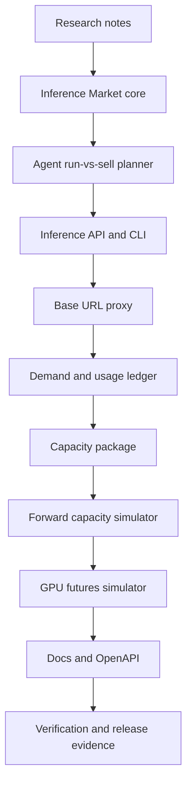

## Safety status

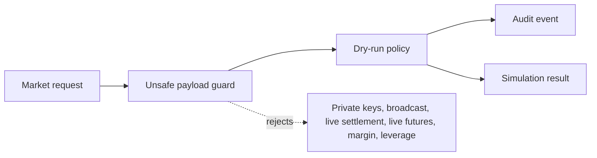

Current safe defaults remain required:

- `dry_run_only=true`
- `funds_moved=false`
- `broadcast_allowed=false`
- `private_key_required=false`
- `live_trading_enabled=false` for futures
- `legal_review_required=true` for forward capacity and futures
- `compliance_review_required=true` for forward capacity and futures

## Checkpoint 2026-05-26

Files added:

- `AGENTS.md`
- `docs/ops/MULTI_DAY_BUILDOUT_STATUS.md`

Tests run: pending for this checkpoint.
Commit: pending.
Next phase: research artifacts and inference market foundation.

## Checkpoint 2026-05-26 Inference, capacity, and futures alpha

Files changed:

- `src/flow_memory/inference_market/`
- `src/flow_memory/capacity_market/`
- `src/flow_memory/futures_market/`
- `src/flow_memory/api/router.py`
- `src/flow_memory/api/manifest.py`
- `src/flow_memory/api/scopes.py`
- `src/flow_memory/cli.py`
- `docs/API_SNAPSHOT.json`
- `docs/openapi/flow-memory.openapi.json`
- `tests/test_inference_capacity_futures_markets.py`

Tests run:

- `python -m pytest tests/test_inference_capacity_futures_markets.py -q`
- `python -m pytest tests/test_inference_capacity_futures_markets.py tests/test_api_openapi_snapshot.py tests/test_api_snapshot.py tests/test_compute_market_naming.py -q`
- `python -m pytest tests/test_api_auth.py tests/test_api_auth_scopes.py -q`
- `python -m ruff check src/flow_memory/inference_market src/flow_memory/capacity_market src/flow_memory/futures_market src/flow_memory/api/marketplace_endpoints.py tests/test_inference_capacity_futures_markets.py`
- `python scripts/check_compute_market_production.py`
- `python -m mypy src tests scripts --config-file pyproject.toml`

Commits:

- `2f88883 Add inference capacity futures simulators`

Safety status:

- Inference, capacity, forward-capacity, and futures behavior remains dry-run or simulation-only.
- External providers remain disabled by default.
- Futures remain non-live with legal and compliance review flags.

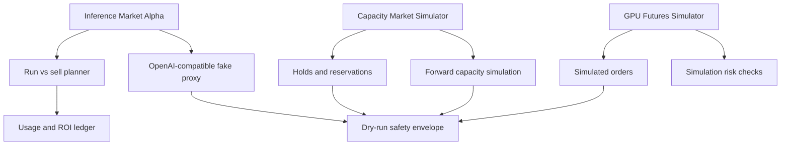

## Checkpoint 2026-05-26 Persistence follow-up

Files changed:

- `src/flow_memory/compute_market/storage.py`
- `src/flow_memory/compute_market/storage_backends.py`
- `src/flow_memory/inference_market/service.py`
- `src/flow_memory/capacity_market/service.py`
- `src/flow_memory/futures_market/service.py`
- `tests/test_inference_capacity_futures_markets.py`

Tests run:

- `python -m pytest tests/test_inference_capacity_futures_markets.py -q`
- `python -m ruff check src/flow_memory/inference_market/service.py src/flow_memory/capacity_market/service.py src/flow_memory/futures_market/service.py src/flow_memory/compute_market/storage.py src/flow_memory/compute_market/storage_backends.py tests/test_inference_capacity_futures_markets.py`
- `python -m mypy src/flow_memory/inference_market src/flow_memory/capacity_market src/flow_memory/futures_market src/flow_memory/compute_market src/flow_memory/api tests/test_inference_capacity_futures_markets.py --config-file pyproject.toml`
- `python scripts/check_compute_market_production.py`
- `git diff --check -- src/flow_memory/inference_market/service.py src/flow_memory/capacity_market/service.py src/flow_memory/futures_market/service.py src/flow_memory/compute_market/storage.py src/flow_memory/compute_market/storage_backends.py tests/test_inference_capacity_futures_markets.py`

Commits:

- `7819d2c Persist market simulator records`

Blockers:

- Public Level 1 deployment still requires external Render credentials, managed Postgres, managed Redis, public URL, API secret, object-lock audit URI, and production provider allowlist.
- Live provider quotes, live billing, live settlement, and live futures remain intentionally blocked.

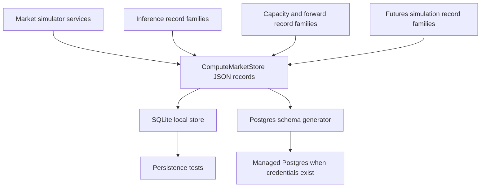

## Checkpoint 2026-05-26 Inference admin hardening

Files changed:

- `src/flow_memory/inference_market/service.py`
- `src/flow_memory/api/marketplace_endpoints.py`
- `tests/test_inference_capacity_futures_markets.py`

Tests run:

- `python -m pytest tests/test_inference_capacity_futures_markets.py -q`
- `python -m ruff check src/flow_memory/inference_market/service.py src/flow_memory/api/marketplace_endpoints.py tests/test_inference_capacity_futures_markets.py`
- `python -m mypy src/flow_memory/inference_market src/flow_memory/api/marketplace_endpoints.py tests/test_inference_capacity_futures_markets.py --config-file pyproject.toml`
- `python scripts/check_compute_market_production.py`
- `python -m mypy src tests scripts --config-file pyproject.toml`
- `git diff --check -- src/flow_memory/inference_market/service.py src/flow_memory/api/marketplace_endpoints.py tests/test_inference_capacity_futures_markets.py`

Commits:

- `51fe87e Harden inference market admin endpoints`

Implementation:

- Inference credit account creation, source create/update/disable/health, cancel-listing, and demand snapshot endpoints now delegate to stateful service methods.
- These state changes persist through the same compute-market record store when a store is attached.
- Raw provider credentials are rejected; `credential_ref` remains the only accepted secret reference field.

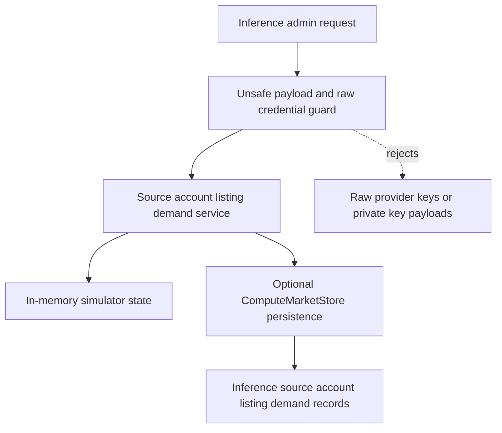

## Checkpoint 2026-05-26 CLI alias coverage

Files changed:

- `src/flow_memory/cli.py`
- `tests/test_inference_capacity_futures_markets.py`
- `docs/INFERENCE_MARKET.md`
- `docs/CAPACITY_MARKET.md`

Tests run:

- `python -m pytest tests/test_inference_capacity_futures_markets.py -q`
- `python -m ruff check src/flow_memory/cli.py tests/test_inference_capacity_futures_markets.py src/flow_memory/inference_market/service.py src/flow_memory/api/marketplace_endpoints.py`
- `python -m mypy src/flow_memory/cli.py src/flow_memory/inference_market src/flow_memory/api/marketplace_endpoints.py tests/test_inference_capacity_futures_markets.py --config-file pyproject.toml`
- `python scripts/check_compute_market_production.py`

Commits:

- `939ad0b Add nested market CLI aliases`

Implementation:

- `flow-memory inference credits list`
- `flow-memory inference credits buy`
- `flow-memory inference credits sell`
- `flow-memory capacity forward quote`
- `flow-memory capacity forward simulate`
- `flow-memory capacity forward simulate-delivery`
- `flow-memory capacity forward list`
- `flow-memory capacity index`
- `flow-memory capacity forward-curve`

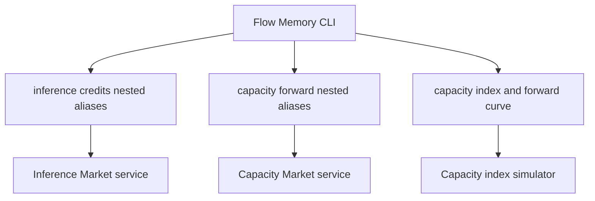

## Checkpoint 2026-05-26 Marketplace API persistence binding

Files changed:

- `src/flow_memory/api/marketplace_endpoints.py`
- `tests/test_inference_capacity_futures_markets.py`

Tests run:

- `python -m pytest tests/test_inference_capacity_futures_markets.py -q`
- `python -m ruff check src/flow_memory/api/marketplace_endpoints.py tests/test_inference_capacity_futures_markets.py`
- `python -m mypy src/flow_memory/api/marketplace_endpoints.py src/flow_memory/inference_market src/flow_memory/capacity_market src/flow_memory/futures_market tests/test_inference_capacity_futures_markets.py --config-file pyproject.toml`
- `python -m pytest tests/test_api_auth.py tests/test_api_auth_scopes.py tests/test_api_openapi_snapshot.py tests/test_api_snapshot.py -q`
- `python scripts/check_compute_market_production.py`
- `git diff --check -- src/flow_memory/api/marketplace_endpoints.py tests/test_inference_capacity_futures_markets.py docs/ops/MULTI_DAY_BUILDOUT_STATUS.md`

Commit:

- `27e2baf Bind market APIs to compute store`

Implementation:

- `/inference/*`, `/capacity/*`, `/capacity/forwards/*`, and `/futures/*` endpoint adapters now lazily bind their simulator services to `default_service().store`.
- The endpoint adapters rebuild their service wrapper when the active compute-market service changes, which keeps tests and production configuration aligned.
- API regression coverage verifies inference admin source creation, capacity reservation, and futures simulated orders persist to the active compute-market store.

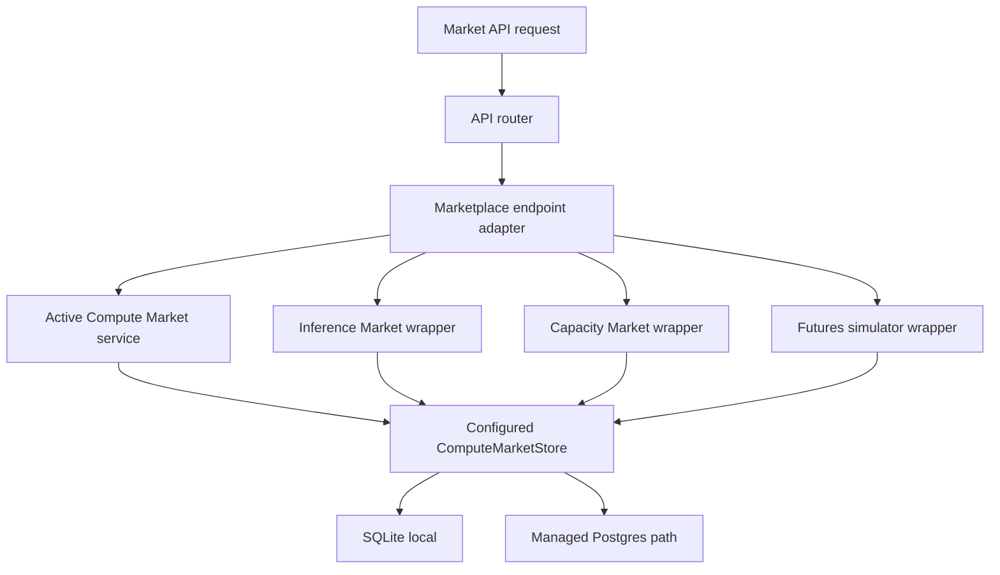

## Checkpoint 2026-05-26 Anthropic-compatible proxy

Files changed:

- `src/flow_memory/inference_market/service.py`
- `src/flow_memory/api/marketplace_endpoints.py`
- `src/flow_memory/api/router.py`
- `src/flow_memory/api/manifest.py`
- `docs/API_SNAPSHOT.json`
- `docs/openapi/flow-memory.openapi.json`
- `docs/INFERENCE_PROXY.md`
- `tests/test_inference_capacity_futures_markets.py`

Tests run:

- `python -m pytest tests/test_inference_capacity_futures_markets.py tests/test_api_openapi_snapshot.py tests/test_api_snapshot.py tests/test_compute_market_naming.py -q`
- `python -m ruff check src/flow_memory/inference_market/service.py src/flow_memory/api/marketplace_endpoints.py src/flow_memory/api/router.py src/flow_memory/api/manifest.py tests/test_inference_capacity_futures_markets.py`
- `python -m mypy src/flow_memory/inference_market src/flow_memory/api/marketplace_endpoints.py src/flow_memory/api/manifest.py tests/test_inference_capacity_futures_markets.py --config-file pyproject.toml`
- `python scripts/check_compute_market_production.py`

Commit:

- `5cd3f98 Add Anthropic-compatible inference proxy`

Implementation:

- Added a seeded Anthropic-compatible credit source, balance, and listing for the local dry-run marketplace.
- Added `GET /anthropic/v1/models` and `POST /anthropic/v1/messages`.
- OpenAI and Anthropic proxy responses now attach an inference usage record and persist it through the active compute-market store.
- External provider credentials remain disabled by default; the proxy still uses deterministic fake provider output.

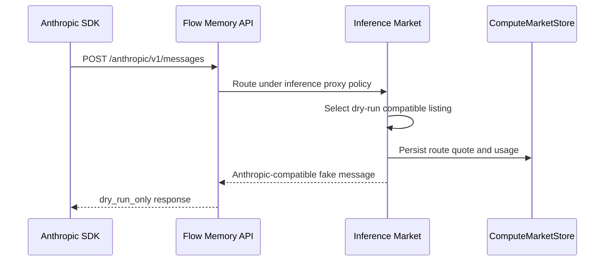

## Checkpoint 2026-05-26 Marketplace audit-chain binding

Files changed:

- `src/flow_memory/inference_market/service.py`
- `src/flow_memory/capacity_market/service.py`
- `src/flow_memory/futures_market/service.py`
- `tests/test_inference_capacity_futures_markets.py`

Tests run:

- `python -m pytest tests/test_inference_capacity_futures_markets.py -q`
- `python -m ruff check src/flow_memory/inference_market/service.py src/flow_memory/capacity_market/service.py src/flow_memory/futures_market/service.py tests/test_inference_capacity_futures_markets.py`
- `python -m mypy src/flow_memory/inference_market src/flow_memory/capacity_market src/flow_memory/futures_market tests/test_inference_capacity_futures_markets.py --config-file pyproject.toml`
- `python scripts/check_compute_market_production.py`

Commit:

- `c89b318 Bind market actions to audit chains`

Implementation:

- Inference market buy, sell, opportunity-cost, OpenAI proxy, and Anthropic proxy operations now append tamper-evident audit events when a compute-market store is attached.
- Capacity hold, reserve, release, forward draft, forward simulation, and delivery simulation now append tamper-evident audit events when a compute-market store is attached.
- Futures simulated orders, cancellations, risk checks, expiry, delivery, and settlement simulations now append tamper-evident audit events when a compute-market store is attached.
- Regression tests verify `inference-market`, `capacity-market`, and `futures-simulator` audit chains survive store reopen and pass hash-chain verification.

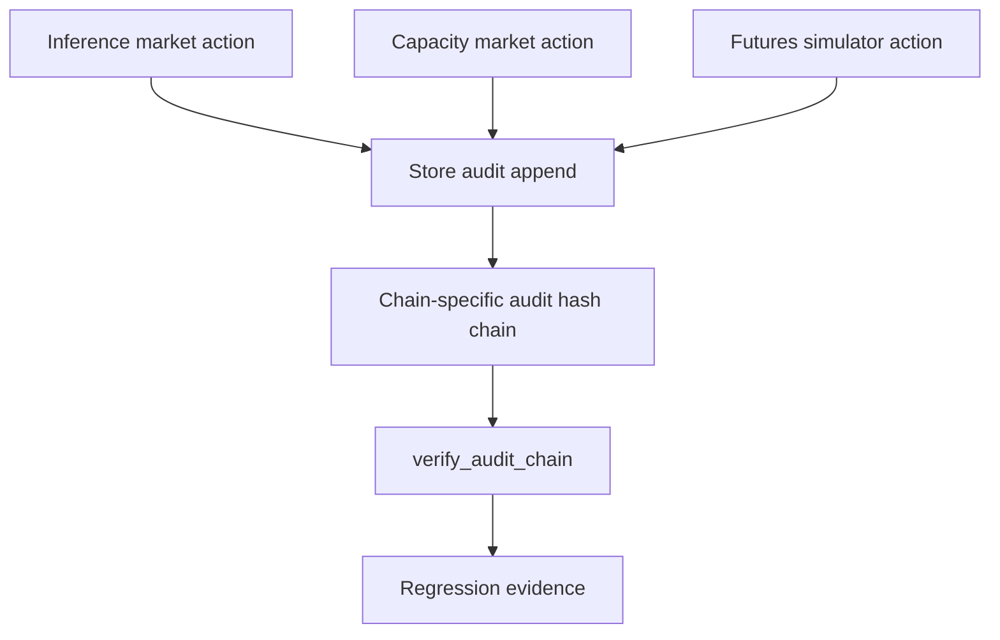

## Checkpoint 2026-05-26 Proxy scope and streaming hardening

Files changed:

- `src/flow_memory/inference_market/service.py`
- `tests/test_inference_capacity_futures_markets.py`

Tests run:

- `python -m pytest tests/test_inference_capacity_futures_markets.py -q`
- `python -m ruff check src/flow_memory/inference_market/service.py tests/test_inference_capacity_futures_markets.py`
- `python -m mypy src/flow_memory/inference_market tests/test_inference_capacity_futures_markets.py --config-file pyproject.toml`
- `python scripts/check_compute_market_production.py`

Commit:

- `dabba23 Harden inference proxy scope behavior`

Implementation:

- OpenAI-compatible and Anthropic-compatible proxy responses now include a deterministic `request_id`.
- If a caller asks for streaming while the local fake provider path is active, the response explicitly returns `streaming_not_implemented` inside `flow_memory.warnings` instead of silently pretending to stream.
- HTTP gateway coverage now verifies the Anthropic-compatible proxy requires `inference:proxy`, denies `inference:read`, records usage, and leaves the inference audit chain valid.

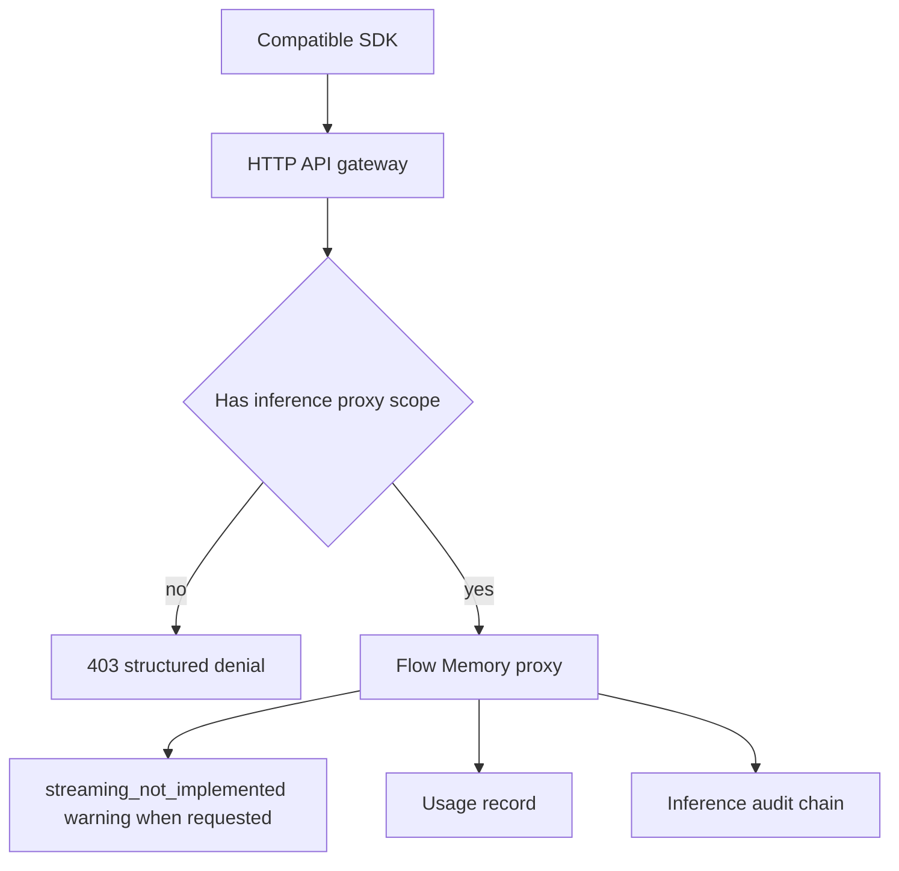

## Checkpoint 2026-05-26 Demand and price intelligence aliases

Files changed:

- `src/flow_memory/inference_market/service.py`
- `src/flow_memory/api/marketplace_endpoints.py`
- `src/flow_memory/api/router.py`
- `src/flow_memory/api/manifest.py`
- `docs/API_SNAPSHOT.json`
- `docs/openapi/flow-memory.openapi.json`
- `docs/INFERENCE_MARKET.md`
- `tests/test_inference_capacity_futures_markets.py`

Tests run:

- `python -m pytest tests/test_inference_capacity_futures_markets.py tests/test_api_openapi_snapshot.py tests/test_api_snapshot.py tests/test_compute_market_naming.py -q`
- `python -m ruff check src/flow_memory/inference_market/service.py src/flow_memory/api/marketplace_endpoints.py src/flow_memory/api/router.py src/flow_memory/api/manifest.py tests/test_inference_capacity_futures_markets.py`
- `python -m mypy src/flow_memory/inference_market src/flow_memory/api/marketplace_endpoints.py src/flow_memory/api/manifest.py tests/test_inference_capacity_futures_markets.py --config-file pyproject.toml`
- `python scripts/check_compute_market_production.py`

Commit:

- `3babbb1 Add inference demand price intelligence`

Implementation:

- Added demand aggregation endpoints: `GET /inference/demand`, `GET /inference/demand/summary`, and `POST /inference/demand/forecast`.
- Added price intelligence endpoints: `GET /inference/prices`, `GET /inference/prices/history`, `GET /inference/prices/spreads`, `GET /inference/prices/anomalies`, and `POST /inference/prices/forecast`.
- Added deterministic summaries and forecasts so agents can inspect demand before deciding whether to buy, sell, defer, or reserve.

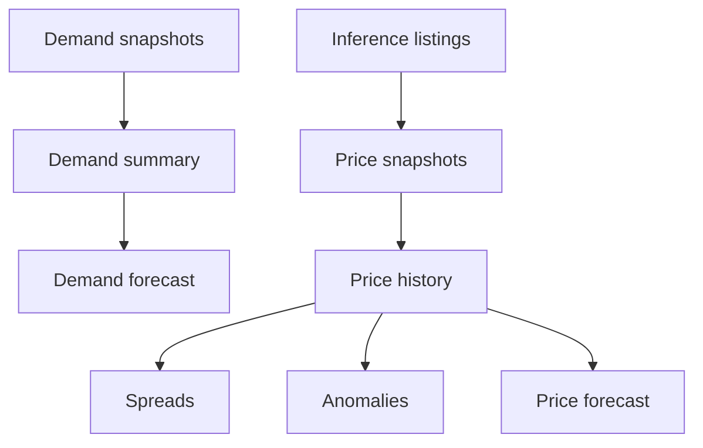
