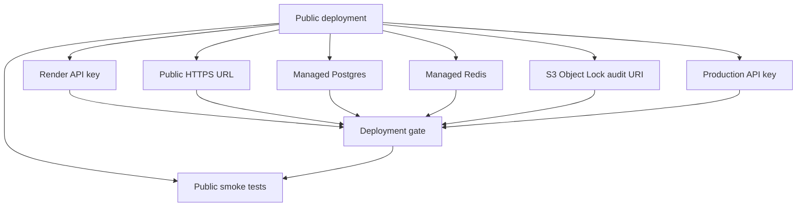
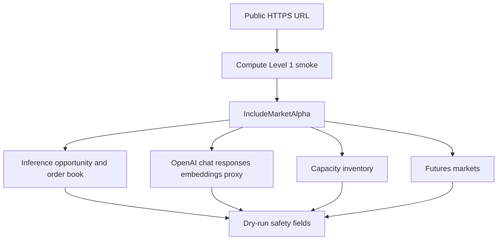

# Public deployment blockers

As of 2026-05-26, local and deployment automation paths exist, but public Level 1 deployment remains blocked by missing external infrastructure and secrets.

## Missing required values

- `RENDER_API_KEY`
- `RENDER_OWNER_ID`
- `FLOW_MEMORY_API_KEY`
- `FLOW_MEMORY_PUBLIC_API_URL`
- `FLOW_MEMORY_COMPUTE_DATABASE_URL`
- `FLOW_MEMORY_COMPUTE_REDIS_URL`
- `FLOW_MEMORY_COMPUTE_AUDIT_EXPORT_URI`

## Required public Level 1 invariants

- Managed Postgres, not SQLite.
- Managed Redis, not in-memory rate limits or circuit breakers.
- HTTPS public URL.
- API key and scope enforcement.
- Audit export to durable immutable storage.
- `dry_run_required=true`.
- `live_settlement_enabled=false`.
- `broadcast_enabled=false`.
- `private_key_inputs_allowed=false`.

Do not claim public deployment until public smoke tests pass against the public URL.

## Optional marketplace alpha smoke

When Level 1 compute deployment is live, run the same smoke script with `-IncludeMarketAlpha` to verify the Flow Memory Inference Market, OpenAI-compatible chat/responses/embeddings proxy paths, Capacity Market inventory, and GPU Futures simulator remain simulation-only behind the public gateway.

