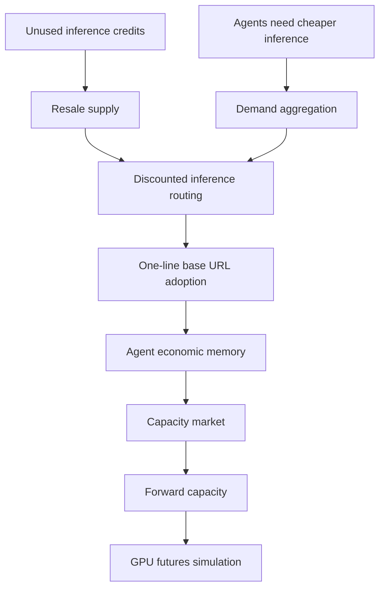
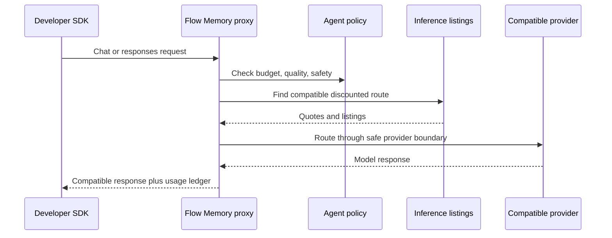

# Pod Squire interview notes

Status: structured notes from the user-provided interview brief. A raw transcript file was not present in the repository during the 2026-05-26 audit, so this document does not quote missing transcript text.

Squire and UsePod are reference patterns only. Flow Memory is the product.

## Participants

- Interview host: referenced by the user-provided brief, not identified in repo artifacts.
- UsePod / Squire founder or representative: referenced by the user-provided brief, not identified in repo artifacts.
- Flow Memory audience: agents, agent operators, and teams that need an economic decision layer for inference, compute, and capacity.

## Origin and background

The reference pattern is a marketplace thesis around agent-accessible inference and compute. It combines inference credit resale, discounted routing, demand aggregation, crypto-native community formation, and a longer-term idea of standardizing compute capacity into future-delivery agreements.

## Thesis funnel

## Agentic inference thesis

Agents are not just consumers of inference. Agents can also hold, route, conserve, resell, or defer inference and capacity. That changes the primitive from a simple API call into an economic decision:

- run now
- buy discounted inference
- sell unused inference
- downgrade intelligence tier
- defer until cheaper
- reserve capacity
- simulate a future-capacity hedge
- reject negative ROI

## Inference credit resale

The near-term wedge is resale of unused inference credits or entitlements. This is easier to adopt than a full compute futures market because it maps to today's developer behavior: change a base URL, keep the same client SDK, and let a router find lower-cost compatible inference.

## One-line base URL adoption wedge

The most practical adoption path is OpenAI-compatible and Anthropic-compatible routing:

## Demand-first go-to-market

Demand aggregation should precede futures. Before Flow Memory can responsibly model forward capacity or futures, it needs real demand memory:

- requested models
- accepted prices
- rejected routes
- deferred tasks
- latency and quality tradeoffs
- agent/task ROI
- seller-side available inference credits

## Token and crypto thesis

The reference pattern uses a token/community narrative. Flow Memory should not make token integration the product abstraction. The product abstraction is economic memory and safe market routing for agents.

## Compute futures terminal vision

Compute futures are a later simulation and research layer, not the near-term wedge. The credible path is:

1. inference resale
2. demand aggregation
3. standardized compute units
4. capacity reservations
5. forward capacity agreements
6. GPU futures simulator
7. live regulated products only after legal, compliance, and security approval

## Enterprise future-delivery example

A future enterprise example is reserving H100 capacity for a future delivery window, but this must start as a simulated forward-capacity contract with explicit non-binding and no-funds-moved safety fields.

## Risks and unknowns

- Transferability of inference credits may be contractually restricted.
- Provider credentials must never be exposed to buyers or agents.
- Resale may create policy, fraud, tax, compliance, and platform-terms risk.
- Forward capacity can resemble regulated financial products if made transferable or cash-settled.
- GPU futures and margin must remain simulation-only until legal/compliance/security approval.

## What Flow Memory should copy

- One-line base URL compatibility.
- Demand-first routing and price discovery.
- Agents as buyers and sellers.
- Discounted inference route selection.
- Long-term standardized compute-capacity thinking.

## What Flow Memory should improve

- Explicit dry-run safety boundaries.
- Tamper-evident audit chain.
- Agent economic memory.
- Run-vs-sell opportunity-cost planner.
- Provider contract validation.
- Production readiness gates for Postgres, Redis, object-lock audit, auth, and deployment.

## What Flow Memory should avoid

- Public Squire/UsePod branding.
- Mainnet settlement.
- Private-key custody.
- Live futures.
- Margin or leverage.
- Claims of legal or regulatory approval.
- Hiding external infra blockers behind local-only success.
