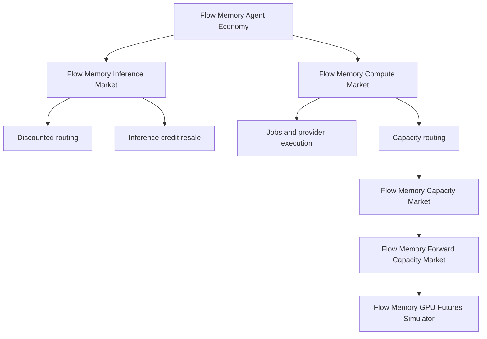
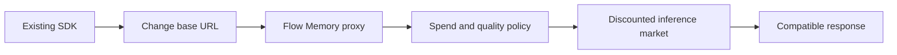
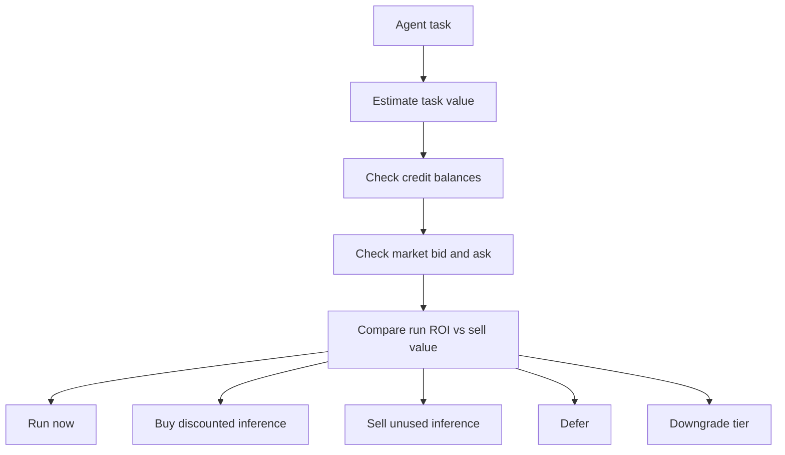
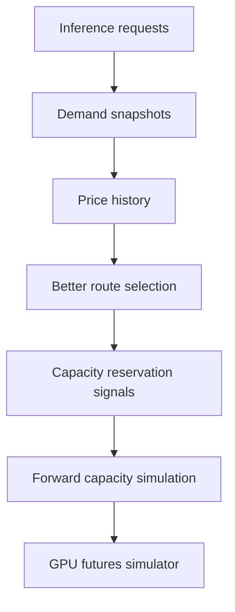
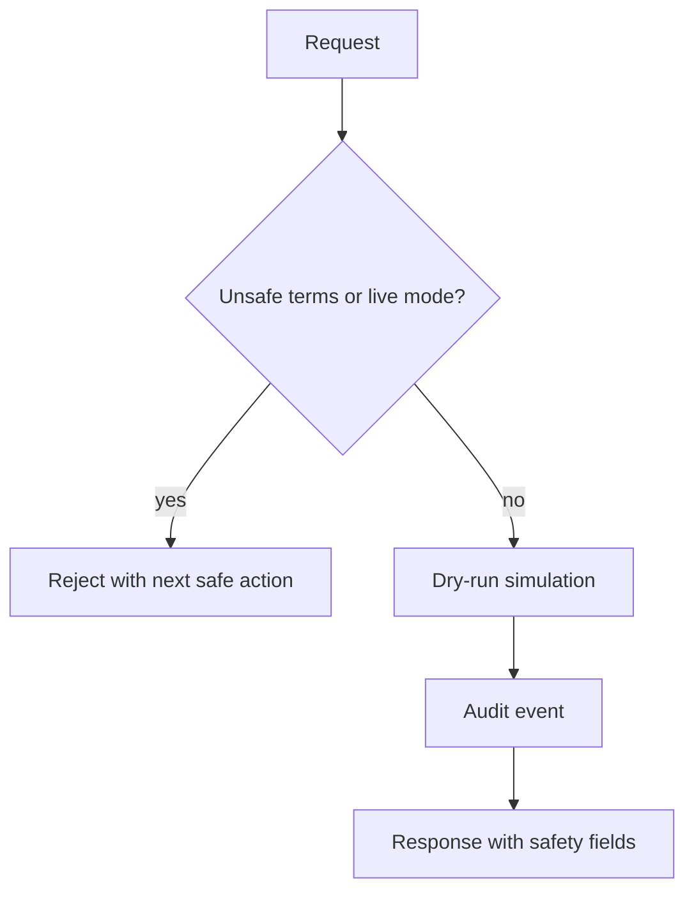

# Flow Memory product thesis from the Squire / UsePod reference pattern

Squire and UsePod are reference patterns only. Flow Memory is the product and public naming surface.

## Thesis

Flow Memory should become the economic memory and decision layer for agents that need to spend, earn, defer, reserve, or simulate future compute. The first wedge is not GPU futures. The first wedge is inference credit resale and discounted inference routing.

## Product hierarchy

## Near-term wedge

Agents need cheaper compatible inference now. The smallest adoption step is a base URL change, not a new custody stack or regulated market.

## Agent buyer and seller modes

Agents can be buyers when a task has positive expected ROI. They can be sellers when unused credits have higher resale value than the expected task value.

## Demand aggregation comes before futures

Flow Memory should record demand and price memory before simulating forward capacity or futures.

## Public product layers

1. Flow Memory Inference Market
2. Flow Memory Compute Market
3. Flow Memory Capacity Market
4. Flow Memory Forward Capacity Market
5. Flow Memory GPU Futures Simulator
6. Flow Memory Agent Economy

## Explicit non-goals for this buildout

- No live settlement.
- No funds moved.
- No private keys.
- No transaction broadcast.
- No mainnet settlement.
- No live futures trading.
- No margin.
- No leverage.
- No legal, compliance, or regulatory approval claims.

## Required safety posture

Every payment, settlement, capacity reservation, forward capacity, and futures response must remain dry-run or simulation-only and expose enough fields for clients to fail closed.

## Strategic implementation order

1. Model inference credits, listings, orders, fills, and usage.
2. Add an agent opportunity-cost planner.
3. Add `/inference/*` API and CLI.
4. Add OpenAI-compatible fake-provider proxy path.
5. Persist demand and price history.
6. Add capacity market package above existing Compute Market capacity reservations.
7. Add forward capacity simulator.
8. Add GPU futures simulator.
9. Expand OpenAPI snapshots, docs, and deployment evidence.
