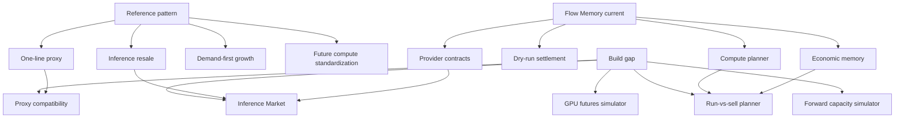
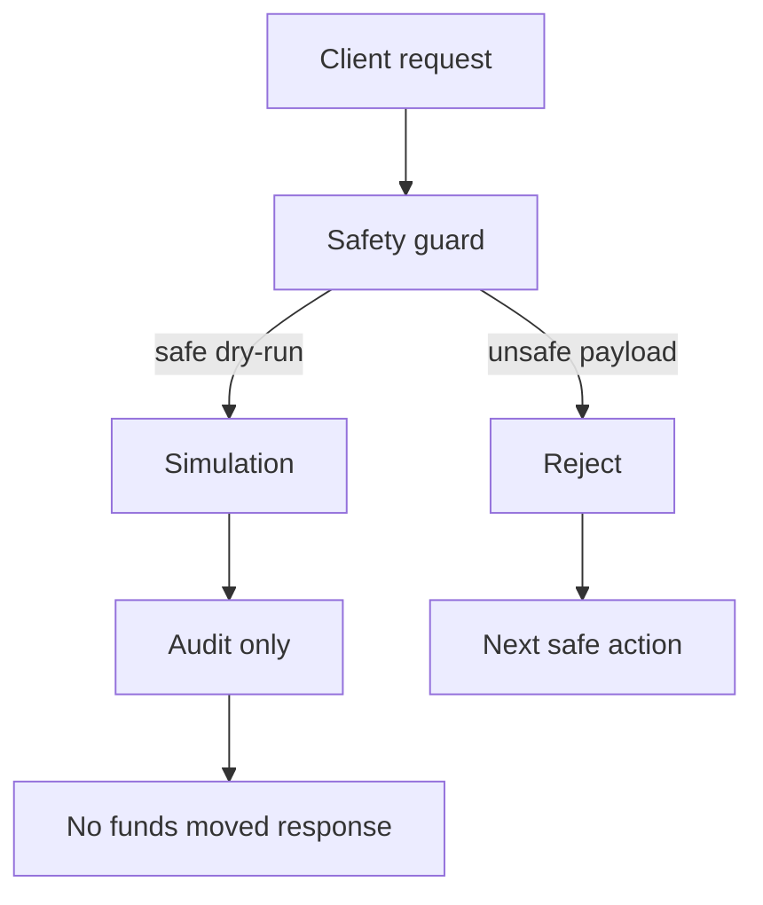

# Squire / UsePod reference pattern to Flow Memory gap analysis

Squire and UsePod are reference patterns only. Flow Memory must not expose their branding in public APIs, CLI commands, OpenAPI tags, package names, model names, or user-facing errors.

## Gap map

## Reference pattern

| Area | Reference pattern |
| --- | --- |
| First wedge | Inference resale and discounted routing |
| Adoption | One-line base URL compatibility |
| Buyer | Agents and developers buying cheaper inference |
| Seller | Agents or accounts selling unused inference |
| Growth | Demand aggregation before financialized compute |
| Long term | Standardized compute units and future delivery |
| Risk | Token narrative can outrun real infrastructure |

## Flow Memory current state

| Area | Current state |
| --- | --- |
| Compute planning | Built under `/compute/*` |
| Intelligence tiering | Built under `/compute/intelligence-plan` |
| Capacity reservations | Built under `/market/capacity/*` |
| Provider onboarding | Built for dry-run marketplace participation |
| Provider quotes | Built for validation, replay protection, cache, and drift |
| Jobs | Built as dry-run lifecycle records |
| Billing | Built as no-custody ledger and external checkout records |
| Audit | Built as tamper-evident chains and export/checkpoint support |
| Postgres | Code path exists; live managed instance not present |
| Redis | Code path exists; live managed instance not present |
| Public deployment | Automation exists; external infra secrets missing |

## Missing or partial layers

| Layer | Status | Required next build |
| --- | --- | --- |
| Inference Market | Missing as dedicated package | Credit sources, balances, listings, orders, fills, quotes, usage |
| Agent seller mode | Missing | Run-vs-sell opportunity planner and agent treasury |
| One-line proxy | Missing | OpenAI-compatible fake provider and policy boundary |
| Demand aggregation | Partial via compute price history | Inference demand snapshots and market spreads |
| Usage ledger | Partial via compute usage | Inference statement and ROI records |
| Capacity Market | Partial via Compute Market capacity endpoints | Dedicated package and CLI/API façade |
| Forward Capacity Market | Missing | Non-binding dry-run contracts and delivery simulation |
| GPU Futures Simulator | Missing | Simulation-only contracts, orders, positions, risk checks |
| Immutable audit storage | Partial | S3 Object Lock binding requires real bucket and credentials |
| Public infra | Blocked | Managed Postgres, Redis, public URL, TLS, API key, Render token |

## Roadmap from inference resale to futures

## Safety boundary

## Build priorities

1. Inference Market core models and deterministic simulation service.
2. Agent treasury and opportunity-cost planner.
3. Inference API/CLI façade.
4. OpenAI-compatible fake provider proxy.
5. Demand aggregation and inference usage statements.
6. Capacity, forward capacity, and futures simulator packages.
7. Docs, OpenAPI snapshots, and safety audits.
8. Public deployment only after external infra secrets exist.
