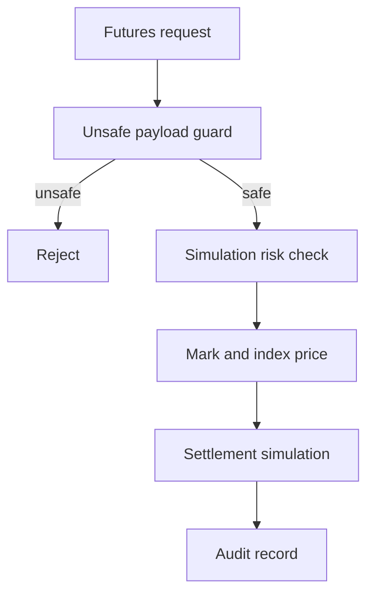

# GPU Futures Simulator risk model

The GPU Futures Simulator is simulation-only. It is not a venue for live trading, margin, leverage, collateral, or settlement.

## Prohibited live features

- live futures
- live settlement
- margin
- leverage
- collateral
- private keys
- seed phrases
- transaction signing
- transaction broadcast
- funds movement

All simulator responses must include legal and compliance review required flags.
