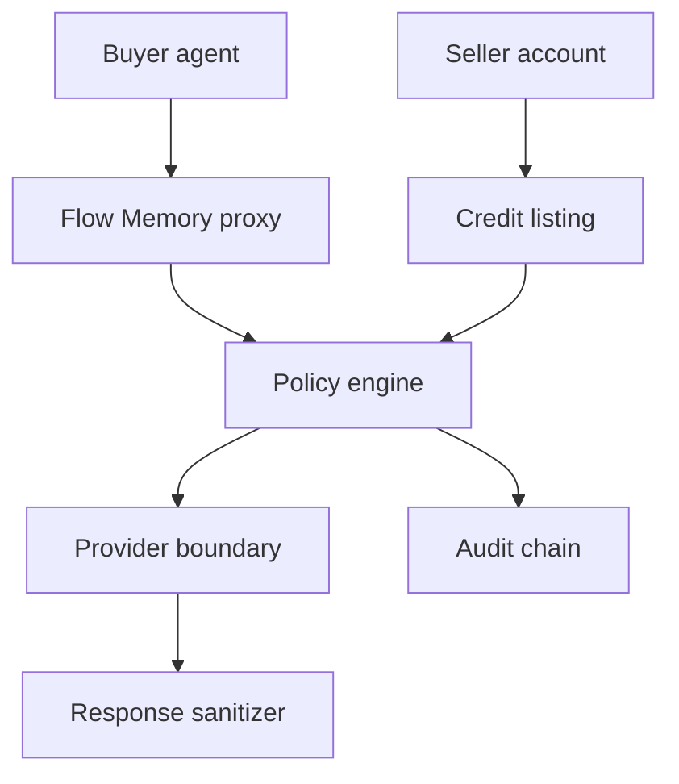

# Inference Market threat model

## Primary threats

| Threat | Control |
| --- | --- |
| Raw credential leakage | Secret references only; raw credentials rejected |
| Seller spoofing | Verified source and account records |
| Stale listings | Listing status and expiry checks |
| Provider response weakens policy | Policy is enforced before and after provider response |
| Funds movement | No custody, no settlement, dry-run only |
| Private key capture | Private-key and seed phrase tokens rejected |
| Abusive proxy payloads | Unsafe payload guard and scope enforcement |

External providers are disabled by default.
